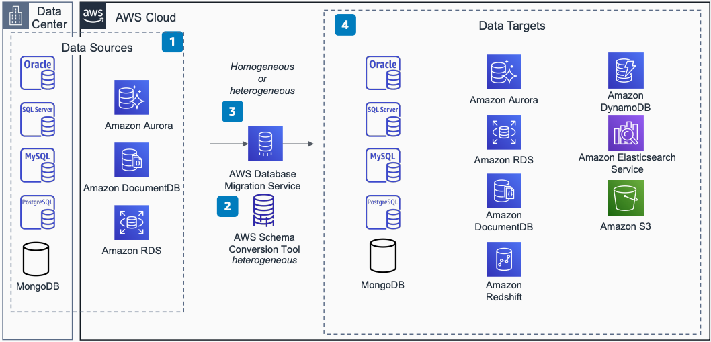

# Change Data Capture Using AWS DMS: Migrate and Replicate

Publication date: **August 2, 2021 ([Diagram history](#diagram-history "#diagram-history"))**

This architecture shows how to use [AWS Database Migration Service](../../../dms/latest/userguide/Welcome.md "../../../dms/latest/userguide/Welcome.md") (AWS DMS) for change data capture (CDC) to migrate databases using ongoing replication.

## Change Data Capture Using AWS DMS: Migrate and Replicate

The following steps describe the architecture:

1. Sources for CDC include Oracle, SQL Server, MySQL, PostgreSQL, MongoDB, Amazon Aurora, [Amazon DocumentDB](../../../documentdb/latest/developerguide/what-is.md "../../../documentdb/latest/developerguide/what-is.md"), and Amazon RDS.
2. AWS Schema Conversion Tool makes heterogeneous database migrations predictable by automatically converting the source database schema and a majority of code objects to a format compatible with the target database.
3. AWS DMS helps you with one-time data migration of databases and continuous data replication. AWS DMS captures changes on the source database and applies them in a transactionally consistent way to the target.
4. Targets for CDC include Oracle, SQL Server, MySQL, PostgreSQL, MongoDB, Amazon Aurora, Amazon DocumentDB, Amazon RDS, and Amazon S3.

## Further reading

For additional information, refer to the following resources:

- [AWS Architecture Icons](https://aws.amazon.com/architecture/icons "https://aws.amazon.com/architecture/icons")
- [AWS Architecture Center](https://aws.amazon.com/architecture "https://aws.amazon.com/architecture")
- [AWS Well-Architected](https://aws.amazon.com/architecture/well-architected "https://aws.amazon.com/architecture/well-architected")

## Diagram history

To be notified about updates to this reference architecture diagram, subscribe to the RSS feed.

| Change              | Description                                     | Date           |
| ------------------- | ----------------------------------------------- | -------------- |
| Initial publication | Reference architecture diagram first published. | August 2, 2021 |

###### Note

To subscribe to RSS updates, you must have an RSS plugin enabled for the browser you are using.
