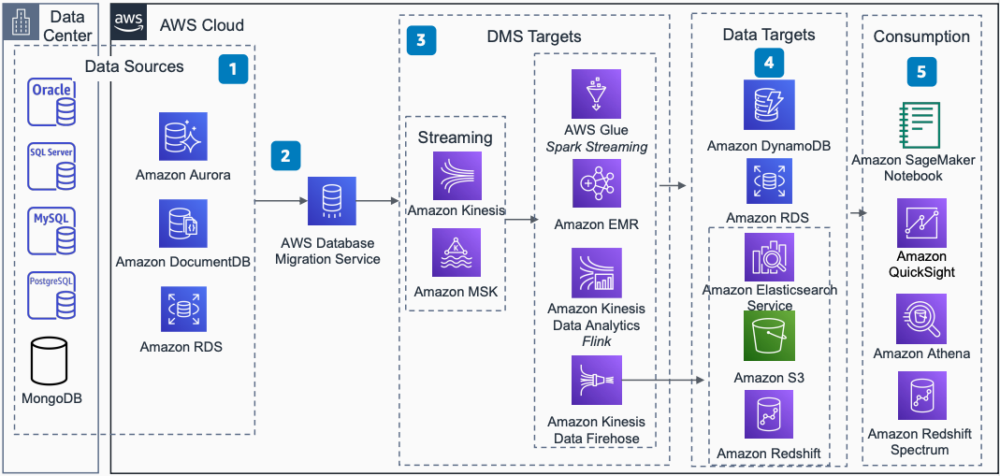

# Change Data Capture Using AWS DMS: Streaming

This architecture shows how to use AWS Database Migration Service (AWS DMS) to ingest real-time changes from source databases through streaming services.

## Change Data Capture Using AWS DMS: Streaming

The following steps describe the architecture:

1. Sources for CDC include Oracle, SQL Server, MySQL, PostgreSQL, MongoDB, Amazon Aurora, Amazon DocumentDB, and Amazon RDS.
2. AWS DMS helps you with one-time data migration of databases and continuous data replication. AWS DMS captures changes on the source database and applies them in a transactionally consistent way to the target.
3. Use AWS DMS to stream data to an [Amazon Kinesis](../../../streams/latest/dev/introduction.md "../../../streams/latest/dev/introduction.md") data stream and Amazon Managed Streaming for Apache Kafka (Amazon MSK) to collect and process large streams of data.
4. Use purpose-built services for analytics in your data lake or data warehouse.
5. Visualize and consume data using [Amazon Quick Sight](../../../quicksight/latest/user/welcome.md "../../../quicksight/latest/user/welcome.md") and SageMaker AI Notebooks.
