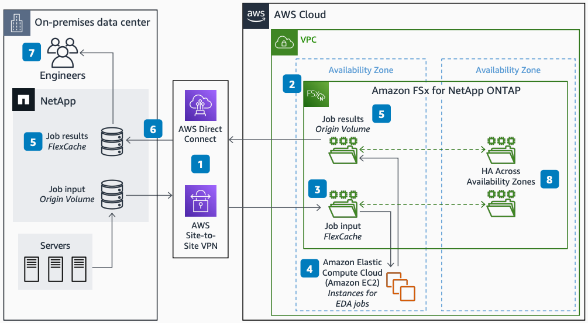

# Cloud Bursting EDA with Amazon FSx for NetApp ONTAP

Publication date: **November 19, 2021 ([Diagram history](#burst-eda-history "#burst-eda-history"))**

With this architecture, you can burst Electronic Design Automation (EDA) jobs from your
on-premises data center to AWS and quickly access the results. The solution uses [Amazon FSx for NetApp
ONTAP](../../../fsx/latest/ONTAPGuide.md "../../../fsx/latest/ONTAPGuide.md") with FlexCache volumes for bidirectional caching between
on-premises and cloud storage.

## Cloud bursting EDA with Amazon FSx for NetApp ONTAP diagram

The following steps describe the data flow and caching configuration for this
architecture:

1. Establish fast, secure networking between your on-premises data center and AWS. Use
   AWS Direct Connect for production, or AWS Site-to-Site VPN for initial testing or proof of
   concept.
2. Deploy Amazon FSx for NetApp ONTAP in AWS and configure cluster peering
   with your on-premises NetApp system.
3. Create a FlexCache volume in Amazon FSx for NetApp ONTAP
   and pair it with the on-premises origin volume. Your [Amazon Elastic Compute Cloud](../../../AWSEC2/latest/UserGuide.md "../../../AWSEC2/latest/UserGuide.md") instances can then access cached data
   from the on-premises file system through Network File System (NFS).
4. Run EDA jobs on Amazon EC2 instances by using the local FlexCache volume.
   Required file blocks load on demand and cache in AWS. Write output to a local output
   origin volume in the cloud.
5. Create a FlexCache volume within your on-premises NetApp
   system and pair it with the Amazon FSx for NetApp ONTAP origin volume. You can
   then access the output data from your on-premises data center.
6. Only data read by users is fetched from the origin volume in AWS. This minimizes
   bandwidth use.
7. Multiple engineers accessing the same files in the on-premises FlexCache
   volume, or users accessing files multiple times, receive the file from the local
   cache.
8. Use a multi-Availability Zone configuration for high availability (HA) in Amazon FSx for
   NetApp ONTAP.

## Further reading

For additional information, see the following resources:

- [AWS Architecture Icons](https://aws.amazon.com/architecture/icons "https://aws.amazon.com/architecture/icons")
- [AWS Architecture Center](https://aws.amazon.com/architecture/ "https://aws.amazon.com/architecture/")
- [AWS
  Well-Architected](https://aws.amazon.com/architecture/well-architected "https://aws.amazon.com/architecture/well-architected")

## Diagram history

To receive updates about this reference architecture diagram, subscribe to the RSS
feed.

| Change              | Description                                     | Date              |
| ------------------- | ----------------------------------------------- | ----------------- |
| Initial publication | Reference architecture diagram first published. | November 19, 2021 |

###### RSS subscription requirement

To subscribe to RSS updates, you must have an RSS plugin enabled for the browser you are
using.
