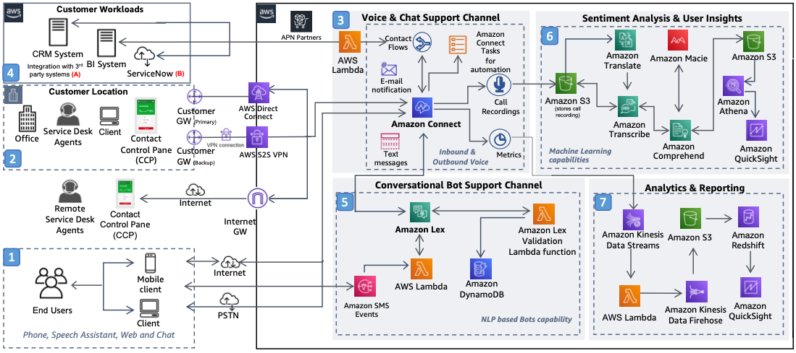

# Cloud-native Contact Center for Multilingual IT Service Desk

Publication date: **January 6, 2021 ([Diagram history](#diagram-history "#diagram-history"))**

This reference architecture diagram shows how to modernize the IT service desk with an intelligent, omnichannel contact center by using [Amazon Connect](../../../connect/latest/adminguide/what-is-amazon-connect.md "../../../connect/latest/adminguide/what-is-amazon-connect.md").

## Cloud-native Contact Center for Multilingual IT Service Desk

1. End users contact the IT Service Desk through voice (PSTN or softphone), web chat, or smartphone. SD agents connect through a web-based softphone (CCP) from a browser.
2. Amazon Connect provides inbound and outbound voice, web chat, and mobile chat with skills-based routing. Configure phone numbers, support queues, contact flows, and routing profiles.
3. Amazon Connect integrates with CRM or ITSM ticketing tools (like ServiceNow) by using connectors from the AWS Partner ecosystem or custom integrations with [AWS Lambda](../../../lambda/latest/dg/welcome.md "../../../lambda/latest/dg/welcome.md").
4. Integrate Amazon Connect with [Amazon Lex](../../../lexv2/latest/dg/what-is.md "../../../lexv2/latest/dg/what-is.md") to create intelligent conversational chatbots. Automate high-volume contacts without increasing SD agents.
5. Amazon Connect stores call recordings in [Amazon Simple Storage Service](../../../AmazonS3/latest/userguide/Welcome.md "../../../AmazonS3/latest/userguide/Welcome.md"). Use Amazon Transcribe and Amazon Translate for speech-to-text conversion. Use Amazon Comprehend to analyze key topics and sentiments.
6. Amazon Macie protects sensitive data stored in call recordings. Use [Amazon Athena](../../../athena/latest/ug/what-is.md "../../../athena/latest/ug/what-is.md") to analyze relationships in the converted text.
7. Amazon Connect provides real-time metrics (agents logged in, abandon rates, calls handled). Analyze contact trace records (CTRs) by using [Amazon Kinesis Data Streams](../../../streams/latest/dev/introduction.md "../../../streams/latest/dev/introduction.md") and Lambda, store in [Amazon Redshift](../../../redshift/latest/dg/welcome.md "../../../redshift/latest/dg/welcome.md"), and view in [Amazon QuickSight](../../../quicksight/latest/user/welcome.md "../../../quicksight/latest/user/welcome.md") dashboards.

###### Note

**A.** Amazon Connect is an open platform, providing out-of-the-box integrations for leading CRM tools such as Salesforce and Zendesk, Workforce Management (WFM) tools, and analytics tools. With Lambda, you can create your own integration to existing ITSM or CRM products. To learn more about APN partners who have created custom integration connectors, see [Amazon Connect Partners](https://aws.amazon.com/products/connect/customer/partners/ "https://aws.amazon.com/products/connect/customer/partners/").

**B.** Amazon Connect Integration offers a Quick Start guide to organizations using [ServiceNow](https://www.servicenow.com/ "https://www.servicenow.com/") as their ticketing tool. You can use Lambda functions to jumpstart integration of ServiceNow and Amazon Connect, resulting in one unified ITSM UI for SD agents and end users.

## Further reading

For additional information, refer to

- [AWS Architecture Icons](https://aws.amazon.com/architecture/icons "https://aws.amazon.com/architecture/icons")
- [AWS Architecture Center](https://aws.amazon.com/architecture "https://aws.amazon.com/architecture")
- [AWS Well-Architected](https://aws.amazon.com/architecture/well-architected "https://aws.amazon.com/architecture/well-architected")
- [Amazon Connect product page](https://aws.amazon.com/connect/ "https://aws.amazon.com/connect/")

## Diagram history

To be notified about updates to this reference architecture diagram, subscribe to the RSS feed.

| Change              | Description                                     | Date            |
| ------------------- | ----------------------------------------------- | --------------- |
| Initial publication | Reference architecture diagram first published. | January 6, 2021 |

###### Note

To subscribe to RSS updates, you must have an RSS plugin enabled for the browser you are using.
