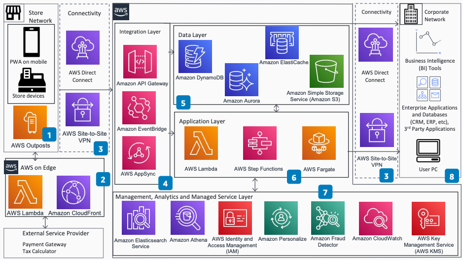

# Cloud Point-of-Sale (POS) System on AWS for CPG

## Overview

A modern point-of-sale (POS) system does much more than provide checkout for customers.
While extra capabilities are welcome, they complicate maintenance and make upgrades more
complex. Consumer packaged goods (CPG) companies need a scalable and maintainable POS
solution for direct-to-consumer store sales.

This architecture shows four key features a cloud-based POS system should have: checkout,
order capture, product management, and back office. You can share these features with a
direct-to-consumer (DTC) ecommerce implementation.

Publication date: October 2021

**Download:** [Architecture diagram (PDF)](samples/cloud-pos-cpg.zip.md "samples/cloud-pos-cpg.zip.md")

## Architecture

The following steps describe the architecture:

1. [AWS
   Outposts](../../../outposts/latest/userguide.md "../../../outposts/latest/userguide.md") adds AWS compute and storage capability at stores. It uses 1U and
   2U form factors.
2. AWS edge services improve user experience and speed content delivery. [Amazon CloudFront](../../../AmazonCloudFront/latest/DeveloperGuide.md "../../../AmazonCloudFront/latest/DeveloperGuide.md")
   and [Lambda@Edge](../../../lambda/latest/dg.md "../../../lambda/latest/dg.md") integrate with
   external service providers such as payment gateways and tax calculators.
3. You choose either [https://docs.aws.amazon.com/directconnect/latest/UserGuide/](../../../directconnect/latest/UserGuide.md "../../../directconnect/latest/UserGuide.md")
   or AWS Site-to-Site VPN for data security in transit.
4. [API Gateway](../../../apigateway/latest/developerguide.md "../../../apigateway/latest/developerguide.md"),
   [Amazon EventBridge](../../../eventbridge/latest/userguide.md "../../../eventbridge/latest/userguide.md"), and
   [Amazon EC2 Auto Scaling](../../../appsync/latest/devguide.md "../../../appsync/latest/devguide.md") form the
   integration layer. They handle incoming requests and integrate with the backend
   application layer, the data layer, and corporate system APIs.
5. The data layer uses purpose-built databases. [Amazon DynamoDB](../../../amazondynamodb/latest/developerguide.md "../../../amazondynamodb/latest/developerguide.md")
   handles key-value data. [Amazon Aurora](../../../AmazonRDS/latest/AuroraUserGuide.md "../../../AmazonRDS/latest/AuroraUserGuide.md")
   stores relational data. [Amazon ElastiCache](../../../AmazonElastiCache/latest/red-ug.md "../../../AmazonElastiCache/latest/red-ug.md")
   provides caching. [Amazon S3](../../../AmazonS3/latest/userguide.md "../../../AmazonS3/latest/userguide.md") stores
   objects.
6. The serverless application layer implements the four cloud POS features. [Lambda](../../../lambda/latest/dg.md "../../../lambda/latest/dg.md"), [AWS Step Functions](../../../step-functions/latest/dg.md "../../../step-functions/latest/dg.md"), and
   run the business logic. The application layer also accesses internal
   systems on the corporate network.
7. The management, analytics, and managed service layer provides ad hoc reporting,
   monitoring, security, and data protection. It integrates with native AWS
   services.
8. The application layer integrates with existing internal and third-party applications
   on corporate networks. Business users and existing business intelligence (BI) and
   enterprise resource planning (ERP) systems support day-to-day activities.

## Diagram history

To receive updates about this reference architecture diagram, subscribe to the RSS
feed.

| Change              | Description                                     | Date            |
| ------------------- | ----------------------------------------------- | --------------- |
| Initial publication | Reference architecture diagram first published. | October 1, 2021 |

###### RSS subscription requirement

To subscribe to RSS updates, you must have an RSS plugin enabled for the browser you
are using.
