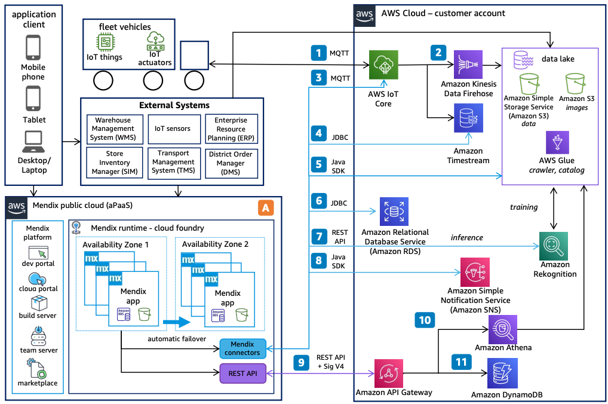

# Cold Chain Logistics Powered by Mendix: Mendix Cloud

Publication date: **April 29, 2022 ([Diagram history](#ccm-cloud-history "#ccm-cloud-history"))**

With this architecture, you can build low-code cold chain logistics applications on
Mendix Cloud, an application platform as a service (aPaaS). Mendix
Cloud connects to AWS services through native connectors that use standard AWS SDKs and
[Amazon API Gateway](../../../apigateway/latest/developerguide.md "../../../apigateway/latest/developerguide.md")
endpoints. The solution uses [AWS IoT Core](../../../iot/latest/developerguide.md "../../../iot/latest/developerguide.md") for device connectivity and [Amazon Rekognition](../../../rekognition/latest/dg.md "../../../rekognition/latest/dg.md") for automated image
analysis.

## Cold chain logistics Mendix Cloud diagram

The following steps describe the integration components for this architecture:

1. Publish telemetry messages from IoT sensors to AWS IoT Core. Process messages according
   to custom rules and forward them into the backend service structure.
2. Feed information from external systems into the [Amazon Simple Storage Service](../../../AmazonS3/latest/userguide.md "../../../AmazonS3/latest/userguide.md") data lake.
3. Use Mendix connectors for IoT to publish and subscribe to IoT devices
   by using the MQTT protocol. Include condition-based logic to control actuators by updating
   a device shadow.
4. Incorporate external databases ([Amazon Aurora](../../../AmazonRDS/latest/AuroraUserGuide.md "../../../AmazonRDS/latest/AuroraUserGuide.md"), [Amazon RDS](../../../AmazonRDS/latest/UserGuide.md "../../../AmazonRDS/latest/UserGuide.md")) directly in your Mendix
   app by using the JDBC driver with the database connector.
5. Upload, modify, and delete unstructured data and files by using the
   Mendix AWS and Amazon S3 connector. Back up data for long-term storage or
   reporting.
6. Analyze images by using the Amazon Rekognition connector microflows.
7. Explore topics and publish messages with attributes by using the Mendix
   [Amazon Simple Notification Service](../../../sns/latest/dg.md "../../../sns/latest/dg.md") connector.
8. Access backend services through [Amazon API Gateway](../../../apigateway/latest/developerguide.md "../../../apigateway/latest/developerguide.md"). Call any AWS service
   that supports REST API with Signature V4 authentication.
9. Retrieve and analyze data lake content by using standard SQL with [Amazon Athena](../../../athena/latest/ug.md "../../../athena/latest/ug.md").
10. Store time-series data from IoT sensors in [Amazon Timestream](../../../timestream/latest/developerguide.md "../../../timestream/latest/developerguide.md"). Query records from
    Mendix by using the database connector (JDBC).
11. Use [Amazon DynamoDB](../../../amazondynamodb/latest/developerguide.md "../../../amazondynamodb/latest/developerguide.md") as a backend database
    for systems that require high-performance data processing at scale.

## Further reading

For additional information, see the following resources:

- [AWS Architecture Icons](https://aws.amazon.com/architecture/icons "https://aws.amazon.com/architecture/icons")
- [AWS Architecture Center](https://aws.amazon.com/architecture/ "https://aws.amazon.com/architecture/")
- [AWS
  Well-Architected](https://aws.amazon.com/architecture/well-architected "https://aws.amazon.com/architecture/well-architected")

## Diagram history

To receive updates about this reference architecture diagram, subscribe to the RSS
feed.

| Change                                                                                                                                         | Description                                     | Date           |
| ---------------------------------------------------------------------------------------------------------------------------------------------- | ----------------------------------------------- | -------------- |
| Initial publication                                                                                                                            | Reference architecture diagram first published. | April 29, 2022 |
| [Initial publication](cold-chain-logistics-mendix-private.md#ccm-private-history "cold-chain-logistics-mendix-private.md#ccm-private-history") | Reference architecture diagram first published. | April 29, 2022 |

###### RSS subscription requirement

To subscribe to RSS updates, you must have an RSS plugin enabled for the browser you are
using.
