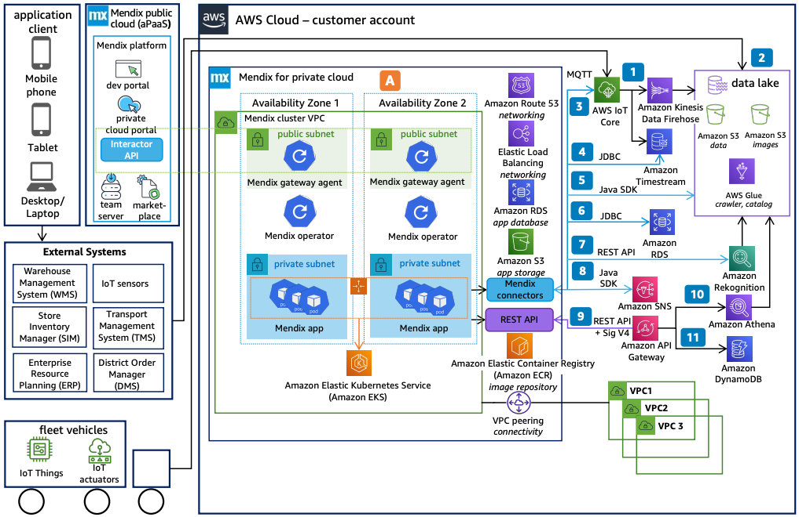

# Cold Chain Logistics Powered by Mendix: Private Cloud

Publication date: **April 29, 2022 ([Diagram history](#ccm-private-history "#ccm-private-history"))**

With this architecture, you can deploy Mendix cold chain logistics
applications on your own [Amazon Elastic Kubernetes Service](../../../eks/latest/userguide.md "../../../eks/latest/userguide.md") cluster. Mendix for Private
Cloud supports the full application lifecycle on Kubernetes. Simplify lifecycle
management with the Mendix Operator and connect securely with the
Mendix Gateway.

## Cold chain logistics Mendix Private Cloud diagram

The following steps describe the private cloud deployment for this architecture:

1. Publish telemetry messages from IoT sensors to [AWS IoT Core](../../../iot/latest/developerguide.md "../../../iot/latest/developerguide.md"). Process messages according to
   custom rules and forward them into the backend.
2. Feed information from external systems into the [Amazon Simple Storage Service](../../../AmazonS3/latest/userguide.md "../../../AmazonS3/latest/userguide.md") data lake.
3. Use Mendix IoT connectors to publish or subscribe to devices by
   using the MQTT protocol. Control actuators by updating device shadows.
4. Register your private Amazon EKS cluster in the Mendix private cloud
   portal. Deploy apps to the cluster by using the Mendix Operator.
5. Incorporate external databases directly in your app by using a JDBC driver with
   the Mendix database connector.
6. Upload, modify, and delete files by using the Mendix Amazon S3
   connector. Back up data for long-term storage.
7. Analyze images by using the [Amazon Rekognition](../../../rekognition/latest/dg.md "../../../rekognition/latest/dg.md") connector microflows.
8. Explore topics and publish messages by using the Mendix [Amazon Simple Notification Service](../../../sns/latest/dg.md "../../../sns/latest/dg.md") connector.
9. Access backend services through [Amazon API Gateway](../../../apigateway/latest/developerguide.md "../../../apigateway/latest/developerguide.md") with Signature V4
   authentication.
10. Retrieve and analyze data by using standard SQL with [Amazon Athena](../../../athena/latest/ug.md "../../../athena/latest/ug.md").
11. Store time-series data in [Amazon Timestream](../../../timestream/latest/developerguide.md "../../../timestream/latest/developerguide.md"). Query records by using
    the JDBC database connector.

## Further reading

For additional information, see the following resources:

- [AWS Architecture Icons](https://aws.amazon.com/architecture/icons "https://aws.amazon.com/architecture/icons")
- [AWS Architecture Center](https://aws.amazon.com/architecture/ "https://aws.amazon.com/architecture/")
- [AWS
  Well-Architected](https://aws.amazon.com/architecture/well-architected "https://aws.amazon.com/architecture/well-architected")

## Diagram history

To receive updates about this reference architecture diagram, subscribe to the RSS
feed.

| Change                                                                                                                                 | Description                                     | Date           |
| -------------------------------------------------------------------------------------------------------------------------------------- | ----------------------------------------------- | -------------- |
| [Initial publication](cold-chain-logistics-mendix-cloud.md#ccm-cloud-history "cold-chain-logistics-mendix-cloud.md#ccm-cloud-history") | Reference architecture diagram first published. | April 29, 2022 |
| Initial publication                                                                                                                    | Reference architecture diagram first published. | April 29, 2022 |

###### RSS subscription requirement

To subscribe to RSS updates, you must have an RSS plugin enabled for the browser you are
using.
