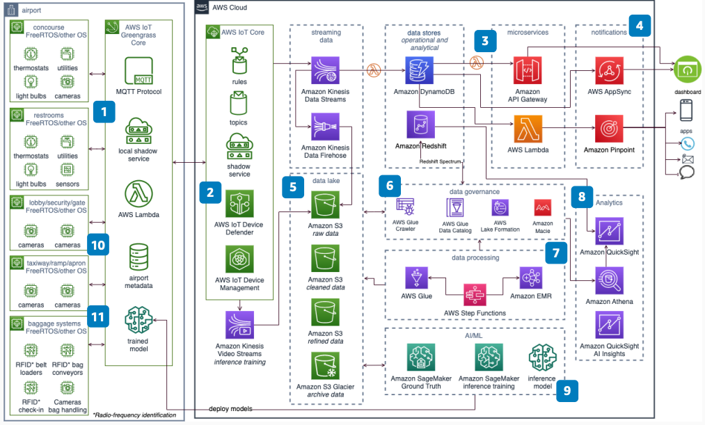

# Connected Airports Using IoT and AI/ML

Publication date: **December 23, 2022 ([Diagram history](#connected-airports-history "#connected-airports-history"))**

This reference architecture shows how to build a smart, connected airport using
Internet of Things (IoT) and artificial intelligence/machine learning (AI/ML). Airport
operators use this architecture to generate near real-time data for aircraft movement, gate
turns, baggage tracking, queue depth, and passenger traffic.

Traditional airports rely on manual processes and disconnected systems. These approaches
cannot provide the real-time visibility that operations teams need. This architecture
connects IoT devices at the edge, processes data in near real time, and applies ML models
for predictive insights. You can also implement compliance measures such as social
distancing and security monitoring.

This architecture references the [Aircraft Turn Tracking
Passive Data Collection](../aircraft-turn-tracking/aircraft-turn-tracking.md "../aircraft-turn-tracking/aircraft-turn-tracking.md") solution for gate turn event collection.

## Connected airports diagram

The following steps describe the architecture:

1. Use [AWS IoT Greengrass](../../../greengrass/v2/developerguide.md "../../../greengrass/v2/developerguide.md") Core to connect, publish, and
   subscribe data. Use Message Queuing Telemetry Transport (MQTT) protocol with IoT
   devices.
2. Use [AWS IoT Core](../../../iot/latest/developerguide.md "../../../iot/latest/developerguide.md") to maintain shadows of IoT
   devices. Connect to AWS Cloud, manage devices, update over the air (OTA), and
   secure devices.
3. Use purpose-built databases such as [DynamoDB](../../../amazondynamodb/latest/developerguide.md "../../../amazondynamodb/latest/developerguide.md") and serverless
   architecture for events, microservices, and operational data.
4. Build a real-time operational dashboard by using microservices and AWS AppSync.
   Deliver alerts through [Amazon Pinpoint](../../../pinpoint/latest/userguide.md "../../../pinpoint/latest/userguide.md").
5. Build the data lake in [Amazon S3](../../../AmazonS3/latest/userguide.md "../../../AmazonS3/latest/userguide.md"). Use [AWS Glue](../../../glue/latest/dg.md "../../../glue/latest/dg.md") and [Amazon EMR](../../../emr/latest/ManagementGuide.md "../../../emr/latest/ManagementGuide.md") for raw and curated processed
   data.
6. Discover and govern data in Amazon S3 by using AWS Glue crawlers, Glue Data Catalog, and
   [Lake Formation](../../../lake-formation/latest/dg.md "../../../lake-formation/latest/dg.md"). Deploy
   Amazon Macie to detect sensitive data.
7. Use AWS Glue jobs and Amazon EMR for data transformation and enrichment.
8. Use [Amazon Redshift](../../../redshift/latest/dg.md "../../../redshift/latest/dg.md"),
   [Athena](../../../athena/latest/ug.md "../../../athena/latest/ug.md"), and [Quick](../../../quicksight/latest/user/welcome.md "../../../quicksight/latest/user/welcome.md") for
   analytics. Build data marts in Amazon Redshift for heavily used analytics.
9. Use [Amazon SageMaker AI](../../../sagemaker/latest/dg.md "../../../sagemaker/latest/dg.md") to
   build, train, and deploy inference models. Deploy edge models on AWS IoT Greengrass Core.
10. Use the Aircraft Turn Tracking solution to passively collect gate turn events.
11. Use social distancing and queue depth management solutions for compliance.

## Further reading

For additional information, see the following resources:

- [AWS Architecture Icons](https://aws.amazon.com/architecture/icons "https://aws.amazon.com/architecture/icons")
- [AWS Architecture Center](https://aws.amazon.com/architecture/ "https://aws.amazon.com/architecture/")
- [AWS Well-Architected](https://aws.amazon.com/architecture/well-architected "https://aws.amazon.com/architecture/well-architected")

## Diagram history

To receive updates about this reference architecture diagram, subscribe to the RSS
feed.

| Change              | Description                                     | Date              |
| ------------------- | ----------------------------------------------- | ----------------- |
| Initial publication | Reference architecture diagram first published. | December 23, 2022 |

###### RSS subscription requirement

To subscribe to RSS updates, you must have an RSS plugin enabled for the browser you
are using.
