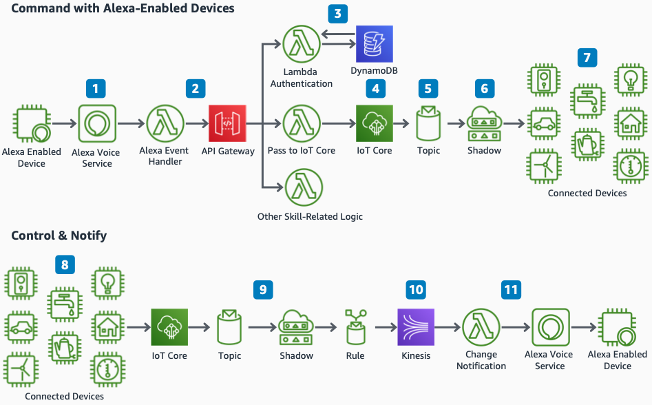

# Connected Home Command and Control on AWS

Publication date: **March 24, 2021 ([Diagram history](#diagram-history "#diagram-history"))**

This reference architecture diagram shows how to integrate Alexa with your connected home devices by using AWS.

## Connected Home Command and Control on AWS

1. An Alexa-enabled device running the Alexa Voice Services SDK or an Amazon Echo creates an Alexa invocation.
2. The Alexa skill uses [AWS Lambda](../../../lambda/latest/dg/welcome.md "../../../lambda/latest/dg/welcome.md") as its backend logic. [Amazon API Gateway](../../../apigateway/latest/developerguide/welcome.md "../../../apigateway/latest/developerguide/welcome.md") validates authorization and access control for the Alexa skill before routing data to the correct Skill Handler.
3. [Amazon DynamoDB](../../../amazondynamodb/latest/developerguide/Introduction.md "../../../amazondynamodb/latest/developerguide/Introduction.md") holds user authorization data that associates your users to their skill and devices while API Gateway verifies whether the request should be accepted.
4. With [AWS IoT Core](../../../iot/latest/developerguide/what-is-aws-iot.md "../../../iot/latest/developerguide/what-is-aws-iot.md"), you can connect devices to the cloud. AWS IoT Core sends and receives updates based on Alexa invocations.
5. Each Alexa invocation triggers an AWS IoT rule, which evaluates each invocation and routes the message to other AWS services.
6. Each Alexa invocation triggers a message to the AWS IoT Device Shadow. The Shadow service then sends a message to the device with settings that need to be updated to match the Alexa request.
7. AWS IoT Core securely sends IoT data to the devices that need to take action based on the Alexa command.
8. In addition to commands, Alexa can receive device data updates that happen locally. Your devices can send data to AWS IoT Core by using AWS IoT SDK, AWS IoT Greengrass, or Amazon FreeRTOS.
9. The devices send messages to AWS IoT Core, which uses an AWS IoT rule to write data to [Amazon Kinesis Data Streams](../../../streams/latest/dev/introduction.md "../../../streams/latest/dev/introduction.md").
10. Kinesis Data Streams delivers real-time data. Amazon Managed Service for Apache Flink, Spark (Amazon EMR), [Amazon EC2](../../../AWSEC2/latest/UserGuide/concepts.md "../../../AWSEC2/latest/UserGuide/concepts.md"), Lambda, and other services extract data for processing.
11. The Lambda function invokes the proactive notifications interface for the Alexa Voice Service (AVS). This gives you a visual or audio indication that new content is available from an Alexa domain or an enabled Alexa skill.

## Further reading

For additional information, refer to

- [AWS Architecture Icons](https://aws.amazon.com/architecture/icons "https://aws.amazon.com/architecture/icons")
- [AWS Architecture Center](https://aws.amazon.com/architecture "https://aws.amazon.com/architecture")
- [AWS Well-Architected](https://aws.amazon.com/architecture/well-architected "https://aws.amazon.com/architecture/well-architected")
- [AWS IoT product page](https://aws.amazon.com/iot/ "https://aws.amazon.com/iot/")

## Diagram history

To be notified about updates to this reference architecture diagram, subscribe to the RSS feed.

| Change              | Description                                     | Date           |
| ------------------- | ----------------------------------------------- | -------------- |
| Initial publication | Reference architecture diagram first published. | March 24, 2021 |

###### Note

To subscribe to RSS updates, you must have an RSS plugin enabled for the browser you are using.
