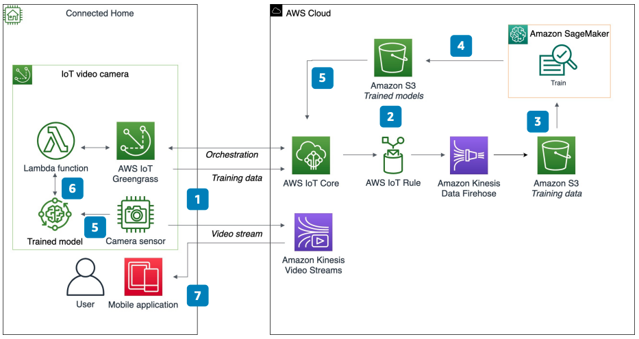

# Connected Home: Machine Learning at the Edge

Publication date: **July 13, 2021 ([Diagram history](#home-ml-history "#home-ml-history"))**

With this architecture, you can run machine learning (ML) inference on Internet of Things
(IoT) video cameras and
other home devices. The solution uses [AWS IoT Greengrass](../../../greengrass/v2/developerguide.md "../../../greengrass/v2/developerguide.md") for edge deployments and
[Amazon SageMaker AI](../../../sagemaker/latest/dg.md "../../../sagemaker/latest/dg.md") for model training and
optimization.

## Connected home ML at the edge diagram

The following steps describe the architecture:

1. Publish training data from an IoT video camera running AWS IoT Greengrass to
   [AWS IoT Core](../../../iot/latest/developerguide.md "../../../iot/latest/developerguide.md").
2. Configure an AWS IoT rule that listens for camera data and forwards messages to
   Amazon Data Firehose for storage in [Amazon Simple Storage Service](../../../AmazonS3/latest/userguide.md "../../../AmazonS3/latest/userguide.md").
3. Use SageMaker AI to train, optimize, and build ML models that use less than a tenth of the
   memory footprint found in resource-constrained devices like cameras.
4. Output trained models from SageMaker AI to Amazon S3 for delivery to the IoT video camera.
5. Use the AWS IoT Greengrass cloud service to orchestrate deployments to the target
   IoT video camera. Deployments can include trained ML models and application logic, such as
   a [AWS Lambda](../../../lambda/latest/dg.md "../../../lambda/latest/dg.md") function or
   Docker container.
6. Run a Lambda function locally on the IoT video camera to perform inference by using the
   latest version of the trained ML model.
7. View the camera's video stream through Amazon Kinesis Video Streams by using a mobile
   application.

## Further reading

For additional information, see the following resources:

- [AWS Architecture Icons](https://aws.amazon.com/architecture/icons "https://aws.amazon.com/architecture/icons")
- [AWS Architecture Center](https://aws.amazon.com/architecture/ "https://aws.amazon.com/architecture/")
- [AWS
  Well-Architected](https://aws.amazon.com/architecture/well-architected "https://aws.amazon.com/architecture/well-architected")

## Diagram history

To receive updates about this reference architecture diagram, subscribe to the RSS
feed.

| Change              | Description                                     | Date          |
| ------------------- | ----------------------------------------------- | ------------- |
| Initial publication | Reference architecture diagram first published. | July 13, 2021 |

###### RSS subscription requirement

To subscribe to RSS updates, you must have an RSS plugin enabled for the browser you are
using.
