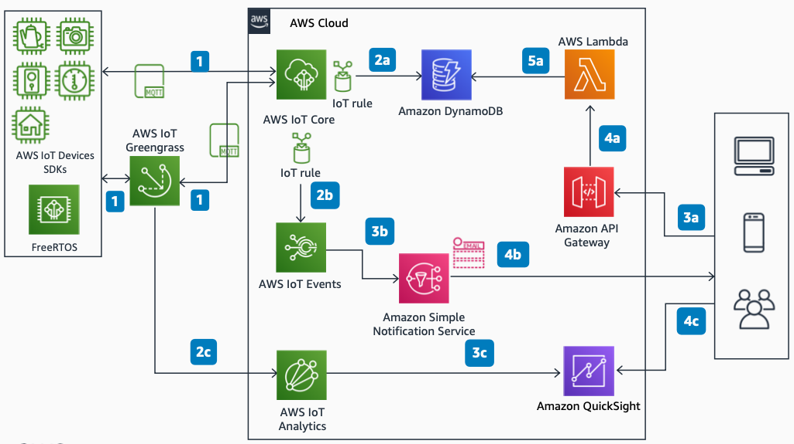

# Connected Home Telemetry on AWS

Publication date: **March 22, 2021 ([Diagram history](#diagram-history "#diagram-history"))**

This reference architecture diagram shows how to measure and collect data from smart home devices by using AWS.

## Connected Home Telemetry on AWS

1. The devices connect to [AWS IoT Core](../../../iot/latest/developerguide/what-is-aws-iot.md "../../../iot/latest/developerguide/what-is-aws-iot.md") directly by using MQTT from FreeRTOS or through AWS IoT Greengrass.
2. AWS IoT Core topic rules route data to downstream services:

   - **2a.** A topic rule picks up meaningful data and saves it in [Amazon DynamoDB](../../../amazondynamodb/latest/developerguide/Introduction.md "../../../amazondynamodb/latest/developerguide/Introduction.md").
   - **2b.** Another topic rule triggers AWS IoT Events for certain data, like temperature.
   - **2c.** AWS IoT Analytics can ingest data directly from AWS IoT Greengrass.

3. Client applications can retrieve and visualize data:

   - **3a.** Client applications can make an API call to retrieve data through Amazon API Gateway.
   - **3b.** AWS IoT Events can trigger [Amazon Simple Notification Service](../../../sns/latest/dg/welcome.md "../../../sns/latest/dg/welcome.md") actions in case certain changes occur in the data (for example, temperature exceeds 25 degrees).
   - **3c.** You can import data from AWS IoT Analytics into [Amazon Quick Sight](../../../quicksight/latest/user/welcome.md "../../../quicksight/latest/user/welcome.md") for visualization and further insights.

4. Notifications and data retrieval:

   - **4a.** [Amazon API Gateway](../../../apigateway/latest/developerguide/welcome.md "../../../apigateway/latest/developerguide/welcome.md") invokes an [AWS Lambda](../../../lambda/latest/dg/welcome.md "../../../lambda/latest/dg/welcome.md") function with logic to retrieve data requested by the client applications from DynamoDB.

5. Visualization and alerts:

   - **5a.** Client applications can visualize the data in Amazon Quick Sight.

## Further reading

For additional information, refer to

- [AWS Architecture Icons](https://aws.amazon.com/architecture/icons "https://aws.amazon.com/architecture/icons")
- [AWS Architecture Center](https://aws.amazon.com/architecture "https://aws.amazon.com/architecture")
- [AWS Well-Architected](https://aws.amazon.com/architecture/well-architected "https://aws.amazon.com/architecture/well-architected")
- [AWS IoT product page](https://aws.amazon.com/iot/ "https://aws.amazon.com/iot/")

## Diagram history

To be notified about updates to this reference architecture diagram, subscribe to the RSS feed.

| Change              | Description                                     | Date           |
| ------------------- | ----------------------------------------------- | -------------- |
| Initial publication | Reference architecture diagram first published. | March 22, 2021 |

###### Note

To subscribe to RSS updates, you must have an RSS plugin enabled for the browser you are using.
