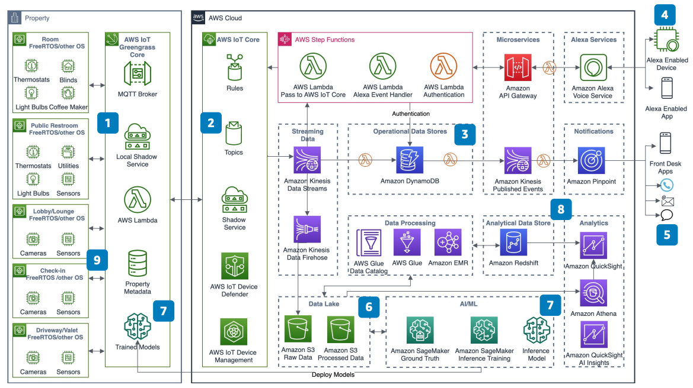

# Connected Lodging Properties Using IoT and AI/ML

Publication date: **August 28, 2020 ([Diagram history](#conlodge-history "#conlodge-history"))**

With this architecture, you can build smart, connected lodging properties. Use IoT and
artificial intelligence/machine learning (AI/ML) to provide touchless room personalization. The
solution monitors queue depths, tracks foot and vehicle traffic, and maintains sanitation
compliance. It uses [AWS IoT Greengrass](../../../greengrass/v2/developerguide.md "../../../greengrass/v2/developerguide.md") at the edge and [Amazon SageMaker AI](../../../sagemaker/latest/dg.md "../../../sagemaker/latest/dg.md") for inference
models.

## Connected lodging properties diagram

The following steps describe the architecture:

1. Use [AWS IoT Greengrass](../../../greengrass/v2/developerguide.md "../../../greengrass/v2/developerguide.md") Core to connect, publish, and
   subscribe to data. Communicate by using the Message Queuing Telemetry Transport (MQTT)
   protocol with IoT devices that run on FreeRTOS.
2. Use [AWS IoT Core](../../../iot/latest/developerguide.md "../../../iot/latest/developerguide.md") to maintain device shadows for all
   IoT devices. Connect to the AWS Cloud, manage devices, update over-the-air (OTA), and
   secure the devices.
3. Use purpose-built databases such as [Amazon DynamoDB](../../../amazondynamodb/latest/developerguide.md "../../../amazondynamodb/latest/developerguide.md") and serverless
   architecture. Store events, deliver microservices, and generate events for an operational
   data store.
4. Use Alexa Voice Service to personalize guest rooms with voice-enabled
   controls.
5. Use [Amazon Pinpoint](../../../pinpoint/latest/userguide.md "../../../pinpoint/latest/userguide.md") to deliver alerts to multiple
   channels. Send notifications for operational events and property management.
6. Build a data lake to store raw data and create curated datasets in [Amazon Simple Storage Service](../../../AmazonS3/latest/userguide.md "../../../AmazonS3/latest/userguide.md"). Use [AWS Glue](../../../glue/latest/dg.md "../../../glue/latest/dg.md") and [Amazon EMR](../../../emr/latest/ManagementGuide.md "../../../emr/latest/ManagementGuide.md") for data
   processing.
7. Use SageMaker AI to build, train, and deploy inference models. (Optional) Deploy edge models
   on AWS IoT Greengrass Core.
8. Use [Amazon Redshift](../../../redshift/latest/mgmt.md "../../../redshift/latest/mgmt.md"), [Amazon Athena](../../../athena/latest/ug.md "../../../athena/latest/ug.md"), and [Amazon Quick Sight](../../../quicksight/latest/developerguide/welcome.md "../../../quicksight/latest/developerguide/welcome.md") for analytics.
   (Optional) Build data marts in Amazon Redshift for heavily used analytics.
9. Use social distancing and queue depth management solutions for compliance and enhanced
   guest experience.

## Further reading

For additional information, see the following resources:

- [AWS Architecture Icons](https://aws.amazon.com/architecture/icons "https://aws.amazon.com/architecture/icons")
- [AWS Architecture Center](https://aws.amazon.com/architecture/ "https://aws.amazon.com/architecture/")
- [AWS
  Well-Architected](https://aws.amazon.com/architecture/well-architected "https://aws.amazon.com/architecture/well-architected")

## Diagram history

To receive updates about this reference architecture diagram, subscribe to the RSS
feed.

| Change              | Description                                     | Date            |
| ------------------- | ----------------------------------------------- | --------------- |
| Initial publication | Reference architecture diagram first published. | August 28, 2020 |

###### RSS subscription requirement

To subscribe to RSS updates, you must have an RSS plugin enabled for the browser you are
using.
