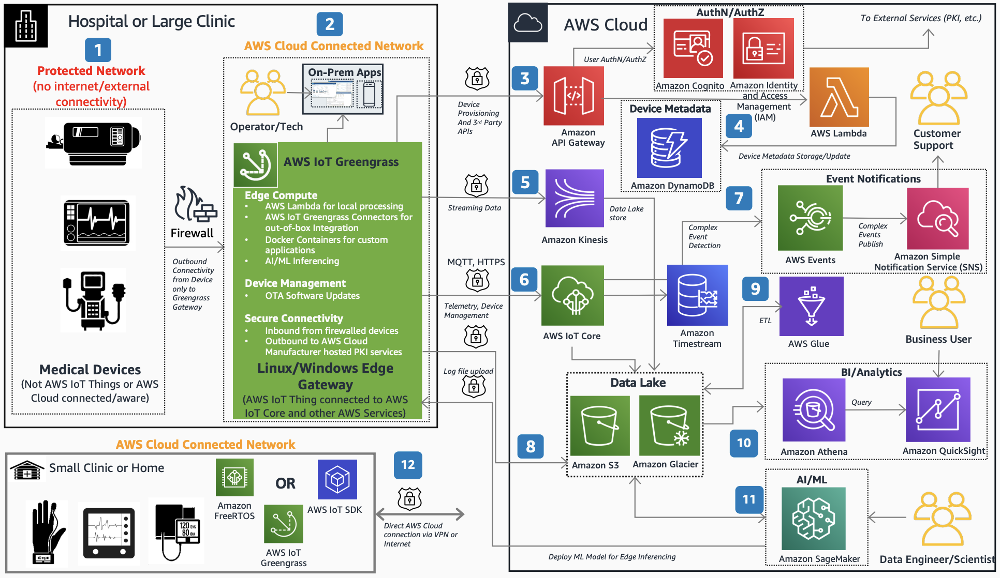

# Connected Medical Devices with AWS IoT

Publication date: **November 10, 2020 ([Diagram history](#med-devices-history "#med-devices-history"))**

With this architecture, you can manage manufacturer medical devices deployed in hospitals,
clinics, and homes. The solution uses [AWS IoT Greengrass](../../../greengrass/v2/developerguide.md "../../../greengrass/v2/developerguide.md") for
edge compute, device management, and secure connectivity. [AWS IoT Core](../../../iot/latest/developerguide.md "../../../iot/latest/developerguide.md") handles cloud-based telemetry and
device provisioning.

## Connected medical devices diagram

The following steps describe the data flow and device management for this
architecture:

1. Deploy medical devices in a hospital or clinic network without internet connectivity.
   Allow only outbound communication to an edge gateway running AWS IoT Greengrass.
2. Use the edge gateway to proxy one or more medical devices. Run local on-premises
   applications for operators and technicians for command and control. Create only AWS IoT Greengrass
   cores as Things in AWS IoT Core. Store metadata for medical devices in
   [Amazon DynamoDB](../../../amazondynamodb/latest/developerguide.md "../../../amazondynamodb/latest/developerguide.md").
3. Use [Amazon API Gateway](../../../apigateway/latest/developerguide.md "../../../apigateway/latest/developerguide.md") as the single secure endpoint
   invoked from AWS IoT Greengrass for all API calls. APIs include device provisioning and
   access to AWS services and third-party endpoints.
4. Send streaming video from medical devices to [Amazon Kinesis](../../../kinesis/latest/dev.md "../../../kinesis/latest/dev.md") in the AWS Cloud.
   Persist video in the [Amazon Simple Storage Service](../../../AmazonS3/latest/userguide.md "../../../AmazonS3/latest/userguide.md") data lake. Implement data and video
   insights by linking with device metadata in DynamoDB.
5. Send telemetry data from devices through AWS IoT Greengrass to AWS IoT Core by
   using Message Queuing Telemetry Transport (MQTT). Store telemetry in [Amazon
   Timestream](../../../timestream/latest/developerguide.md "../../../timestream/latest/developerguide.md") for historical analytics.
6. Upload data files generated from medical procedures directly to Amazon S3. Link files with
   device metadata in DynamoDB.
7. Use [AWS Glue](../../../glue/latest/dg.md "../../../glue/latest/dg.md") for extract,
   transform, and load (ETL) processing. Query data with [Athena](../../../athena/latest/ug.md "../../../athena/latest/ug.md") and visualize insights
   with [Amazon Quick Sight](../../../quicksight/latest/developerguide/welcome.md "../../../quicksight/latest/developerguide/welcome.md").
8. Use [Amazon SageMaker AI](../../../sagemaker/latest/dg.md "../../../sagemaker/latest/dg.md") to train
   machine learning (ML) models and deploy them to the edge for inferencing on
   AWS IoT Greengrass.
9. Detect complex events by using [AWS IoT Events](../../../iotevents/latest/developerguide.md "../../../iotevents/latest/developerguide.md"). Publish event
   notifications through
   [Amazon Simple Notification Service](../../../sns/latest/dg.md "../../../sns/latest/dg.md").
10. Use [Amazon Cognito](../../../cognito/latest/developerguide.md "../../../cognito/latest/developerguide.md") for user authentication and
    authorization.

## Further reading

For additional information, see the following resources:

- [AWS Architecture Icons](https://aws.amazon.com/architecture/icons "https://aws.amazon.com/architecture/icons")
- [AWS Architecture Center](https://aws.amazon.com/architecture/ "https://aws.amazon.com/architecture/")
- [AWS
  Well-Architected](https://aws.amazon.com/architecture/well-architected "https://aws.amazon.com/architecture/well-architected")

## Diagram history

To receive updates about this reference architecture diagram, subscribe to the RSS
feed.

| Change              | Description                                     | Date              |
| ------------------- | ----------------------------------------------- | ----------------- |
| Initial publication | Reference architecture diagram first published. | November 10, 2020 |

###### RSS subscription requirement

To subscribe to RSS updates, you must have an RSS plugin enabled for the browser you are
using.
