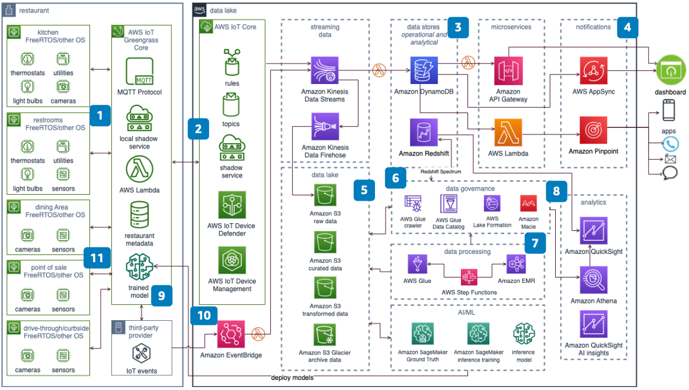

# Connected Restaurants using IoT and AI/ML

Publication date: **December 21, 2022 ([Diagram history](#conrest-history "#conrest-history"))**

With this architecture, you can build smart, connected restaurants. Use IoT and artificial
intelligence/machine learning (AI/ML) to maintain food quality and safety. Preserve cold
storage, manage queues, and monitor foot and vehicle traffic. The solution uses [AWS IoT Greengrass](../../../greengrass/v2/developerguide.md "../../../greengrass/v2/developerguide.md") to maintain cost
efficiency and improve operability.

## Connected restaurants diagram

The following steps describe the architecture:

1. Use [AWS IoT Greengrass](../../../greengrass/v2/developerguide.md "../../../greengrass/v2/developerguide.md") Core to connect, publish, and
   subscribe to data. Communicate by using the Message Queuing Telemetry Transport
   (MQTT) protocol with IoT devices that run on FreeRTOS and
   other operating systems.
2. Use [AWS IoT Core](../../../iot/latest/developerguide.md "../../../iot/latest/developerguide.md") to maintain device shadows for all
   IoT devices. Connect to the AWS Cloud, manage devices, update over-the-air (OTA), and
   secure the devices.
3. Use purpose-built databases such as [Amazon DynamoDB](../../../amazondynamodb/latest/developerguide.md "../../../amazondynamodb/latest/developerguide.md") and serverless
   architecture. Store events, deliver microservices, and generate events for the
   operational data store.
4. Build a near real-time operational dashboard by using microservices and [AWS AppSync](../../../appsync/latest/devguide.md "../../../appsync/latest/devguide.md").
5. Use [Amazon Pinpoint](../../../pinpoint/latest/userguide.md "../../../pinpoint/latest/userguide.md") to deliver alerts to multiple
   channels.
6. Build a data lake to store raw data and create curated datasets in [Amazon Simple Storage Service](../../../AmazonS3/latest/userguide.md "../../../AmazonS3/latest/userguide.md"). Use [AWS Glue](../../../glue/latest/dg.md "../../../glue/latest/dg.md") and [Amazon EMR](../../../emr/latest/ManagementGuide.md "../../../emr/latest/ManagementGuide.md") for data
   processing.
7. Discover and govern data in Amazon S3 by using AWS Glue crawlers, the AWS Glue Data Catalog,
   and [AWS Lake Formation](../../../lake-formation/latest/dg.md "../../../lake-formation/latest/dg.md"). Deploy
   [Amazon Macie](../../../macie/latest/user.md "../../../macie/latest/user.md") to detect
   sensitive data.
8. Use AWS Glue jobs and Amazon EMR to transform or enrich the data.
9. Use [Amazon Redshift](../../../redshift/latest/mgmt.md "../../../redshift/latest/mgmt.md"), [Amazon Athena](../../../athena/latest/ug.md "../../../athena/latest/ug.md"), and [Amazon Quick Sight](../../../quick/latest/userguide/what-is.md "../../../quick/latest/userguide/what-is.md") for analytics.
   (Optional) Build data marts in Amazon Redshift for heavily used analytics. For one-time needs, use
   Athena or Amazon Redshift Spectrum for direct analysis on the data lake.
10. Use [Amazon SageMaker AI](../../../sagemaker/latest/dg.md "../../../sagemaker/latest/dg.md") to
    build, train, and deploy inference models. (Optional) Deploy edge models on AWS IoT Greengrass Core.
    Use the Facilitate Social Distancing and Queue Depth Management solutions for compliance and enhanced customer
    experience.
11. Use [Amazon EventBridge](../../../eventbridge/latest/userguide.md "../../../eventbridge/latest/userguide.md") to integrate with third-party
    providers.

## Further reading

For additional information, see the following resources:

- [AWS Architecture Icons](https://aws.amazon.com/architecture/icons "https://aws.amazon.com/architecture/icons")
- [AWS Architecture Center](https://aws.amazon.com/architecture/ "https://aws.amazon.com/architecture/")
- [AWS
  Well-Architected](https://aws.amazon.com/architecture/well-architected "https://aws.amazon.com/architecture/well-architected")

## Diagram history

To receive updates about this reference architecture diagram, subscribe to the RSS
feed.

| Change              | Description                                     | Date              |
| ------------------- | ----------------------------------------------- | ----------------- |
| Initial publication | Reference architecture diagram first published. | December 21, 2022 |

###### RSS subscription requirement

To subscribe to RSS updates, you must have an RSS plugin enabled for the browser you
are using.
