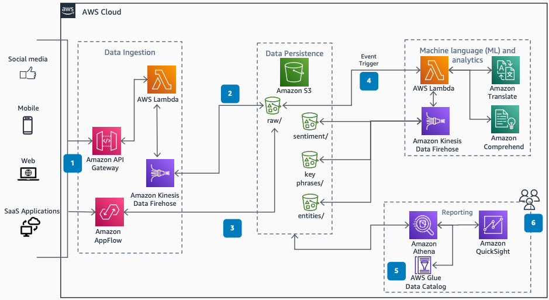

# Consumer Review Sentiment Analysis for CPG

Publication date: **May 13, 2021 ([Diagram history](#sentiment-history "#sentiment-history"))**

With this architecture, you can gain insights from consumer reviews in near real time.
Consumer packaged goods (CPG) companies use review data to understand consumption-related
decisions and proactively address issues. You use [Amazon Comprehend](../../../comprehend/latest/dg.md "../../../comprehend/latest/dg.md") for natural language processing (NLP)
sentiment analysis, [Amazon Translate](../../../translate/latest/dg.md "../../../translate/latest/dg.md") for translation, and a serverless event-driven
architecture.

For more information about this approach, see [Detect
sentiment from customer reviews using Amazon Comprehend](https://aws.amazon.com/blogs/machine-learning/detect-sentiment-from-customer-reviews-using-amazon-comprehend/ "https://aws.amazon.com/blogs/machine-learning/detect-sentiment-from-customer-reviews-using-amazon-comprehend/") on the AWS Machine Learning
Blog.

## Sentiment analysis diagram

The following steps describe the architecture:

1. Review data flows into AWS through the ingestion pipeline from multiple sources
   such as ecommerce sites, product websites, and social media webhooks.
2. An Amazon Data Firehose delivery stream loads the reviews into an [Amazon Simple Storage Service](../../../AmazonS3/latest/userguide.md "../../../AmazonS3/latest/userguide.md") bucket.
3. [Amazon AppFlow](../../../appflow/latest/userguide.md "../../../appflow/latest/userguide.md") ingests data from
   software-as-a-service (SaaS) applications such as Salesforce,
   Marketo, Slack, and ServiceNow into
   Amazon S3.
4. An Amazon S3 event invokes an [AWS Lambda](../../../lambda/latest/dg.md "../../../lambda/latest/dg.md") function to analyze raw reviews. Use Amazon Translate
   to translate reviews into a base language if necessary. Use Amazon Comprehend for NLP to perform
   sentiment analysis, key-phrase extraction, and entity extraction.
5. The [AWS Glue](../../../glue/latest/dg.md "../../../glue/latest/dg.md") Data Catalog
   contains a logical database that organizes tables for the data in Amazon S3.
6. [Amazon Athena](../../../athena/latest/ug.md "../../../athena/latest/ug.md") uses these
   table definitions to query data in Amazon S3. Results display in an [Amazon Quick Sight](../../../quicksight/latest/developerguide/welcome.md "../../../quicksight/latest/developerguide/welcome.md") dashboard.

## Further reading

For additional information, see the following resources:

- [AWS Architecture Icons](https://aws.amazon.com/architecture/icons "https://aws.amazon.com/architecture/icons")
- [AWS Architecture Center](https://aws.amazon.com/architecture/ "https://aws.amazon.com/architecture/")
- [AWS Well-Architected](https://aws.amazon.com/architecture/well-architected "https://aws.amazon.com/architecture/well-architected")

## Diagram history

To receive updates about this reference architecture diagram, subscribe to the RSS
feed.

| Change              | Description                                     | Date         |
| ------------------- | ----------------------------------------------- | ------------ |
| Initial publication | Reference architecture diagram first published. | May 13, 2021 |

###### RSS subscription requirement

To subscribe to RSS updates, you must have an RSS plugin enabled for the browser you
are using.
