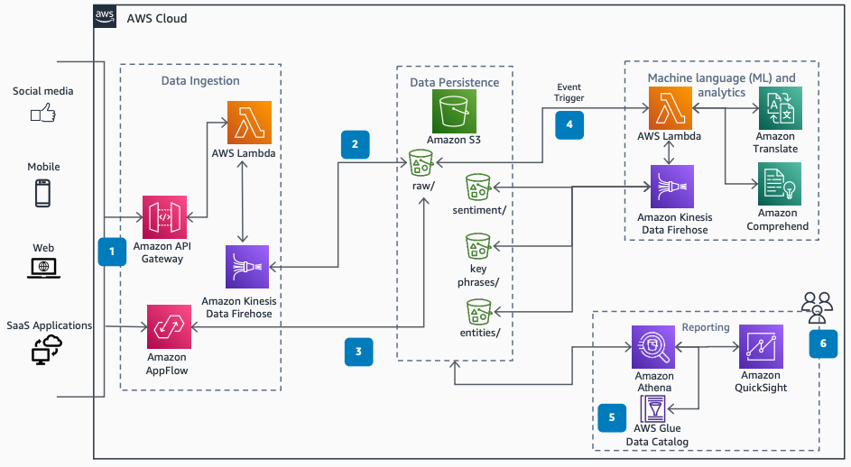

# Consumer Review Sentiment Analysis for CPG

Publication date: **May 13, 2021 ([Diagram history](#diagram-history "#diagram-history"))**

This architecture shows how to gain insights from consumer reviews in near real time. With a serverless event-driven architecture, consumer packaged goods (CPG) companies can analyze sentiment, extract key phrases, and identify entities from reviews across multiple sources.

## Consumer Review Sentiment Analysis for CPG

The following steps describe the architecture:

1. Review data is ingested into AWS through the ingestion pipeline from multiple sources such as e-commerce, product websites, and social media webhooks.
2. An [Amazon Kinesis Data Firehose](../../../firehose/latest/dev/what-is-this-service.md "../../../firehose/latest/dev/what-is-this-service.md") delivery stream loads the reviews into an [Amazon Simple Storage Service](../../../AmazonS3/latest/userguide/Welcome.md "../../../AmazonS3/latest/userguide/Welcome.md") bucket.
3. [Amazon AppFlow](../../../appflow/latest/userguide/what-is-appflow.md "../../../appflow/latest/userguide/what-is-appflow.md") securely ingests data from SaaS applications (like Salesforce, Marketo, Slack, and ServiceNow) into Amazon S3.
4. An Amazon S3 event invokes an [AWS Lambda](../../../lambda/latest/dg/welcome.md "../../../lambda/latest/dg/welcome.md") function to analyze the raw reviews. The function uses [Amazon Translate](../../../translate/latest/dg/what-is.md "../../../translate/latest/dg/what-is.md") for language translation and [Amazon Comprehend](../../../comprehend/latest/dg/what-is.md "../../../comprehend/latest/dg/what-is.md") for sentiment analysis, key-phrase extraction, and entity extraction.
5. The [AWS Glue](../../../glue/latest/dg/what-is-glue.md "../../../glue/latest/dg/what-is-glue.md") Data Catalog contains a logical database that organizes tables for the data in Amazon S3.
6. [Amazon Athena](../../../athena/latest/ug/what-is.md "../../../athena/latest/ug/what-is.md") uses these table definitions to query the data stored in Amazon S3 and return the information to an [Amazon Quick Sight](../../../quicksight/latest/user/welcome.md "../../../quicksight/latest/user/welcome.md") dashboard.

## Further reading

For additional information, refer to the following resources:

- [AWS Architecture Icons](https://aws.amazon.com/architecture/icons "https://aws.amazon.com/architecture/icons")
- [AWS Architecture Center](https://aws.amazon.com/architecture "https://aws.amazon.com/architecture")
- [AWS Well-Architected](https://aws.amazon.com/architecture/well-architected "https://aws.amazon.com/architecture/well-architected")
- [Detect sentiment from customer reviews using Amazon Comprehend (blog post)](https://aws.amazon.com/blogs/machine-learning/detect-sentiment-from-customer-reviews-using-amazon-comprehend/ "https://aws.amazon.com/blogs/machine-learning/detect-sentiment-from-customer-reviews-using-amazon-comprehend/")
- [Amazon Comprehend product page](https://aws.amazon.com/comprehend/ "https://aws.amazon.com/comprehend/")

## Diagram history

To be notified about updates to this reference architecture diagram, subscribe to the RSS feed.

| Change              | Description                                     | Date         |
| ------------------- | ----------------------------------------------- | ------------ |
| Initial publication | Reference architecture diagram first published. | May 13, 2021 |

###### Note

To subscribe to RSS updates, you must have an RSS plugin enabled for the browser you are using.
