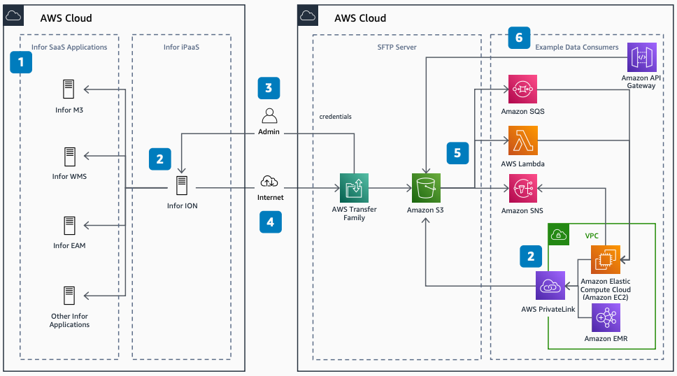

# Consuming Data from InforOS over SFTP

Publication date: **March 20, 2021 ([Diagram history](#cdi-diagram-history "#cdi-diagram-history"))**

With this architecture, you can integrate your applications with
[Infor CloudSuite](https://www.infor.com/products/cloud-strategy "https://www.infor.com/products/cloud-strategy")
by using bulk data transfer over Secure File Transfer Protocol (SFTP). You use [AWS Transfer Family](../../../transfer/latest/userguide.md "../../../transfer/latest/userguide.md") as the managed SFTP
server, with [Amazon Simple Storage Service](../../../AmazonS3/latest/userguide.md "../../../AmazonS3/latest/userguide.md")
(Amazon S3) for storage.

## Consuming data from InforOS architecture diagram

The following steps describe the architecture:

1. Infor CloudSuite applications produce data. These applications
   include Infor M3, Infor WMS, Infor EAM,
   and others.
2. [Infor ION](https://www.infor.com/products/ion "https://www.infor.com/products/ion")
   acts as an SFTP client, polling the SFTP server for new data.
3. An administrator creates an SFTP user in Transfer Family and passes credentials to
   Infor ION.
4. Files moving over SFTP can be BOD/XML, delimiter-separated, JSON, or
   schema-free formats.
5. Amazon S3 event notifications send data to [Amazon Simple Queue Service](../../../AWSSimpleQueueService/latest/SQSDeveloperGuide.md "../../../AWSSimpleQueueService/latest/SQSDeveloperGuide.md") (Amazon SQS),
   [AWS Lambda](../../../lambda/latest/dg.md "../../../lambda/latest/dg.md"), or [Amazon Simple Notification Service](../../../sns/latest/dg.md "../../../sns/latest/dg.md") (Amazon SNS) when new objects
   are written.
6. Example consumers read data from Amazon S3. These include [Amazon API Gateway](../../../apigateway/latest/developerguide.md "../../../apigateway/latest/developerguide.md"), [Amazon EMR](../../../emr/latest/ManagementGuide.md "../../../emr/latest/ManagementGuide.md"), and [Amazon Elastic Compute Cloud](../../../AWSEC2/latest/UserGuide.md "../../../AWSEC2/latest/UserGuide.md") through AWS PrivateLink.

## Further reading

For additional information, see the following resources:

- [AWS Architecture Icons](https://aws.amazon.com/architecture/icons "https://aws.amazon.com/architecture/icons")
- [AWS Architecture Center](https://aws.amazon.com/architecture "https://aws.amazon.com/architecture")
- [AWS Well-Architected](https://aws.amazon.com/architecture/well-architected "https://aws.amazon.com/architecture/well-architected")
- [Producing Data to InforOS over SFTP](../producing-data-to-inforos/producing-data-to-inforos.md "../producing-data-to-inforos/producing-data-to-inforos.md")

## Diagram history

To be notified about updates to this reference architecture diagram, subscribe to the RSS feed.

| Change              | Description                                     | Date           |
| ------------------- | ----------------------------------------------- | -------------- |
| Initial publication | Reference architecture diagram first published. | March 20, 2021 |

###### RSS subscription

To subscribe to RSS updates, you must have an RSS plugin enabled for the browser that you are using.
