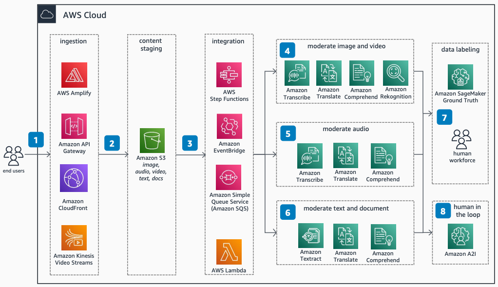

# Content Moderation and Compliance Using AWS AI Services

Publication date: **October 28, 2022 ([Diagram history](#diagram-history "#diagram-history"))**

This architecture shows how to build customizable serverless workflows for reliable and scalable AI-based content moderation. With AWS AI services, you can automate content analysis across multiple media types.

## Content Moderation and Compliance Using AWS AI Services

The following steps describe the architecture:

1. End users upload their content into the AWS Cloud.
2. [Amazon Transcribe](../../../transcribe/latest/dg/what-is.md "../../../transcribe/latest/dg/what-is.md") and [Amazon Rekognition](../../../rekognition/latest/dg/what-is.md "../../../rekognition/latest/dg/what-is.md") process the audio streams within video streams. They extract content moderation categories by using simple APIs.
3. Workflows, publisher/subscription patterns, and custom code moderate the content.
4. Content securely persists into an [Amazon Simple Storage Service](../../../AmazonS3/latest/userguide/Welcome.md "../../../AmazonS3/latest/userguide/Welcome.md") bucket or another data store.
5. Amazon Transcribe converts audio into text. [Amazon Comprehend](../../../comprehend/latest/dg/what-is.md "../../../comprehend/latest/dg/what-is.md") provides natural language processing (NLP) for analysis.
6. [Amazon Textract](../../../textract/latest/dg/what-is.md "../../../textract/latest/dg/what-is.md") extracts content from documents. Amazon Comprehend NLP moderates the extracted content.
7. [Amazon SageMaker AI](../../../sagemaker/latest/dg/whatis.md "../../../sagemaker/latest/dg/whatis.md") Ground Truth integrates human workforces to customize model vocabularies and image labels.
8. [Amazon Augmented AI (Amazon A2I)](../../../sagemaker/latest/dg/a2i-use-augmented-ai-a2i-human-review-loops.md "../../../sagemaker/latest/dg/a2i-use-augmented-ai-a2i-human-review-loops.md") brings humans into the loop for scenarios that are not fully automatable.

## Further reading

For additional information, refer to the following resources:

- [AWS Architecture Icons](https://aws.amazon.com/architecture/icons "https://aws.amazon.com/architecture/icons")
- [AWS Architecture Center](https://aws.amazon.com/architecture "https://aws.amazon.com/architecture")
- [AWS Well-Architected](https://aws.amazon.com/architecture/well-architected "https://aws.amazon.com/architecture/well-architected")
- [Amazon Rekognition product page](https://aws.amazon.com/rekognition/ "https://aws.amazon.com/rekognition/")

## Diagram history

To be notified about updates to this reference architecture diagram, subscribe to the RSS feed.

| Change              | Description                                     | Date             |
| ------------------- | ----------------------------------------------- | ---------------- |
| Initial publication | Reference architecture diagram first published. | October 28, 2022 |

###### Note

To subscribe to RSS updates, you must have an RSS plugin enabled for the browser you are using.
