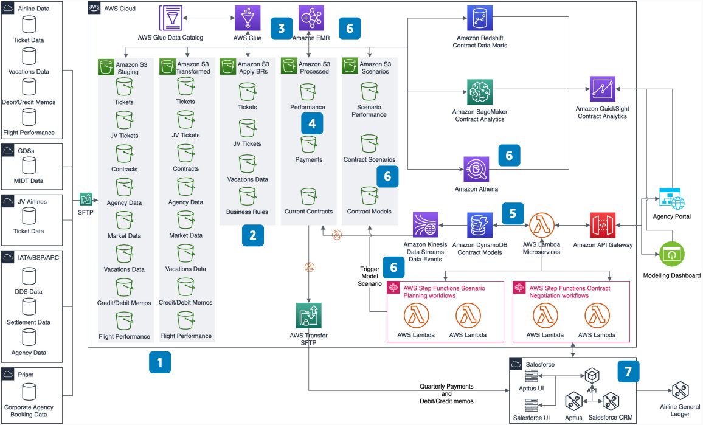

# Contract Lifecycle Management and Modeling

Publication date: **March 10, 2021 ([Diagram history](#contract-lifecycle-management-history "#contract-lifecycle-management-history"))**

With this architecture, you can improve contract lifecycle management and facilitate
contract modeling. You can access current and historical transactions, competitive market data, agency
data, and contract data in one place. You combine these data sources
with analytics tools and elastic compute.

If your airline sales team manages agency and corporate contracts, you might rely on
manual processes and spreadsheets today. This workflow models contracts with scenario analysis and
automates the negotiation process. It aggregates required data and uses elastic compute
during the contract negotiation period.

This architecture uses Amazon Simple Storage Service (Amazon S3), AWS Glue, and Amazon EMR for data storage and
processing. It also uses AWS Step Functions (Step Functions), Amazon DynamoDB (DynamoDB), and AWS Lambda (Lambda) to
build the contract modeling platform.

## Contract lifecycle management and modeling diagram

The following steps describe the architecture:

1. Use [Amazon S3](../../../AmazonS3/latest/userguide.md "../../../AmazonS3/latest/userguide.md")
   to create a data lake with all required data. Maintain raw, curated, and transformed
   data for processing efficiency.
2. Store transformed data separately by using business rules. This separation allows
   you to recompute results when business rules change.
3. Use [AWS Glue](../../../glue/latest/dg.md "../../../glue/latest/dg.md") and [Amazon EMR](../../../emr/latest/ManagementGuide.md "../../../emr/latest/ManagementGuide.md") for
   transformation, business rules application, and payment processing.
4. Process performance and payments periodically. Store the results in Amazon S3 for
   payment processing and performance reporting.
5. Build the contract modeling user interface with [DynamoDB](../../../amazondynamodb/latest/developerguide.md "../../../amazondynamodb/latest/developerguide.md"), [Lambda](../../../lambda/latest/dg.md "../../../lambda/latest/dg.md"), and [Step Functions](../../../step-functions/latest/dg.md "../../../step-functions/latest/dg.md").
6. Facilitate contract scenarios through Amazon EMR, Step Functions, Amazon S3, and [Amazon Athena (Athena)](../../../athena/latest/ug.md "../../../athena/latest/ug.md").
7. Manage contract negotiation and payment workflows through capabilities in the
   Apttus/Salesforce platform.

## Further reading

For additional information, see the following resources:

- [AWS Architecture Icons](https://aws.amazon.com/architecture/icons "https://aws.amazon.com/architecture/icons")
- [AWS Architecture Center](https://aws.amazon.com/architecture/ "https://aws.amazon.com/architecture/")
- [AWS Well-Architected](https://aws.amazon.com/architecture/well-architected "https://aws.amazon.com/architecture/well-architected")

## Diagram history

To receive updates about this reference architecture diagram, subscribe to the RSS
feed.

| Change              | Description                                     | Date           |
| ------------------- | ----------------------------------------------- | -------------- |
| Initial publication | Reference architecture diagram first published. | March 10, 2021 |

###### RSS subscription requirement

To subscribe to RSS updates, you must have an RSS plugin enabled for the browser you
are using.
