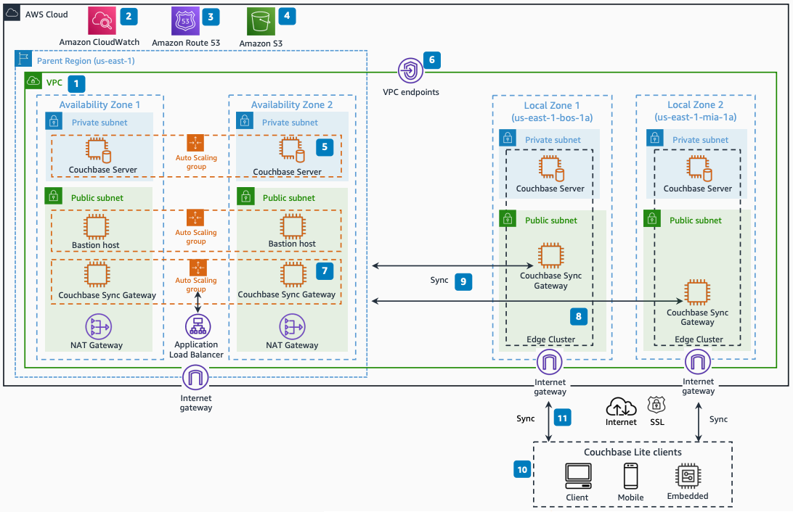

# Couchbase on AWS Local Zones for Low Latency Edge Use Case

Publication date: **December 25, 2021 ([Diagram history](#diagram-history "#diagram-history"))**

This architecture shows how to deploy Couchbase Server and Couchbase Sync Gateway on AWS Local Zones for a low latency edge use case. It extends [Amazon VPC](../../../vpc/latest/userguide/what-is-amazon-vpc.md "../../../vpc/latest/userguide/what-is-amazon-vpc.md") from the parent region into multiple AWS Local Zones.

## Couchbase on AWS Local Zones architecture

The following components describe this architecture:

1. Amazon VPC extends from the parent region into multiple AWS Local Zones.
2. Couchbase metrics and logs route to [Amazon CloudWatch](../../../AmazonCloudWatch/latest/monitoring/WhatIsCloudWatch.md "../../../AmazonCloudWatch/latest/monitoring/WhatIsCloudWatch.md") for centralized log management and alerts.
3. [Amazon Route 53](../../../Route53/latest/DeveloperGuide/Welcome.md "../../../Route53/latest/DeveloperGuide/Welcome.md") uses geolocation-based routing to route clients to the nearest AWS Local Zone or the parent Region.
4. Couchbase Server backups store directly to an [Amazon Simple Storage Service](../../../AmazonS3/latest/userguide/Welcome.md "../../../AmazonS3/latest/userguide/Welcome.md") bucket.
5. Couchbase Server multi-Availability Zone deployment provides high availability and automatic failover. Couchbase Server in the private subnet connects to the internet using NAT Gateway.
6. A bastion host in the public subnet provides access to Couchbase Server from an external network.
7. VPC endpoints enable private connections between VPC and AWS services without requiring access over the internet.
8. Couchbase Sync Gateway multi-Availability Zone deployment with Application Load Balancer provides high availability and automatic failover.
9. An edge cluster consisting of Couchbase Server and Couchbase Sync Gateway deploys on an AWS Local Zone.
10. Inter-Sync Gateway Replication between the Couchbase cluster in the parent region and the edge cluster in the AWS Local Zone uses private IP addresses within the VPC.
11. Couchbase Lite clients such as mobile, desktop, and embedded devices run an embedded NoSQL database and provide low latency data sync with the edge cluster Sync Gateway over the internet.

## Further reading

For additional information, see the following resources:

- [AWS Architecture Icons](https://aws.amazon.com/architecture/icons "https://aws.amazon.com/architecture/icons")
- [AWS Architecture Center](https://aws.amazon.com/architecture "https://aws.amazon.com/architecture")
- [AWS Well-Architected](https://aws.amazon.com/architecture/well-architected "https://aws.amazon.com/architecture/well-architected")

## Diagram history

To be notified about updates to this reference architecture diagram, subscribe to the RSS feed.

| Change              | Description                                     | Date              |
| ------------------- | ----------------------------------------------- | ----------------- |
| Initial publication | Reference architecture diagram first published. | December 25, 2021 |

###### Note

To subscribe to RSS updates, you must have an RSS plugin enabled for the browser you are using.
