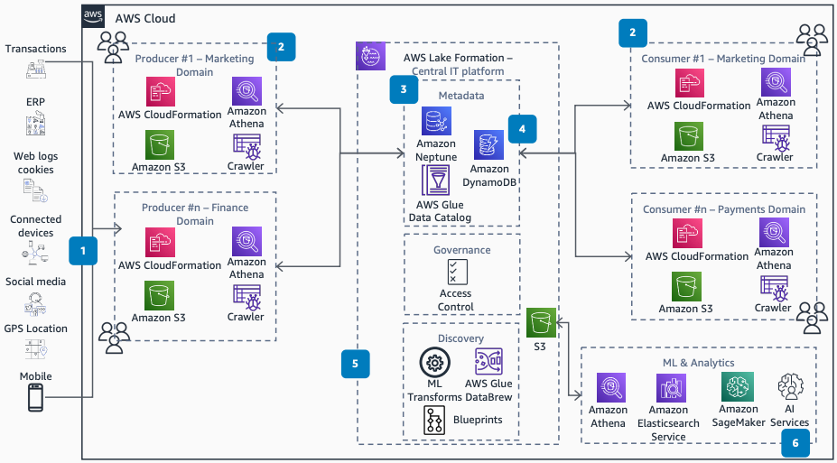

# Consumer Packaged Goods Data Mesh

Publication date: **May 11, 2021 ([Diagram history](#cpgmesh-history "#cpgmesh-history"))**

With this architecture, you can build a data mesh for consumer packaged goods (CPG)
companies. Growth in online sales increases the amount of data that business operations
generate and maintain. A data mesh follows principles of flexibility and domain-owned design
while maintaining data properties throughout the lifecycle. You use [AWS Lake Formation](../../../lake-formation/latest/dg.md "../../../lake-formation/latest/dg.md") for centralized governance and [AWS Glue](../../../glue/latest/dg.md "../../../glue/latest/dg.md") for data cataloging.

For more information about this architecture, see [How
to Create a Modern CPG Data Architecture with Data Mesh](https://aws.amazon.com/blogs/industries/how-to-create-a-modern-cpg-data-architecture-with-data-mesh/ "https://aws.amazon.com/blogs/industries/how-to-create-a-modern-cpg-data-architecture-with-data-mesh/") on the AWS Blog.

## CPG data mesh diagram

The following steps describe the architecture:

1. Data flows into AWS through batch processing, real-time streams, and Secure File
   Transfer Protocol (SFTP).
2. Data sources are managed by the business domain. Consumers and producers use
   organization-level blueprints that provide core services such as security, governance,
   IAM roles, and standards.
3. Manage metadata through multiple services. Use AWS Glue for data cataloging. Store data
   lineage in [Amazon Neptune](../../../neptune/latest/userguide.md "../../../neptune/latest/userguide.md"). Store data contracts in [Amazon DynamoDB](../../../amazondynamodb/latest/developerguide.md "../../../amazondynamodb/latest/developerguide.md").
4. Consumers search the data by using the contract properties.
5. Lake Formation provides centralized management of fine-grained permissions. It also supports
   automatic schema discovery and conversion to the required format.
6. Perform ML and analytics by using Lake Formation. This mesh node provides insights and
   strategy. Use [Amazon Athena](../../../athena/latest/ug.md "../../../athena/latest/ug.md"), [Amazon OpenSearch Service](../../../opensearch-service/latest/developerguide.md "../../../opensearch-service/latest/developerguide.md"), and [Amazon SageMaker AI](../../../sagemaker/latest/dg.md "../../../sagemaker/latest/dg.md") for analysis.

## Further reading

For additional information, see the following resources:

- [AWS Architecture Icons](https://aws.amazon.com/architecture/icons "https://aws.amazon.com/architecture/icons")
- [AWS Architecture Center](https://aws.amazon.com/architecture/ "https://aws.amazon.com/architecture/")
- [AWS Well-Architected](https://aws.amazon.com/architecture/well-architected "https://aws.amazon.com/architecture/well-architected")

## Diagram history

To receive updates about this reference architecture diagram, subscribe to the RSS
feed.

| Change              | Description                                     | Date         |
| ------------------- | ----------------------------------------------- | ------------ |
| Initial publication | Reference architecture diagram first published. | May 11, 2021 |

###### RSS subscription requirement

To subscribe to RSS updates, you must have an RSS plugin enabled for the browser you
are using.
