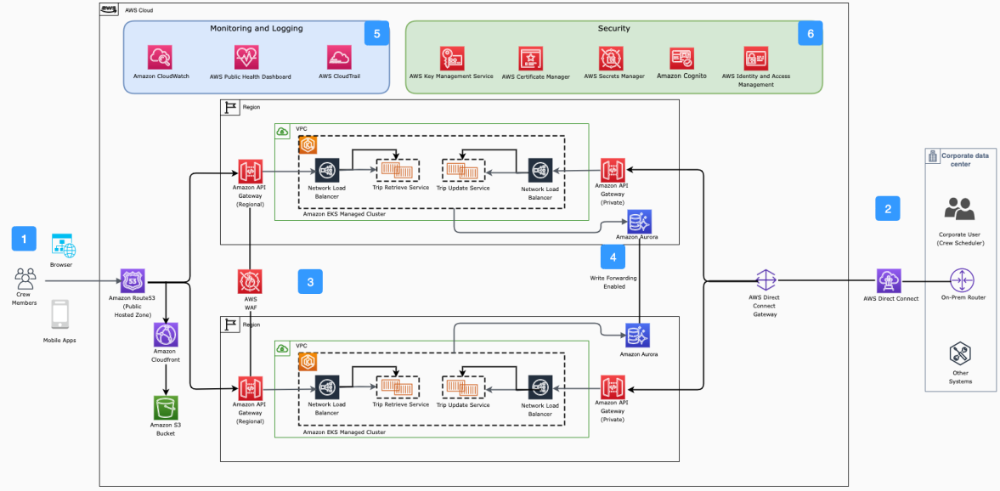

# Architecture of Crew Management System

Publication date: **November 29, 2021 ([Diagram history](#crew-arch-history "#crew-arch-history"))**

This architecture focuses on Trip Update and Retrieve services. You can use AWS to
create a highly available, secure, flexible, and cost-effective architecture for crew
management systems.

This architecture extends the [Architecture for Airline
Crew Management Systems](../crew-management-systems/crew-management-systems.md "../crew-management-systems/crew-management-systems.md"). It deploys across multiple Regions for high availability
and reduced latency.

## Crew management architecture diagram

The following steps describe the architecture:

1. Crew apps resolve domain names through [Route 53](../../../Route53/latest/DeveloperGuide.md "../../../Route53/latest/DeveloperGuide.md") to the nearest region and
   [CloudFront](../../../AmazonCloudFront/latest/DeveloperGuide.md "../../../AmazonCloudFront/latest/DeveloperGuide.md") distribution. A
   regional [API Gateway](../../../apigateway/latest/developerguide.md "../../../apigateway/latest/developerguide.md") provides access to read
   crew trip data. CloudFront serves static pages from [Amazon S3](../../../AmazonS3/latest/userguide.md "../../../AmazonS3/latest/userguide.md").
2. An [Amazon Aurora](../../../AmazonRDS/latest/AuroraUserGuide.md "../../../AmazonRDS/latest/AuroraUserGuide.md") Global Database
   provides high availability and low latency with Aurora Replicas. With read replica
   write forwarding, applications send writes to any Aurora Global Database
   replica.
3. Deploy the application in multiple Regions for high availability and reduced
   latency. Use [CloudFormation](../../../AWSCloudFormation/latest/UserGuide.md "../../../AWSCloudFormation/latest/UserGuide.md") for single-click
   deployment. Use a fully managed [Amazon EKS](../../../eks/latest/userguide.md "../../../eks/latest/userguide.md") cluster for Trip Update and Retrieve
   services. Network Load Balancer routes traffic to Amazon EKS services.
4. Connect corporate users and systems by using [AWS Direct Connect](../../../directconnect/latest/UserGuide.md "../../../directconnect/latest/UserGuide.md"). A private API Gateway
   provides access to crew schedulers for update and read operations.
5. Use [CloudWatch](../../../AmazonCloudWatch/latest/monitoring.md "../../../AmazonCloudWatch/latest/monitoring.md") and monitoring tools to optimize
   operational health.
6. Use AWS cloud security services for at-rest, end-to-end encryption.

## Further reading

For additional information, see the following resources:

- [AWS Architecture Icons](https://aws.amazon.com/architecture/icons "https://aws.amazon.com/architecture/icons")
- [AWS Architecture Center](https://aws.amazon.com/architecture/ "https://aws.amazon.com/architecture/")
- [AWS Well-Architected](https://aws.amazon.com/architecture/well-architected "https://aws.amazon.com/architecture/well-architected")

## Diagram history

To receive updates about this reference architecture diagram, subscribe to the RSS
feed.

| Change              | Description                                     | Date              |
| ------------------- | ----------------------------------------------- | ----------------- |
| Initial publication | Reference architecture diagram first published. | November 29, 2021 |

###### RSS subscription requirement

To subscribe to RSS updates, you must have an RSS plugin enabled for the browser you
are using.
