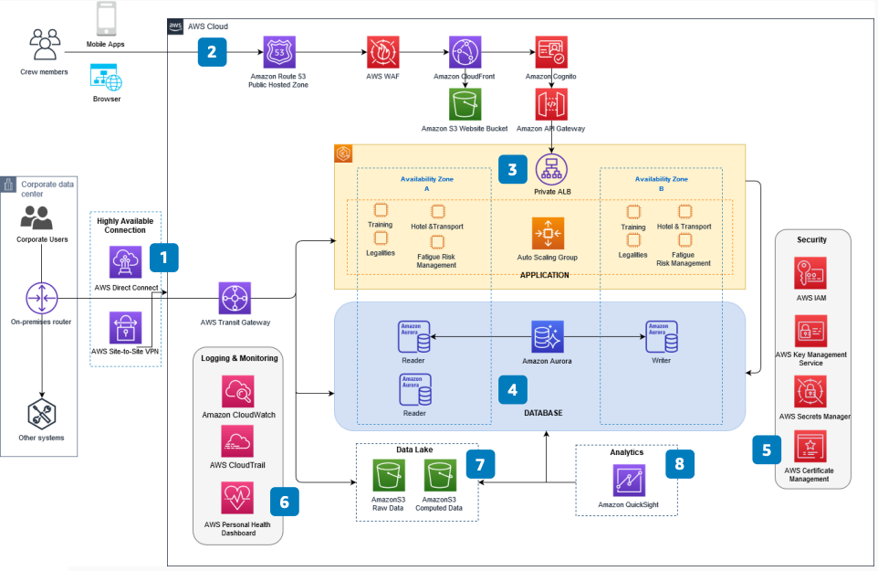

# Architecture for Airline Crew Management Systems

Publication date: **June 11, 2021 ([Diagram history](#crew-systems-history "#crew-systems-history"))**

You can use AWS to create a highly available, secure, flexible, and cost-effective
architecture for airline crew management systems. This architecture connects corporate
users to crew applications through multiple networking options.

This architecture uses [Amazon Elastic Kubernetes Service](../../../eks/latest/userguide.md "../../../eks/latest/userguide.md") for container orchestration. It stores
crew data in [Amazon Aurora](../../../AmazonRDS/latest/AuroraUserGuide.md "../../../AmazonRDS/latest/AuroraUserGuide.md") and provides business
intelligence through [Amazon Quick Sight](../../../quicksight/latest/user/welcome.md "../../../quicksight/latest/user/welcome.md").

## Airline crew management systems diagram

The following steps describe the architecture:

1. Connect corporate users and systems to crew management on AWS. Use [AWS Direct Connect](../../../directconnect/latest/UserGuide.md "../../../directconnect/latest/UserGuide.md")
   as primary and AWS Site-to-Site VPN as secondary.
2. [Amazon Cognito](../../../cognito/latest/developerguide.md "../../../cognito/latest/developerguide.md") provides user authentication
   and access control to crew applications.
3. Crew apps resolve domain names through [Route 53](../../../Route53/latest/DeveloperGuide.md "../../../Route53/latest/DeveloperGuide.md") to [API Gateway](../../../apigateway/latest/developerguide.md "../../../apigateway/latest/developerguide.md") and [CloudFront](../../../AmazonCloudFront/latest/DeveloperGuide.md "../../../AmazonCloudFront/latest/DeveloperGuide.md"). API Gateway provides
   access to the application tier. CloudFront serves static pages and assets from [Amazon S3](../../../AmazonS3/latest/userguide.md "../../../AmazonS3/latest/userguide.md"). [AWS WAF](../../../waf/latest/developerguide.md "../../../waf/latest/developerguide.md") protects
   these resources.
4. The application tier has a private Application Load Balancer for crew management
   microservices. Connect the Application Load Balancer to an [Amazon EKS](../../../eks/latest/userguide.md "../../../eks/latest/userguide.md") cluster across two Availability
   Zones.
5. [Amazon Aurora](../../../AmazonRDS/latest/AuroraUserGuide.md "../../../AmazonRDS/latest/AuroraUserGuide.md") PostgreSQL-Compatible
   Edition provides high availability with Aurora Replicas. Store data copies across
   multiple Availability Zones.
6. Use AWS cloud security services for at-rest, end-to-end encryption. Protect
   credentials and private keys.
7. Use [CloudWatch](../../../AmazonCloudWatch/latest/monitoring.md "../../../AmazonCloudWatch/latest/monitoring.md") and monitoring tools to
   optimize operational health.
8. Create a data lake with Amazon S3 and Amazon S3 Glacier for crew management data. Use the
   data lake for reporting, visualization, and advanced analytics.
9. Use [Quick](../../../quicksight/latest/user/welcome.md "../../../quicksight/latest/user/welcome.md") for business intelligence
   on crew planning, training statistics, and crew utilization.

## Further reading

For additional information, see the following resources:

- [AWS Architecture Icons](https://aws.amazon.com/architecture/icons "https://aws.amazon.com/architecture/icons")
- [AWS Architecture Center](https://aws.amazon.com/architecture/ "https://aws.amazon.com/architecture/")
- [AWS Well-Architected](https://aws.amazon.com/architecture/well-architected "https://aws.amazon.com/architecture/well-architected")

## Diagram history

To receive updates about this reference architecture diagram, subscribe to the RSS
feed.

| Change              | Description                                     | Date          |
| ------------------- | ----------------------------------------------- | ------------- |
| Initial publication | Reference architecture diagram first published. | June 11, 2021 |

###### RSS subscription requirement

To subscribe to RSS updates, you must have an RSS plugin enabled for the browser you
are using.
