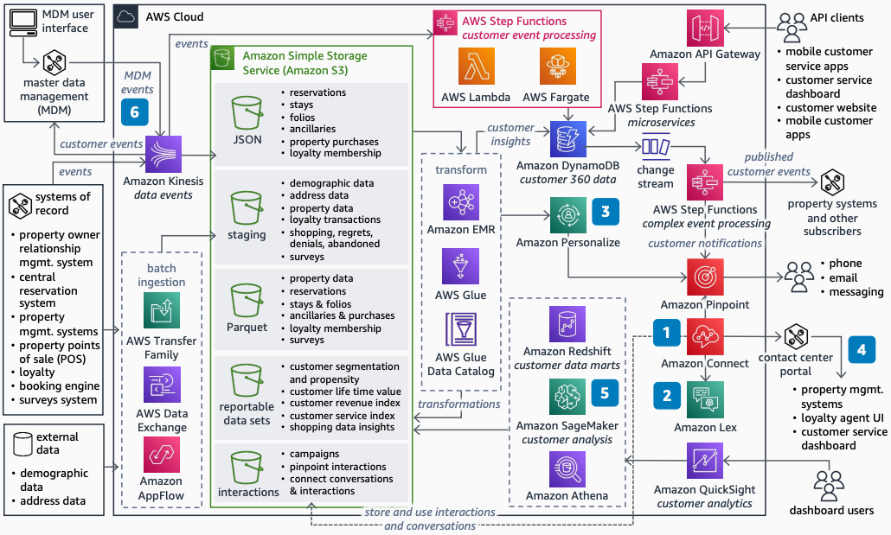

# Customer Engagement Using AI/ML for Lodging

Publication date: **August 25, 2022 ([Diagram history](#celodge-history "#celodge-history"))**

With this architecture, you can improve customer experience and brand loyalty for lodging
companies. Personalize interactions and improve response times by recognizing guest needs and
intents. The solution uses [Connect Customer](../../../connect/latest/adminguide.md "../../../connect/latest/adminguide.md") for cloud-based contact centers, [Amazon Lex](../../../lexv2/latest/dg.md "../../../lexv2/latest/dg.md") for chatbots, and [Amazon Personalize](../../../personalize/latest/dg.md "../../../personalize/latest/dg.md") for real-time
personalization.

## Customer engagement AI/ML diagram

The following steps describe the architecture:

1. Use Connect Customer to implement call centers in the cloud and eliminate on-premises hardware.
   Use [AWS Lambda](../../../lambda/latest/dg.md "../../../lambda/latest/dg.md") and [AWS Step Functions](../../../step-functions/latest/dg.md "../../../step-functions/latest/dg.md") to access the
   operational data platform for faster customer interactions. Connect Customer provides skill-based
   call routing and workflows.
2. Use Amazon Lex to build conversational chatbots that automate user interactions.
3. Use Amazon Personalize to create real-time personalized user experiences at scale.
4. Integrate the Connect Customer Contact Control Panel (CCP) with customer service, loyalty
   membership, and reservations. Improve call handling times for complex scenarios.
5. Use [Amazon Transcribe](../../../transcribe/latest/dg.md "../../../transcribe/latest/dg.md") and [Amazon Comprehend](../../../comprehend/latest/dg.md "../../../comprehend/latest/dg.md") for sentiment analysis. Identify frequent
   customer intents and adjust call center operations and automation.
6. (Optional) Improve customer interaction effectiveness by integrating the MDM
   system.

## Further reading

For additional information, see the following resources:

- [AWS Architecture Icons](https://aws.amazon.com/architecture/icons "https://aws.amazon.com/architecture/icons")
- [AWS Architecture Center](https://aws.amazon.com/architecture/ "https://aws.amazon.com/architecture/")
- [AWS Well-Architected](https://aws.amazon.com/architecture/well-architected "https://aws.amazon.com/architecture/well-architected")

## Diagram history

To receive updates about this reference architecture diagram, subscribe to the RSS
feed.

| Change              | Description                                     | Date            |
| ------------------- | ----------------------------------------------- | --------------- |
| Initial publication | Reference architecture diagram first published. | August 25, 2022 |

###### RSS subscription requirement

To subscribe to RSS updates, you must have an RSS plugin enabled for the browser you
are using.
