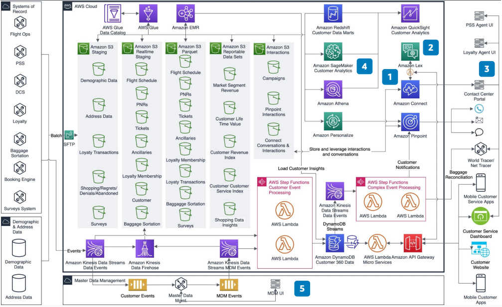

# Customer Engagement Using AI/ML for Airlines

Publication date: **November 14, 2020 ([Diagram history](#engagement-airlines-history "#engagement-airlines-history"))**

With this architecture, you can improve customer experience and brand loyalty for airlines.
Personalize interactions and improve call and response times. This workflow quickly recognizes
the customer, customer needs, intents, and optimizes the interactions.

Airlines face barriers in time and costs when building and upgrading call center
applications. Customers communicate on multiple channels such as chat, SMS, and social media.
This increases costs due to the need to integrate multiple technologies. Airlines have reduced
costs through automation and improved customer experience by reducing call times. However, the
general lack of airline knowledge with call center developers and redundancy in custom
development contributes to increasing complexity and cost.

This architecture builds upon the [Traveler 360 Data Platform for
Airlines](../traveler-360-airlines/traveler-360-airlines.md "../traveler-360-airlines/traveler-360-airlines.md") by adding personalized interactions with the customer.

## Customer engagement AI/ML for airlines diagram

The following steps describe the architecture:

1. Use [Amazon Connect Customer](../../../connect/latest/adminguide.md "../../../connect/latest/adminguide.md")
   for cloud call centers. Use [Lambda](../../../lambda/latest/dg.md "../../../lambda/latest/dg.md") for operational data platform integration.
   Configure skills-based routing and workflows.
2. Use [Amazon Lex](../../../lexv2/latest/dg.md "../../../lexv2/latest/dg.md") for
   conversational chatbots. Use Lambda for data platform access.
3. Integrate the Connect Customer Contact Control Panel with customer service, Passenger Service
   System (PSS), loyalty, and World Tracer user interfaces.
4. Use [Amazon Transcribe](../../../transcribe/latest/dg.md "../../../transcribe/latest/dg.md") and
   [Amazon Comprehend](../../../comprehend/latest/dg.md "../../../comprehend/latest/dg.md") for
   sentiment analysis. Identify customer intents and adjust operations accordingly.
5. (Optional) Improve effectiveness with master data management (MDM) integration.
   MDM provides a unified traveler profile for accurate engagement.

## Further reading

For additional information, see the following resources:

- [AWS Architecture Icons](https://aws.amazon.com/architecture/icons "https://aws.amazon.com/architecture/icons")
- [AWS Architecture Center](https://aws.amazon.com/architecture/ "https://aws.amazon.com/architecture/")
- [AWS Well-Architected](https://aws.amazon.com/architecture/well-architected "https://aws.amazon.com/architecture/well-architected")

## Diagram history

To receive updates about this reference architecture diagram, subscribe to the RSS
feed.

| Change              | Description                                     | Date              |
| ------------------- | ----------------------------------------------- | ----------------- |
| Initial publication | Reference architecture diagram first published. | November 14, 2020 |

###### RSS subscription requirement

To subscribe to RSS updates, you must have an RSS plugin enabled for the browser you
are using.
