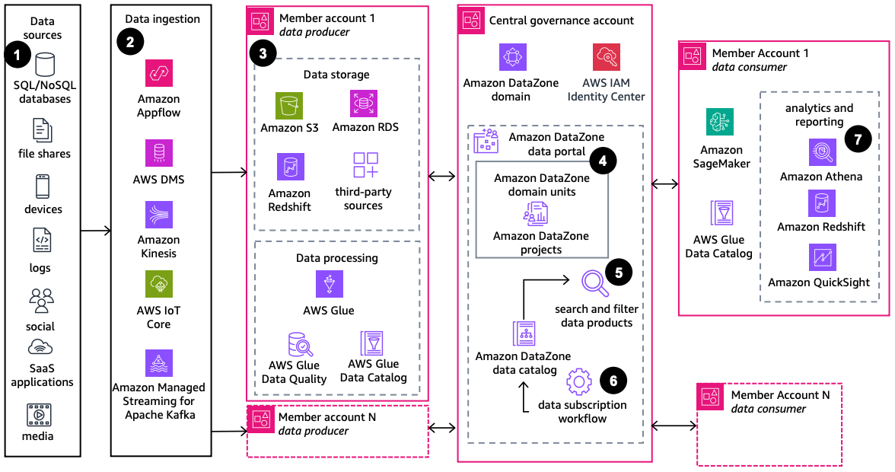

# Data Mesh Reference Architecture with Amazon DataZone

Publication date: **November 20, 2024 ([Diagram history](#diagram-history "#diagram-history"))**

Data mesh is a decentralized architectural and organizational framework that helps organizations accelerate innovation and drive business value. This architecture shows how to use [Amazon DataZone](../../../datazone/latest/userguide/what-is-datazone.md "../../../datazone/latest/userguide/what-is-datazone.md") to build a data mesh-based data solution.

## Data Mesh Reference Architecture with Amazon DataZone

The following steps describe the architecture:

1. Gather data from sources across the enterprise through databases, file shares, edge devices, logs, social networks, SaaS applications, and streaming media.
2. Based on the source system and end user requirements, ingest raw data using [Amazon AppFlow](../../../appflow/latest/userguide/what-is-appflow.md "../../../appflow/latest/userguide/what-is-appflow.md"), [AWS Database Migration Service](../../../dms/latest/userguide/Welcome.md "../../../dms/latest/userguide/Welcome.md"), [Amazon Kinesis](../../../streams/latest/dev/introduction.md "../../../streams/latest/dev/introduction.md"), [AWS IoT Core](../../../iot/latest/developerguide/what-is-aws-iot.md "../../../iot/latest/developerguide/what-is-aws-iot.md"), and Amazon Managed Streaming for Apache Kafka.
3. In the producer account, transform raw data using [AWS Glue](../../../glue/latest/dg/what-is-glue.md "../../../glue/latest/dg/what-is-glue.md"). Store metadata in AWS Glue Data Catalog, measure data quality using AWS Glue Data Quality, and register data in [Amazon S3](../../../AmazonS3/latest/userguide/Welcome.md "../../../AmazonS3/latest/userguide/Welcome.md"), [Amazon Redshift](../../../redshift/latest/dg/welcome.md "../../../redshift/latest/dg/welcome.md"), [Amazon RDS](../../../AmazonRDS/latest/UserGuide/Welcome.md "../../../AmazonRDS/latest/UserGuide/Welcome.md"), and third-party sources as assets in the Amazon DataZone catalog using data source jobs.
4. The central governance account hosts the Amazon DataZone domain and the related data portal. Associate AWS accounts of data producers and consumers with the Amazon DataZone domain, and create projects under related domain units.
5. End users log into the Amazon DataZone data portal using IAM credentials or single sign-on (SSO) through [https://docs.aws.amazon.com/singlesignon/latest/userguide/what-is.html](../../../singlesignon/latest/userguide/what-is.md "../../../singlesignon/latest/userguide/what-is.md"). They search, filter, and view asset information including data quality, business metadata, and technical metadata.
6. When end users find assets of interest, they request access using the subscription feature of Amazon DataZone. The asset owner approves or rejects the request based on validity.
7. After the subscription request is granted and fulfilled, access the asset in the consumer account for AI/ML model development using [SageMaker AI](../../../sagemaker/latest/dg/whatis.md "../../../sagemaker/latest/dg/whatis.md"), and for analytics and reporting use [Athena](../../../athena/latest/ug/what-is.md "../../../athena/latest/ug/what-is.md"), Amazon Redshift, and [Quick](../../../quicksight/latest/user/welcome.md "../../../quicksight/latest/user/welcome.md").

## Further reading

For additional information, refer to the following resources:

- [AWS Architecture Icons](https://aws.amazon.com/architecture/icons "https://aws.amazon.com/architecture/icons")
- [AWS Architecture Center](https://aws.amazon.com/architecture "https://aws.amazon.com/architecture")
- [AWS Well-Architected](https://aws.amazon.com/architecture/well-architected "https://aws.amazon.com/architecture/well-architected")

## Diagram history

To be notified about updates to this reference architecture diagram, subscribe to the RSS feed.

| Change              | Description                                     | Date              |
| ------------------- | ----------------------------------------------- | ----------------- |
| Initial publication | Reference architecture diagram first published. | November 20, 2024 |

###### Note

To subscribe to RSS updates, you must have an RSS plugin enabled for the browser you are using.
