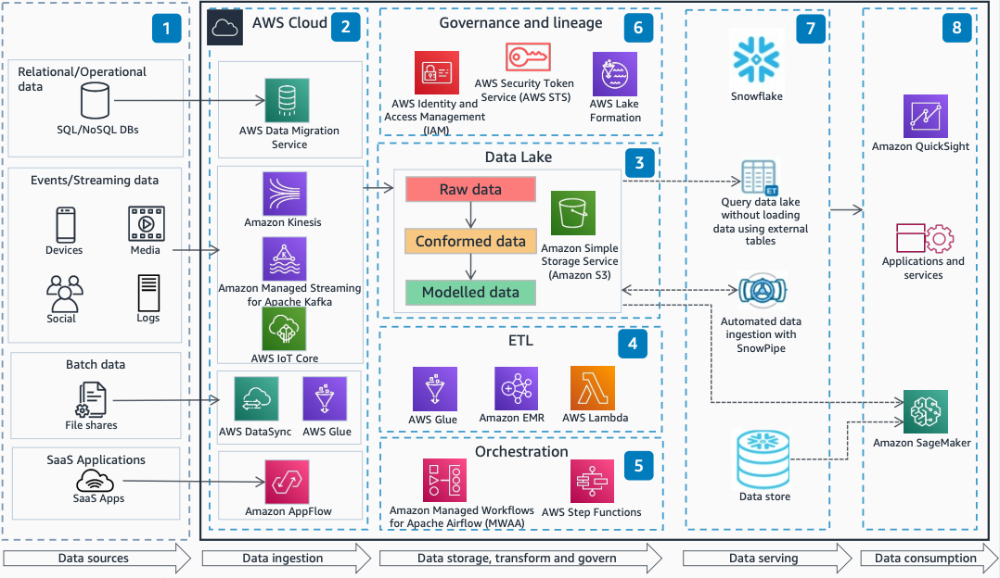

# Modern Data Platform Using AWS and Snowflake

Publication date: **March 11, 2022 ([Diagram history](#diagram-history "#diagram-history"))**

This architecture shows how to build an end-to-end modern data analytics platform using AWS and Snowflake. You can ingest data from multiple sources, store it in a data lake, and use Snowflake as a virtual data warehouse for analytics.

## Modern Data Platform Using AWS and Snowflake

The following steps describe the architecture:

1. Collect data from multiple data sources across the enterprise, software as a service (SaaS) applications, edge devices, logs, streaming data, and social media networks.
2. Based on the type of data source, use [AWS Database Migration Service](../../../dms/latest/userguide/Welcome.md "../../../dms/latest/userguide/Welcome.md"), AWS DataSync, [Amazon Kinesis](../../../streams/latest/dev/introduction.md "../../../streams/latest/dev/introduction.md"), Amazon Managed Streaming for Apache Kafka, AWS IoT Core, [AWS Glue](../../../glue/latest/dg/what-is-glue.md "../../../glue/latest/dg/what-is-glue.md"), and Amazon AppFlow to ingest the data into the data lake.
3. [Amazon Simple Storage Service](../../../AmazonS3/latest/userguide/Welcome.md "../../../AmazonS3/latest/userguide/Welcome.md") provides fully managed, highly available, and scalable data lake storage.
4. AWS Glue extracts, transforms, and ingests data across multiple data stores. Amazon EMR provides the cloud big data platform for processing vast amounts of data using open-source analytics frameworks. [AWS Lambda](../../../lambda/latest/dg/welcome.md "../../../lambda/latest/dg/welcome.md") and Amazon EC2 provide compute capability for data enrichment.
5. Amazon Managed Workflows for Apache Airflow (MWAA) or [AWS Step Functions](../../../step-functions/latest/dg/welcome.md "../../../step-functions/latest/dg/welcome.md") orchestrates end-to-end data pipelines.
6. [Lake Formation](../../../lake-formation/latest/dg/what-is-lake-formation.md "../../../lake-formation/latest/dg/what-is-lake-formation.md") makes it easy to build, secure, and manage your data lake. It provides a single place to enforce data classification and manage fine-grained access. IAM and AWS STS manage access permissions and temporary credentials.
7. Snowflake serves as a virtual data warehouse with the ability to query Amazon S3 using external tables, and automated and continuous data ingestion using SnowPipe.
8. SageMaker AI builds, trains, and deploys machine learning (ML) models and adds intelligence to your applications. [Amazon Quick Sight](../../../quicksight/latest/user/welcome.md "../../../quicksight/latest/user/welcome.md") provides ML-powered business intelligence (BI).

## Further reading

For additional information, refer to the following resources:

- [AWS Architecture Icons](https://aws.amazon.com/architecture/icons "https://aws.amazon.com/architecture/icons")
- [AWS Architecture Center](https://aws.amazon.com/architecture "https://aws.amazon.com/architecture")
- [AWS Well-Architected](https://aws.amazon.com/architecture/well-architected "https://aws.amazon.com/architecture/well-architected")

## Diagram history

To be notified about updates to this reference architecture diagram, subscribe to the RSS feed.

| Change              | Description                                     | Date           |
| ------------------- | ----------------------------------------------- | -------------- |
| Initial publication | Reference architecture diagram first published. | March 11, 2022 |

###### Note

To subscribe to RSS updates, you must have an RSS plugin enabled for the browser you are using.
