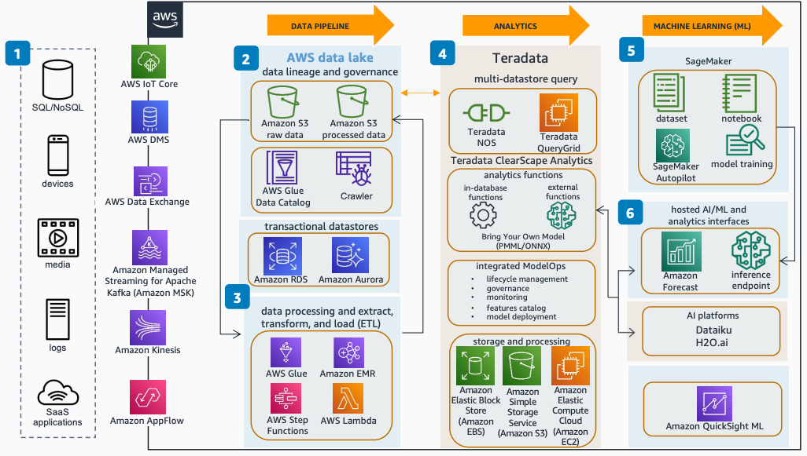

# Modern Data Platform Using AWS and Teradata

Publication date: **November 18, 2022 ([Diagram history](#diagram-history "#diagram-history"))**

Teradata VantageCloud Enterprise is part of the Teradata VantageCloud offering, the complete cloud analytics and data platform that includes Teradata ClearScape Analytics and integration with [SageMaker AI](../../../sagemaker/latest/dg/whatis.md "../../../sagemaker/latest/dg/whatis.md").

## Modern Data Platform Using AWS and Teradata

The following steps describe the architecture:

1. Collect data from multiple sources across the enterprise and SaaS applications. Ingest data using [AWS Data Exchange](../../../data-exchange/latest/userguide/what-is.md "../../../data-exchange/latest/userguide/what-is.md"), [AWS Database Migration Service](../../../dms/latest/userguide/Welcome.md "../../../dms/latest/userguide/Welcome.md") (AWS DMS), [AWS IoT Core](../../../iot/latest/developerguide/what-is-aws-iot.md "../../../iot/latest/developerguide/what-is-aws-iot.md"), and [Amazon Kinesis](../../../streams/latest/dev/introduction.md "../../../streams/latest/dev/introduction.md"). AWS Data Exchange, AWS DMS, and [Amazon AppFlow](../../../appflow/latest/userguide/what-is-appflow.md "../../../appflow/latest/userguide/what-is-appflow.md") use Amazon S3 as a transitional or permanent datastore accessed through Teradata Native Object Store (NOS).
2. The AWS data lake manages data lifecycle and governance. [Amazon S3](../../../AmazonS3/latest/userguide/Welcome.md "../../../AmazonS3/latest/userguide/Welcome.md") provides highly available storage for permanent and transitional data in the data lake.
3. Process the data using [AWS Glue](../../../glue/latest/dg/what-is-glue.md "../../../glue/latest/dg/what-is-glue.md") and [Amazon EMR](../../../emr/latest/ManagementGuide/emr-what-is-emr.md "../../../emr/latest/ManagementGuide/emr-what-is-emr.md"), and store it to Amazon S3 or directly into Teradata using AWS Glue streaming.
4. Teradata Vantage on AWS serves as a highly scalable data warehouse and analytics platform. With Teradata QueryGrid, the analytics platform can query other datastores such as SQL databases and Amazon EMR. Teradata NOS allows Teradata Vantage to access and configure data on Amazon S3 as an external table.
5. SageMaker AI retrieves training data from both Teradata and Amazon S3 using the Teradata SQL kernel or Python library. Deploy trained models to a SageMaker AI endpoint or import them as a bring your own model (BYOM) into Teradata for in-database analytics.
6. External functions within Teradata SQL interface get inference from AWS inference endpoints and third-party AI platform providers.

## Further reading

For additional information, refer to the following resources:

- [AWS Architecture Icons](https://aws.amazon.com/architecture/icons "https://aws.amazon.com/architecture/icons")
- [AWS Architecture Center](https://aws.amazon.com/architecture "https://aws.amazon.com/architecture")
- [AWS Well-Architected](https://aws.amazon.com/architecture/well-architected "https://aws.amazon.com/architecture/well-architected")

## Diagram history

To be notified about updates to this reference architecture diagram, subscribe to the RSS feed.

| Change              | Description                                     | Date              |
| ------------------- | ----------------------------------------------- | ----------------- |
| Initial publication | Reference architecture diagram first published. | November 18, 2022 |

###### Note

To subscribe to RSS updates, you must have an RSS plugin enabled for the browser you are using.
