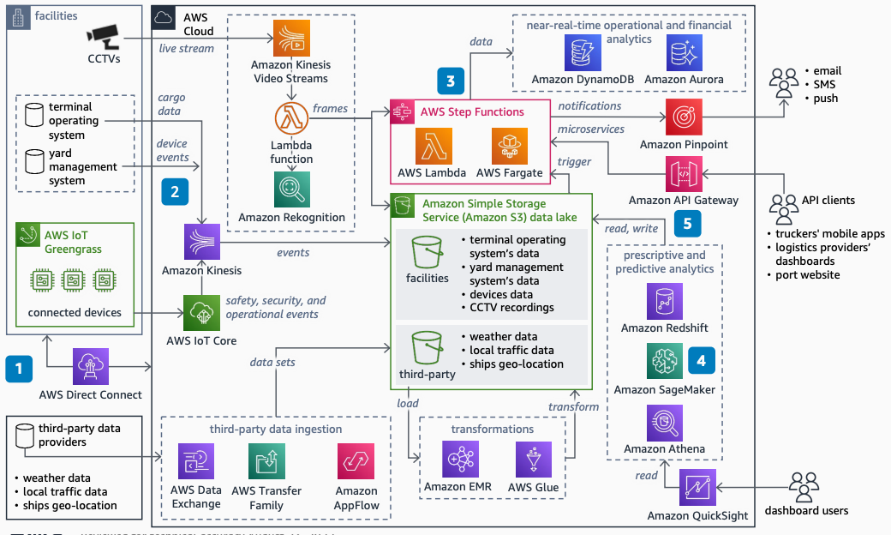

# Data Platform for Ports and Inland Logistics Facilities

Publication date: **August 23, 2022 ([Diagram history](#ports-history "#ports-history"))**

With this architecture, you can eliminate data silos across port terminals and logistics
facilities. Build a scalable, low-cost data platform with near-real-time visibility. Improve
profitability with ML, analytics, and workflow automation. The solution uses [AWS IoT Core](../../../iot/latest/developerguide.md "../../../iot/latest/developerguide.md") for device
connectivity, [Amazon SageMaker AI](../../../sagemaker/latest/dg.md "../../../sagemaker/latest/dg.md") for predictive analytics, and [AWS Step Functions](../../../step-functions/latest/dg/welcome.md "../../../step-functions/latest/dg/welcome.md") for workflow
automation.

## Data platform for ports diagram

The following steps describe the data ingestion and analytics components for this
architecture:

1. Build a data pipeline from Enterprise Resource Planning (ERP) systems, IoT-enabled
   assets, and third-party data providers. Use the AWS global footprint to connect multiple
   ports and create a unified data stream.
2. Deploy an elastic and scalable data ingestion solution. Increase resilience, security,
   availability, and fault tolerance. Expand or reduce capacity based on seasonal trade
   fluctuations without upfront capital.
3. Automate back-office and operational workflows by using AWS Step Functions. Reduce overheads
   and improve management of safety, security, and equipment gating operations.
4. Use SageMaker AI and [Amazon Rekognition](../../../rekognition/latest/dg.md "../../../rekognition/latest/dg.md") for predictive and prescriptive
   analytics. Reduce operational costs through equipment usage optimization, route and fuel
   optimization, and maintenance planning.
5. Turn data into actionable knowledge with [Amazon Redshift](../../../redshift/latest/mgmt.md "../../../redshift/latest/mgmt.md") and [Amazon Quick Sight](../../../quicksight/latest/developerguide/welcome.md "../../../quicksight/latest/developerguide/welcome.md"). Disseminate alerts with [Amazon Pinpoint](../../../pinpoint/latest/userguide.md "../../../pinpoint/latest/userguide.md"). Share key
   metrics with partners through [Amazon API Gateway](../../../apigateway/latest/developerguide.md "../../../apigateway/latest/developerguide.md").

## Further reading

For additional information, see the following resources:

- [AWS Architecture Icons](https://aws.amazon.com/architecture/icons "https://aws.amazon.com/architecture/icons")
- [AWS Architecture Center](https://aws.amazon.com/architecture/ "https://aws.amazon.com/architecture/")
- [AWS
  Well-Architected](https://aws.amazon.com/architecture/well-architected "https://aws.amazon.com/architecture/well-architected")

## Diagram history

To receive updates about this reference architecture diagram, subscribe to the RSS
feed.

| Change              | Description                                     | Date            |
| ------------------- | ----------------------------------------------- | --------------- |
| Initial publication | Reference architecture diagram first published. | August 23, 2022 |

###### RSS subscription requirement

To subscribe to RSS updates, you must have an RSS plugin enabled for the browser you are
using.
