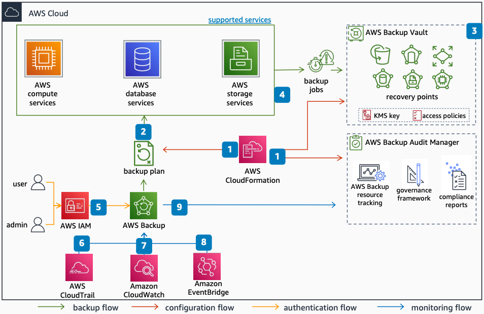

# Cloud-native data protection with AWS Backup

This reference architecture describes how [AWS Backup](../../../aws-backup/latest/devguide/whatisbackup.md "../../../aws-backup/latest/devguide/whatisbackup.md") is implemented in a single AWS account to protect multiple services in an automated way.

1. Use [AWS CloudFormation](../../../AWSCloudFormation/latest/UserGuide/Welcome.md "../../../AWSCloudFormation/latest/UserGuide/Welcome.md") to create the components that AWS Backup uses in this architecture.
2. The AWS Backup plan defines the frequency, retention period, lifecycle, backup copy destination, and resources to protect.
3. The AWS Backup vault is a logical container that stores and organizes your backups. A defined [AWS KMS](../../../kms/latest/developerguide/overview.md "../../../kms/latest/developerguide/overview.md") key enforces encryption.
4. A backup job runs within the backup window defined in the backup plan. After the job completes, a recovery point appears in the vault for restore.
5. Secure access to your resources through [IAM](../../../IAM/latest/UserGuide/introduction.md "../../../IAM/latest/UserGuide/introduction.md") by using AWS-managed policies as a starting point. At the vault level, access policies protect the vault and its contents.
6. AWS Backup actions record in [CloudTrail](../../../awscloudtrail/latest/userguide/cloudtrail-user-guide.md "../../../awscloudtrail/latest/userguide/cloudtrail-user-guide.md") as events.
7. Monitor AWS Backup service metrics through [CloudWatch](../../../AmazonCloudWatch/latest/monitoring/WhatIsCloudWatch.md "../../../AmazonCloudWatch/latest/monitoring/WhatIsCloudWatch.md").
8. Use [https://docs.aws.amazon.com/eventbridge/latest/userguide/eb-what-is.html](../../../eventbridge/latest/userguide/eb-what-is.md "../../../eventbridge/latest/userguide/eb-what-is.md") to monitor AWS Backup events, such as when a backup fails or gets deleted.
9. Audit backups and automate reports through AWS Backup Audit Manager. With this service, you can continuously monitor compliance of your backups.

## Further reading

For additional information, refer to

- [AWS Architecture Icons](https://aws.amazon.com/architecture/icons "https://aws.amazon.com/architecture/icons")
- [AWS Architecture Center](https://aws.amazon.com/architecture "https://aws.amazon.com/architecture")
- [AWS Well-Architected](https://aws.amazon.com/architecture/well-architected "https://aws.amazon.com/architecture/well-architected")
- [AWS Backup product page](https://aws.amazon.com/backup/ "https://aws.amazon.com/backup/")

## Diagram history

To be notified about updates to this reference architecture diagram, subscribe to the RSS feed.

| Change                                                                                                                                                 | Description                                      | Date          |
| ------------------------------------------------------------------------------------------------------------------------------------------------------ | ------------------------------------------------ | ------------- |
| Initial publication                                                                                                                                    | Reference architecture diagram first published.  | July 29, 2022 |
| [Initial publication](data-protection-cross-account.md#cross-account-diagram-history "data-protection-cross-account.md#cross-account-diagram-history") | Reference architecture diagram first published.  | July 29, 2022 |
| [Initial publication](data-protection-landing-zone.md#landing-zone-diagram-history "data-protection-landing-zone.md#landing-zone-diagram-history")     | Reference architecture diagram first published.  | July 29, 2022 |
| [Initial publication](data-protection-vault-lock.md#diagram-history "data-protection-vault-lock.md#diagram-history")                                   | Reference architecture diagrams first published. | July 29, 2022 |

###### Note

To subscribe to RSS updates, you must have an RSS plugin enabled for the browser you are using.
