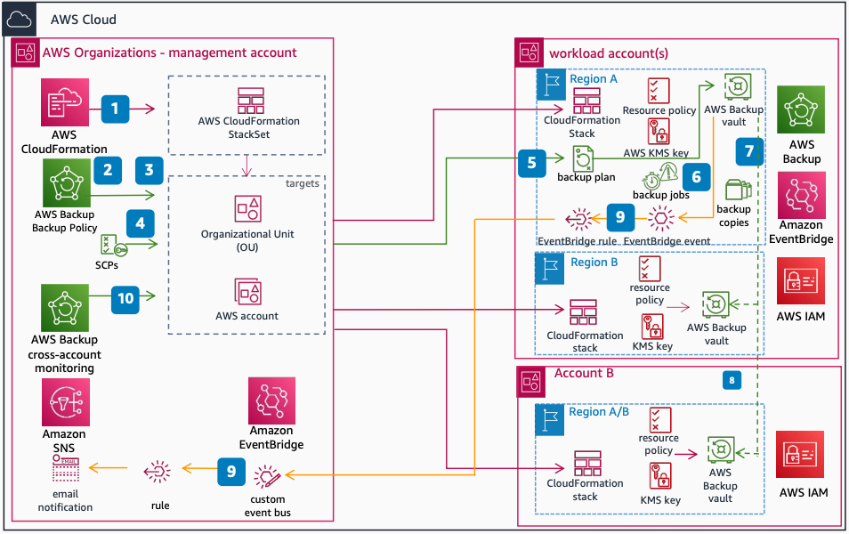

# Cross-account and Region data protection with AWS Backup and AWS Organizations

This reference architecture shows how to implement a consistent backup strategy through multiple AWS accounts and Regions, and copy backups between them through an automated, policy-driven approach.

1. Use [AWS CloudFormation](../../../AWSCloudFormation/latest/UserGuide/Welcome.md "../../../AWSCloudFormation/latest/UserGuide/Welcome.md") StackSets to create [AWS Backup](../../../aws-backup/latest/devguide/whatisbackup.md "../../../aws-backup/latest/devguide/whatisbackup.md") resources such as an [IAM](../../../IAM/latest/UserGuide/introduction.md "../../../IAM/latest/UserGuide/introduction.md") role, backup vault, [AWS KMS](../../../kms/latest/developerguide/overview.md "../../../kms/latest/developerguide/overview.md") key, and access policies.
2. Create a backup policy. Define the frequency, retention, lifecycle, backup copy settings, and resource assignment tag values. Then attach the policy to a target.
3. StackSets and backup policies support both organizational units (OUs) or specific AWS accounts as targets.
4. Use Service Control Policies (SCPs) to protect your AWS Backup resources from unwanted modification, deletion, or use.
5. After configuration and attachment to a target, AWS Backup creates a backup plan in all member accounts that belong to the OU.
6. Based on the plan schedule, backup jobs run and recovery points appear in the backup vault.
7. For cross-account backup copies, use a customer-managed AWS KMS key on the originating resource and source backup vault. Then provide the necessary permissions to the key and target vault.
8. Cross-Region backups can occur within the same account or to a different account in a single step. The backup policy defines the vault name and destination account.
9. Forward backup events through an [https://docs.aws.amazon.com/eventbridge/latest/userguide/eb-what-is.html](../../../eventbridge/latest/userguide/eb-what-is.md "../../../eventbridge/latest/userguide/eb-what-is.md") rule to a central custom event bus for centralized monitoring. Then trigger email notifications by using [Amazon SNS](../../../sns/latest/dg/welcome.md "../../../sns/latest/dg/welcome.md").
10. Monitor cross-account and Region activities through the AWS Backup console in the AWS Organizations management account.

## Further reading

For additional information, refer to

- [AWS Architecture Icons](https://aws.amazon.com/architecture/icons "https://aws.amazon.com/architecture/icons")
- [AWS Architecture Center](https://aws.amazon.com/architecture "https://aws.amazon.com/architecture")
- [AWS Well-Architected](https://aws.amazon.com/architecture/well-architected "https://aws.amazon.com/architecture/well-architected")
- [AWS Backup product page](https://aws.amazon.com/backup/ "https://aws.amazon.com/backup/")

## Diagram history

To be notified about updates to this reference architecture diagram, subscribe to the RSS feed.

| Change                                                                                                                                             | Description                                      | Date          |
| -------------------------------------------------------------------------------------------------------------------------------------------------- | ------------------------------------------------ | ------------- |
| [Initial publication](data-protection-cloud-native.md#cloud-native-diagram-history "data-protection-cloud-native.md#cloud-native-diagram-history") | Reference architecture diagram first published.  | July 29, 2022 |
| Initial publication                                                                                                                                | Reference architecture diagram first published.  | July 29, 2022 |
| [Initial publication](data-protection-landing-zone.md#landing-zone-diagram-history "data-protection-landing-zone.md#landing-zone-diagram-history") | Reference architecture diagram first published.  | July 29, 2022 |
| [Initial publication](data-protection-vault-lock.md#diagram-history "data-protection-vault-lock.md#diagram-history")                               | Reference architecture diagrams first published. | July 29, 2022 |

###### Note

To subscribe to RSS updates, you must have an RSS plugin enabled for the browser you are using.
