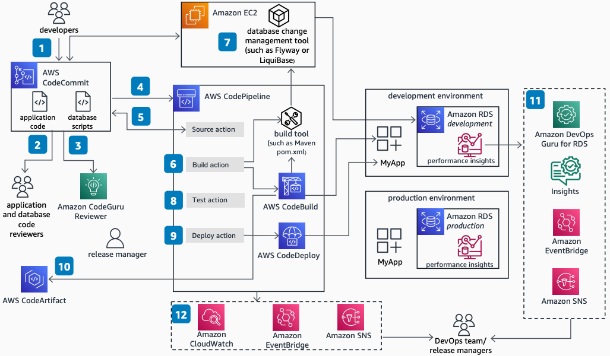

# Database DevOps on AWS: Development Workflow

Publication date: **March 31, 2023 ([Diagram history](#diagram-history "#diagram-history"))**

Use this architecture in the development workflow to automate database changes as part of DevOps practice. Build an orchestration to deploy database changes at the same rate as application code, enforce database-application-joint code reviews, integrate database and application code operations, detect abnormal system behavior, and automate notifications to appointed teams.

## Database DevOps on AWS: Development Workflow

The following steps describe the architecture:

1. The developer checks both application and database code into [AWS CodeCommit](../../../codecommit/latest/userguide/welcome.md "../../../codecommit/latest/userguide/welcome.md").
2. At every push request, AWS CodeCommit enforces code reviews through the use of approval rules.
3. Amazon CodeGuru Reviewer automatically evaluates code changes, detects errors, and offers code recommendations.
4. AWS CodeCommit initiates [CodePipeline](../../../codepipeline/latest/userguide/welcome.md "../../../codepipeline/latest/userguide/welcome.md") to take pipeline actions.
5. The CodePipeline Source action checks out application and database code.
6. The CodePipeline Build action invokes a build management tool to start the application and database code build phase.
7. The build tool calls the database change tool. It downloads the database scripts and runs them against the target database.
8. The build tool calls database test scripts and validates output.
9. The CodePipeline Deploy action deploys code to the target environment.
10. Build artifacts are published to [AWS CodeArtifact](../../../codeartifact/latest/ug/welcome.md "../../../codeartifact/latest/ug/welcome.md") for others to consume.
11. (Optional) Use Performance Insights on [Amazon RDS](../../../AmazonRDS/latest/UserGuide/Welcome.md "../../../AmazonRDS/latest/UserGuide/Welcome.md") and Amazon DevOps Guru to automatically apply ML techniques to detect performance bottlenecks and operational issues.
12. [EventBridge](../../../eventbridge/latest/userguide/eb-what-is.md "../../../eventbridge/latest/userguide/eb-what-is.md") captures events and sends them to an [Amazon SNS](../../../sns/latest/dg/welcome.md "../../../sns/latest/dg/welcome.md") topic for user notifications.

## Further reading

For additional information, refer to the following resources:

- [AWS Architecture Icons](https://aws.amazon.com/architecture/icons "https://aws.amazon.com/architecture/icons")
- [AWS Architecture Center](https://aws.amazon.com/architecture "https://aws.amazon.com/architecture")
- [AWS Well-Architected](https://aws.amazon.com/architecture/well-architected "https://aws.amazon.com/architecture/well-architected")

## Diagram history

To be notified about updates to this reference architecture diagram, subscribe to the RSS feed.

| Change              | Description                                     | Date           |
| ------------------- | ----------------------------------------------- | -------------- |
| Initial publication | Reference architecture diagram first published. | March 31, 2023 |

###### Note

To subscribe to RSS updates, you must have an RSS plugin enabled for the browser you are using.
