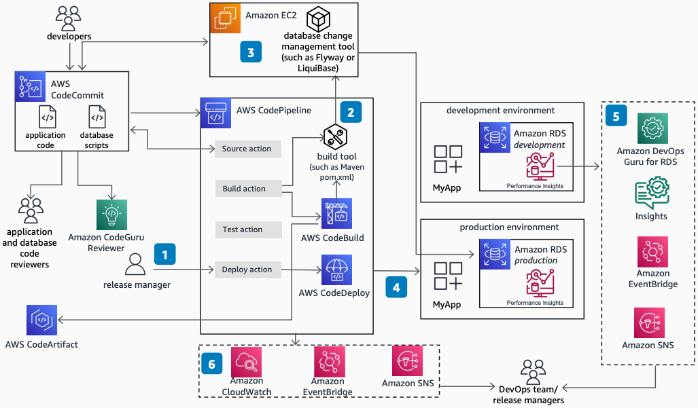

# Database DevOps on AWS: Production Workflow

Publication date: **March 31, 2023 ([Diagram history](database-devops-development.md#diagram-history "database-devops-development.md#diagram-history"))**

Use this architecture in the production workflow to automate database changes as part of DevOps practice. Build an orchestration to deploy database changes at the same rate as application code, detect abnormal system behavior, and automate notifications to appointed teams to take corrective actions.

## Database DevOps on AWS: Production Workflow

The following steps describe the architecture:

1. The release manager issues a production deployment request.
2. [CodePipeline](../../../codepipeline/latest/userguide/welcome.md "../../../codepipeline/latest/userguide/welcome.md") invokes the build management tool which calls the database change management tool.
3. The database change tool downloads the database change scripts and runs them against the target [Amazon RDS](../../../AmazonRDS/latest/UserGuide/Welcome.md "../../../AmazonRDS/latest/UserGuide/Welcome.md") production database.
4. CodePipeline initiates the Deploy action to deploy code to the target environment.
5. (Optional) Use Performance Insights on Amazon RDS and Amazon DevOps Guru to automatically apply ML techniques to detect performance bottlenecks and operational issues.
6. [EventBridge](../../../eventbridge/latest/userguide/eb-what-is.md "../../../eventbridge/latest/userguide/eb-what-is.md") captures events and sends them to an [Amazon SNS](../../../sns/latest/dg/welcome.md "../../../sns/latest/dg/welcome.md") topic for user notifications.
