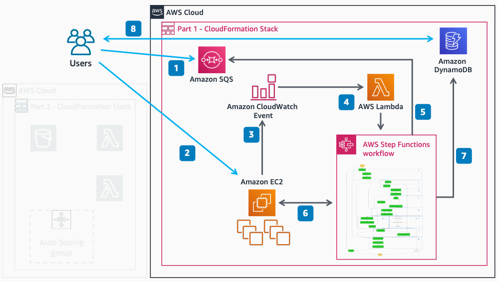

# Decoupled Serverless Scheduler, Part 1

Publication date: **February 18, 2021 ([Diagram history](#diagram-history "#diagram-history"))**

This architecture shows how to deploy a decoupled serverless scheduler to run any HPC application at scale. You submit jobs to [Amazon Simple Queue Service](../../../AWSSimpleQueueService/latest/SQSDeveloperGuide/welcome.md "../../../AWSSimpleQueueService/latest/SQSDeveloperGuide/welcome.md") using [AWS Systems Manager](../../../systems-manager/latest/userguide/what-is-systems-manager.md "../../../systems-manager/latest/userguide/what-is-systems-manager.md") Run Command, and [AWS Step Functions](../../../step-functions/latest/dg/welcome.md "../../../step-functions/latest/dg/welcome.md") orchestrates the job execution on [Amazon Elastic Compute Cloud](../../../AWSEC2/latest/UserGuide/concepts.md "../../../AWSEC2/latest/UserGuide/concepts.md") instances.

## Decoupled Serverless Scheduler, Part 1

The following steps describe the architecture:

1. Jobs submitted to Amazon SQS use AWS Systems Manager Run Command such as bash or Windows PowerShell.
2. You launch an Amazon EC2 instance or cluster of Amazon EC2 instances with the tag key `scheduler-queue`.
3. On Amazon EC2 launch, an [Amazon CloudWatch](../../../AmazonCloudWatch/latest/monitoring/WhatIsCloudWatch.md "../../../AmazonCloudWatch/latest/monitoring/WhatIsCloudWatch.md") Event triggers an [AWS Lambda](../../../lambda/latest/dg/welcome.md "../../../lambda/latest/dg/welcome.md") function.
4. The Lambda function looks for the tag key `scheduler-queue` and triggers a new Step Functions state machine, passing the instance ID and tag value (SQS job queue name).
5. The workflow polls Amazon SQS for a new job, and continues to poll until there are no more jobs.
6. The workflow runs the job on previously launched Amazon EC2 instances or cluster of Amazon EC2 instances.
7. The workflow continuously writes job status to a [Amazon DynamoDB](../../../amazondynamodb/latest/developerguide/Introduction.md "../../../amazondynamodb/latest/developerguide/Introduction.md") table.
8. You monitor job status through the AWS Management Console or AWS Command Line Interface (AWS CLI).

## Further reading

For additional information, refer to the following resources:

- [AWS Architecture Icons](https://aws.amazon.com/architecture/icons "https://aws.amazon.com/architecture/icons")
- [AWS Architecture Center](https://aws.amazon.com/architecture "https://aws.amazon.com/architecture")
- [AWS Well-Architected](https://aws.amazon.com/architecture/well-architected "https://aws.amazon.com/architecture/well-architected")
- [AWS Decoupled Serverless Scheduler on GitHub](https://github.com/aws-samples/aws-decoupled-serverless-scheduler "https://github.com/aws-samples/aws-decoupled-serverless-scheduler")

## Diagram history

To be notified about updates to this reference architecture diagram, subscribe to the RSS feed.

| Change                                                                                                                                       | Description                                     | Date              |
| -------------------------------------------------------------------------------------------------------------------------------------------- | ----------------------------------------------- | ----------------- |
| Initial publication                                                                                                                          | Reference architecture diagram first published. | February 18, 2021 |
| [Initial publication](decoupled-serverless-scheduler-part2.md#diagram-history-2 "decoupled-serverless-scheduler-part2.md#diagram-history-2") | Reference architecture diagram first published. | February 18, 2021 |

###### Note

To subscribe to RSS updates, you must have an RSS plugin enabled for the browser you are using.
