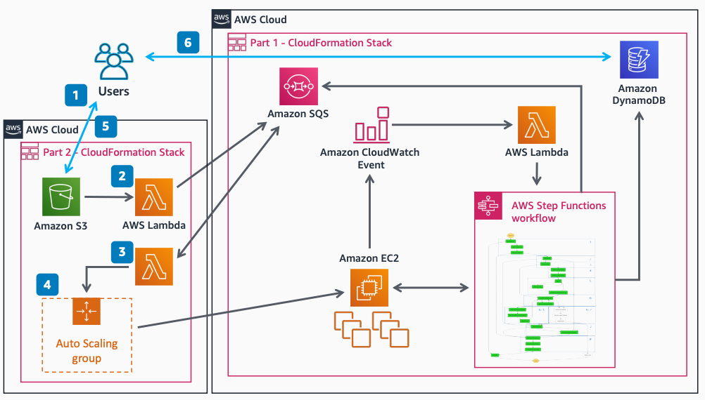

# Decoupled Serverless Scheduler, Part 2

This architecture shows how to extend the decoupled serverless scheduler by using [Amazon Simple Storage Service](../../../AmazonS3/latest/userguide/Welcome.md "../../../AmazonS3/latest/userguide/Welcome.md") event triggers and Amazon EC2 Auto Scaling Groups for automatic worker management. You upload input files and executables to Amazon S3 instead of Amazon SQS, eliminating the need for JSON job definitions.

## Decoupled Serverless Scheduler, Part 2

The following steps describe the architecture:

1. You upload input files and executables for jobs to Amazon S3.
2. The Amazon S3 event triggers an [AWS Lambda](../../../lambda/latest/dg/welcome.md "../../../lambda/latest/dg/welcome.md") function to create and submit new jobs.
3. Lambda monitors the job queue and updates the Amazon EC2 Auto Scaling Group with the desired instance count (customizable).
4. The Amazon EC2 Auto Scaling Group scales the number of workers from 0 to a defined maximum.
5. You download results from Amazon S3.
6. You monitor job status through the AWS Management Console or AWS CLI.

## Further reading

For additional information, refer to the following resources:

- [AWS Architecture Icons](https://aws.amazon.com/architecture/icons "https://aws.amazon.com/architecture/icons")
- [AWS Architecture Center](https://aws.amazon.com/architecture "https://aws.amazon.com/architecture")
- [AWS Well-Architected](https://aws.amazon.com/architecture/well-architected "https://aws.amazon.com/architecture/well-architected")

## Diagram history

To be notified about updates to this reference architecture diagram, subscribe to the RSS feed.

| Change                                                                                                                                   | Description                                     | Date              |
| ---------------------------------------------------------------------------------------------------------------------------------------- | ----------------------------------------------- | ----------------- |
| [Initial publication](decoupled-serverless-scheduler-part1.md#diagram-history "decoupled-serverless-scheduler-part1.md#diagram-history") | Reference architecture diagram first published. | February 18, 2021 |
| Initial publication                                                                                                                      | Reference architecture diagram first published. | February 18, 2021 |

###### Note

To subscribe to RSS updates, you must have an RSS plugin enabled for the browser you are using.
