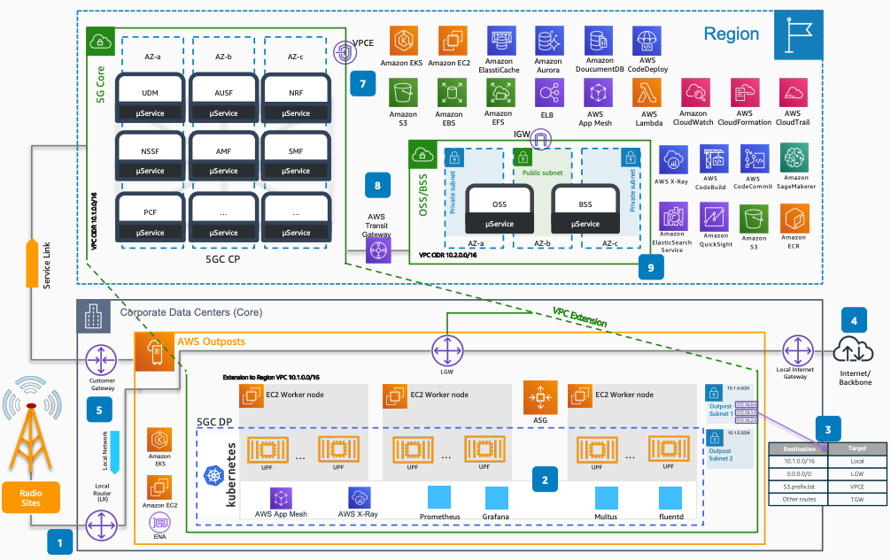

# Deploying 5G Core on AWS

Publication date: **December 28, 2020 ([Diagram history](#5gcore-history "#5gcore-history"))**

With this architecture, you can distribute your 5G Core between on-premises data centers
and AWS Regions. The solution uses [AWS Outposts](../../../outposts/latest/userguide.md "../../../outposts/latest/userguide.md") for the User Plane Function (UPF) and
[Amazon Elastic Kubernetes Service](../../../eks/latest/userguide.md "../../../eks/latest/userguide.md") for containerized
network functions.

## Deploying 5G Core on AWS diagram

The following steps describe the network topology and data flow for this
architecture:

1. Ingest subscriber traffic from the Radio Access Network (RAN) into AWS Outposts running
   the 5G UPF through the Outposts Local Gateway (LGW).
2. Run UPF instances as containers on Amazon EKS with access to multiple network interfaces
   through AWS multi-homing support and Multus.
3. Configure two subnets on AWS Outposts (for ingress and egress) with routing tables that
   contain paths to service endpoints and [AWS Transit Gateway](../../../vpc/latest/tgw.md "../../../vpc/latest/tgw.md") for other VPCs.
4. Achieve internet access for mobile subscribers through the local gateway as a default
   route in the subnet route tables.
5. Separate Service Link traffic from local traffic through virtual LANs (VLANs). This
   provides connectivity both locally and to AWS Regions.
6. Use [AWS Direct Connect](../../../directconnect/latest/UserGuide.md "../../../directconnect/latest/UserGuide.md") to provide a high-throughput
   connection to a Amazon VPC on an AWS Region through a public virtual interface.
7. Use the service endpoint to provide direct access to AWS Regional services such as
   [Amazon Simple Storage Service](../../../AmazonS3/latest/userguide.md "../../../AmazonS3/latest/userguide.md") without traversing the internet.
8. Use AWS Transit Gateway to provide connectivity to other VPCs that perform 5G management and
   control services.
9. Run orchestration, operational, and business support systems on AWS Regions with
   direct connectivity to on-premises data centers.

## Further reading

For additional information, see the following resources:

- [AWS Architecture Icons](https://aws.amazon.com/architecture/icons "https://aws.amazon.com/architecture/icons")
- [AWS Architecture Center](https://aws.amazon.com/architecture/ "https://aws.amazon.com/architecture/")
- [AWS
  Well-Architected](https://aws.amazon.com/architecture/well-architected "https://aws.amazon.com/architecture/well-architected")

## Diagram history

To receive updates about this reference architecture diagram, subscribe to the RSS
feed.

| Change              | Description                                     | Date              |
| ------------------- | ----------------------------------------------- | ----------------- |
| Initial publication | Reference architecture diagram first published. | December 28, 2020 |

###### RSS subscription requirement

To subscribe to RSS updates, you must have an RSS plugin enabled for the browser you are
using.
