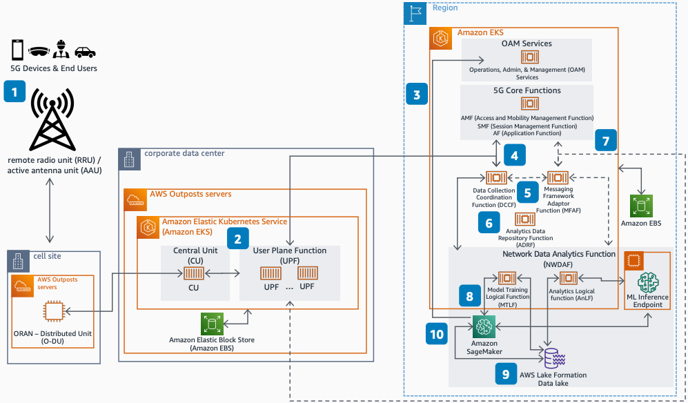

# Deploying 5G O-RAN NWDAF on AWS

Publication date: **June 16, 2022 ([Diagram history](#nwdaf-history "#nwdaf-history"))**

With this architecture, you can implement the Network Data Analytics Function (NWDAF) on
AWS to achieve observed service experience data analytics. The solution uses [Amazon Elastic Kubernetes Service](../../../eks/latest/userguide.md "../../../eks/latest/userguide.md") for network functions and
[Amazon SageMaker AI](../../../sagemaker/latest/dg.md "../../../sagemaker/latest/dg.md") for machine learning
(ML) lifecycle operations including training and deploying inference endpoints.

## Deploying 5G O-RAN NWDAF on AWS diagram

The following steps describe the NWDAF components and data flow for this
architecture:

1. Monitor end-user experience by using observed service experience analytics.
2. Provide Open Radio Access Network (O-RAN) standards-based network connectivity
   through 5G RAN and core network functions.
3. Run network functions on Amazon EKS compute with Amazon EBS storage (backed up in remote
   regions).
4. Send application, session, location, and quality of experience (QoE) data from
   network functions to the Data Collection Coordination Function (DCCF).
5. Use the DCCF to coordinate the collection and distribution of data. The DCCF
   prevents overlapping data subscriptions and notifications.
6. Forward or retrieve data from the Analytics Data Repository Function (ADRF) through
   the DCCF. The ADRF aggregates data and handles data lifecycle management.
7. Coordinate data collection and delivery through the Messaging Framework Adaptor
   Function (MFAF), which formats and processes data received from network functions.
8. Use SageMaker AI for ML lifecycle operations in the NWDAF Model Training Logical Function
   (MTLF). Train and deploy ML model inference endpoints for Analytics Logical Functions
   (AnLFs) to use for predictions.
9. Store processed analytics, inference results, and trained models in an [Amazon Simple Storage Service](../../../AmazonS3/latest/userguide.md "../../../AmazonS3/latest/userguide.md")-backed [AWS Lake Formation](../../../lake-formation/latest/dg.md "../../../lake-formation/latest/dg.md") data
   lake.
10. Compare current data values against historical, expected, and predicted Mean Opinion
    Score (MoS) values to derive an observed service experience analysis. Send results to
    Operations, Administration, and Management (OAM) services for network
    optimization.

## Further reading

For additional information, see the following resources:

- [AWS Architecture Icons](https://aws.amazon.com/architecture/icons "https://aws.amazon.com/architecture/icons")
- [AWS Architecture Center](https://aws.amazon.com/architecture/ "https://aws.amazon.com/architecture/")
- [AWS
  Well-Architected](https://aws.amazon.com/architecture/well-architected "https://aws.amazon.com/architecture/well-architected")

## Diagram history

To receive updates about this reference architecture diagram, subscribe to the RSS
feed.

| Change              | Description                                     | Date          |
| ------------------- | ----------------------------------------------- | ------------- |
| Initial publication | Reference architecture diagram first published. | June 16, 2022 |

###### RSS subscription requirement

To subscribe to RSS updates, you must have an RSS plugin enabled for the browser you are
using.
