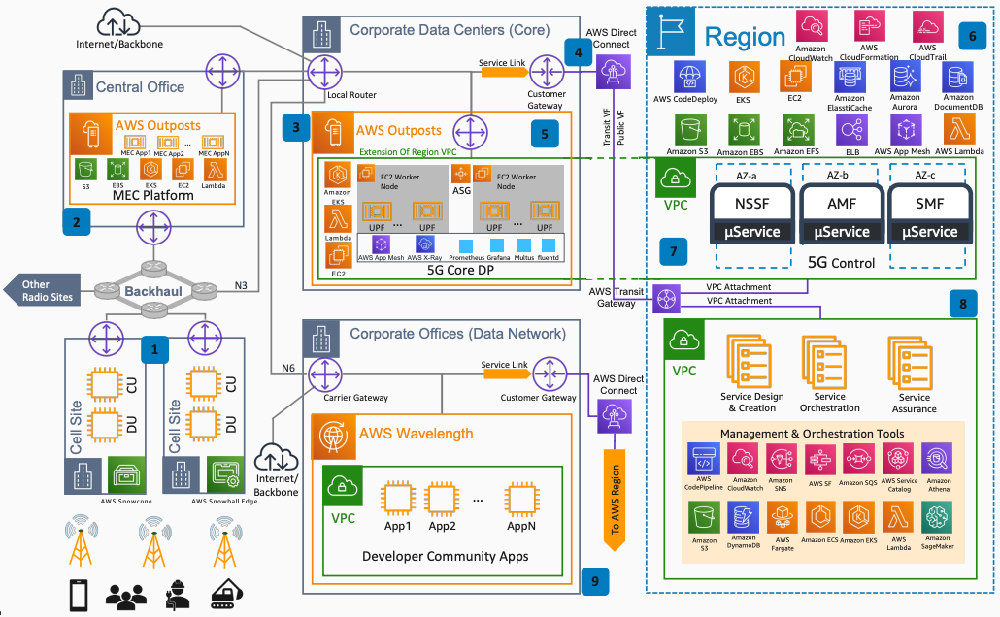

# Deploying E2E 5G Network with AWS

Publication date: **December 28, 2020 ([Diagram history](#e2e5g-history "#e2e5g-history"))**

With this architecture, you can deploy an end-to-end (E2E) 5G network by using AWS
services. The solution covers Radio Access Network (RAN), Multi-Access Edge Computing (MEC),
5G Core, and data network components across [AWS Outposts](../../../outposts/latest/userguide.md "../../../outposts/latest/userguide.md"), [AWS Wavelength](../../../wavelength/latest/developerguide.md "../../../wavelength/latest/developerguide.md"), and AWS Regions.

## Deploying E2E 5G network diagram

The following steps describe the network components and connectivity for this
architecture:

1. Use [AWS Snowball Edge](../../../snowball/latest/snowcone-guide.md "../../../snowball/latest/snowcone-guide.md") (up to 100 Mbps) or AWS
   Snowball Edge (up to 10 Gbps) for Open RAN Distributed Unit (DU) and Centralized Unit
   (CU) deployments based on throughput requirements.
2. Build MEC capabilities by using AWS Outposts with services such as [Amazon Elastic Compute Cloud](../../../AWSEC2/latest/UserGuide.md "../../../AWSEC2/latest/UserGuide.md"), [Amazon Elastic Container Service](../../../AmazonECS/latest/developerguide.md "../../../AmazonECS/latest/developerguide.md"), [Amazon Elastic Kubernetes Service](../../../eks/latest/userguide.md "../../../eks/latest/userguide.md"), and [Amazon Simple Storage Service](../../../AmazonS3/latest/userguide.md "../../../AmazonS3/latest/userguide.md").
3. Deploy the 5G Core User Plane Function (UPF) on AWS Outposts on-premises for high
   throughput.
4. Use [AWS Direct Connect](../../../directconnect/latest/UserGuide.md "../../../directconnect/latest/UserGuide.md") to connect on-premises 5G
   Core components to an AWS Region for control and management.
5. Implement the 5G Core UPF as microservices on Amazon EKS. Take advantage of Single-Root
   Input/Output Virtualization (SR-IOV), Data Plane Development Kit (DPDK), and dual-homing
   capabilities.
6. Run the control plane on the AWS Region on the same Amazon VPC as on-premises.
   Implement control plane functions on Amazon ECS or Amazon EKS.
7. Expand UPF instances to AWS Regions through Network Load Balancer if needed by using Amazon VPC
   expansion to on-premises.
8. Interconnect other VPCs through [AWS Transit Gateway](../../../vpc/latest/tgw.md "../../../vpc/latest/tgw.md") to host management and orchestration
   services.
9. Use AWS Wavelength to give the developer community access to the communication service
   provider (CSP) environment. Provide low-latency applications to subscribers.

## Further reading

For additional information, see the following resources:

- [AWS Architecture Icons](https://aws.amazon.com/architecture/icons "https://aws.amazon.com/architecture/icons")
- [AWS Architecture Center](https://aws.amazon.com/architecture/ "https://aws.amazon.com/architecture/")
- [AWS
  Well-Architected](https://aws.amazon.com/architecture/well-architected "https://aws.amazon.com/architecture/well-architected")

## Diagram history

To receive updates about this reference architecture diagram, subscribe to the RSS
feed.

| Change              | Description                                     | Date              |
| ------------------- | ----------------------------------------------- | ----------------- |
| Initial publication | Reference architecture diagram first published. | December 28, 2020 |

###### RSS subscription requirement

To subscribe to RSS updates, you must have an RSS plugin enabled for the browser you are
using.
