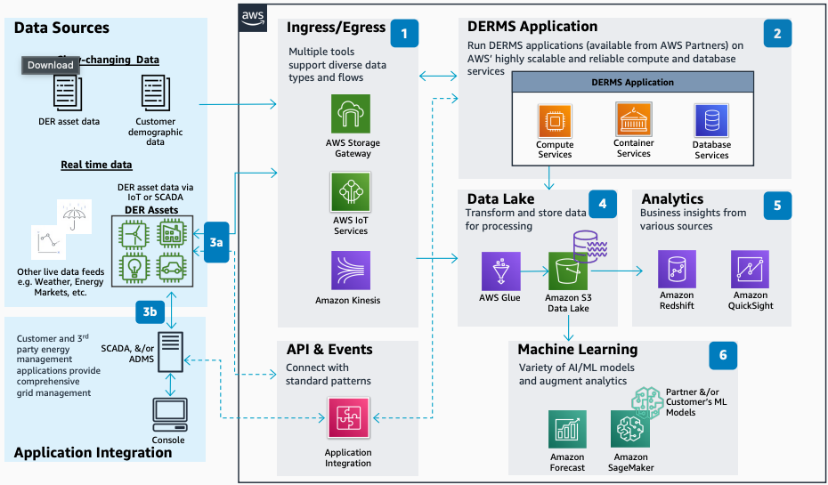

# DERMS on AWS for Utilities

Publication date: **February 19, 2021 ([Diagram history](#derms-history "#derms-history"))**

With this architecture, you can run DERMS on AWS to manage your growing fleet of DERs.
On-premises DERMS solutions often face scalability limitations and integration challenges. This
architecture scales elastically and integrates with managed ML services to improve grid
reliability. The solution uses [Amazon SageMaker AI](../../../sagemaker/latest/dg.md "../../../sagemaker/latest/dg.md") and [Amazon Forecast](../../../forecast/latest/dg.md "../../../forecast/latest/dg.md") for machine learning (ML), [Amazon Kinesis](../../../streams/latest/dev.md "../../../streams/latest/dev.md") for streaming data, and
[Amazon Simple Storage Service](../../../AmazonS3/latest/userguide.md "../../../AmazonS3/latest/userguide.md") for data lake
storage.

## DERMS on AWS for Utilities diagram

The following steps describe the data flow and analytics pipeline for this
architecture:

1. Collect streaming and batch data from various data sources, such as customer and grid
   data, meter data, DER measurements, market prices, and weather. Integrate with DERMS
   through one or more of [AWS Transfer Family](../../../transfer/latest/userguide/what-is-aws-transfer-family.md "../../../transfer/latest/userguide/what-is-aws-transfer-family.md"), [AWS IoT](../../../iot/latest/developerguide.md "../../../iot/latest/developerguide.md") services,
   streaming, or API services.
2. Deploy vendor DERMS applications by using different compute services, such as [Amazon Elastic Compute Cloud](../../../AWSEC2/latest/UserGuide.md "../../../AWSEC2/latest/UserGuide.md"), [AWS Lambda](../../../lambda/latest/dg.md "../../../lambda/latest/dg.md"), or AWS container
   services. Store associated transactional and operational data sets in purpose-built AWS
   databases based on their data structure and access patterns.
3. 3A. Control DER assets directly through IoT or APIs from the DERMS.

3B. Make recommendations to the advanced distribution management system
(ADMS) or supervisory control and data acquisition (SCADA) system. Integrate ADMS and
other systems with DERMS by using application integration services such as [Amazon API Gateway](../../../apigateway/latest/developerguide.md "../../../apigateway/latest/developerguide.md"), [Amazon Simple Notification Service](../../../sns/latest/dg.md "../../../sns/latest/dg.md"), [Amazon Simple Queue Service](../../../AWSSimpleQueueService/latest/SQSDeveloperGuide.md "../../../AWSSimpleQueueService/latest/SQSDeveloperGuide.md"), or [Amazon EventBridge](../../../eventbridge/latest/userguide.md "../../../eventbridge/latest/userguide.md"). 4. Automate extract, transform, and load (ETL) processes such as transformation and
deduplication with [AWS Glue](../../../glue/latest/dg.md "../../../glue/latest/dg.md"). Use
Amazon S3 as low-cost storage for raw and curated data, with archival copies for retention and
compliance. Your data lake serves as the single source of truth for downstream analytics
and ML work. Use AWS Glue to automate data schema discovery and metadata tagging to create a
searchable metadata catalog. 5. Query petabytes of structured and semi-structured data across your data warehouse and
data lake by using standard SQL with [Amazon Redshift](../../../redshift/latest/mgmt.md "../../../redshift/latest/mgmt.md"). Create and publish interactive dashboards
with [Amazon Quick Sight](../../../quicksight/latest/developerguide/welcome.md "../../../quicksight/latest/developerguide/welcome.md"). Access
dashboards from any device or embed them into your applications and websites. 6. Use pre-trained AI models, such as Forecast, to detect grid anomalies, forecast energy
usage, and predict equipment failures. Build, train, and deploy your own ML model with
SageMaker AI.

## Further reading

For additional information, see the following resources:

- [AWS Architecture Icons](https://aws.amazon.com/architecture/icons "https://aws.amazon.com/architecture/icons")
- [AWS Architecture Center](https://aws.amazon.com/architecture/ "https://aws.amazon.com/architecture/")
- [AWS
  Well-Architected](https://aws.amazon.com/architecture/well-architected "https://aws.amazon.com/architecture/well-architected")

## Diagram history

To receive updates about this reference architecture diagram, subscribe to the RSS
feed.

| Change              | Description                                     | Date              |
| ------------------- | ----------------------------------------------- | ----------------- |
| Initial publication | Reference architecture diagram first published. | February 19, 2021 |

###### RSS subscription requirement

To subscribe to RSS updates, you must have an RSS plugin enabled for the browser you are
using.
