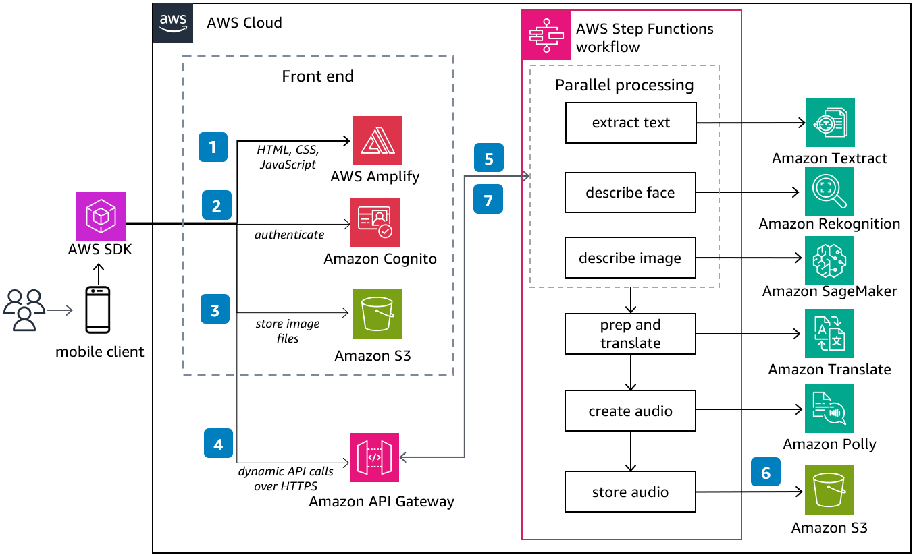

# DescribeForMe Web App

Publication date: **September 1, 2023 ([Diagram history](#diagram-history "#diagram-history"))**

The [DescribeForMe](https://www.describeforme.com/ "https://www.describeforme.com/") web app uses the AWS Cloud to help the visually impaired review images.
Through the use of multiple artificial intelligence and machine learning (AI/ML) services, you
can submit a photo and an image caption will be read back to you in a clear, natural-sounding
voice in a variety of languages and dialects.

## DescribeForMe Web App Diagram

1. **AWS Amplify** distributes the DescribeForMe
   web app, consisting of HTML, JavaScript, and CSS, to your mobile device.
2. The **Amazon Cognito** identity pool grants temporary access
   to the **Amazon Simple Storage Service** (Amazon S3) bucket.
3. The user uploads an image file to the **Amazon S3** bucket
   using an AWS SDK through the web app.
4. The DescribeForMe web app invokes the backend AI services by sending
   the **Amazon S3** object key in the payload
   to **Amazon API Gateway**.
5. **API Gateway** instantiates an **AWS Step Functions**
   workflow. The state machine orchestrates the AI/ML services **Amazon Rekognition**,
   **Amazon SageMaker AI**, **Amazon Textract**,
   **Amazon Translate**, and **Amazon Polly**
   using **AWS Lambda** functions.
6. The **Step Functions** workflow creates an audio file as output and
   stores it in **Amazon S3** in MP3 format.
7. A pre-signed URL with the location of the audio file stored in **Amazon S3**
   is sent back to your browser through **Amazon API Gateway**. Your mobile
   device plays the audio file using the pre-signed URL.

## Further reading

For additional information, refer to

- [AWS Architecture
  Icons](https://aws.amazon.com/architecture/icons "https://aws.amazon.com/architecture/icons")
- [AWS Architecture Center](https://aws.amazon.com/architecture "https://aws.amazon.com/architecture")
- [AWS Well-Architected](https://aws.amazon.com/architecture/well-architected "https://aws.amazon.com/architecture/well-architected")
- [DescribeForMe](https://www.describeforme.com/ "https://www.describeforme.com/")

## Contributors

Contributors to this reference architecture diagram include:

- Alak Eswaradass, Senior Solutions Architect, Amazon Web Services
- Jack Marchetti, Senior Solutions Architect, Amazon Web Services
- Kandyce Bohannon, Senior Solutions Architect, Amazon Web Services
- Trac Do, Solutions Architect, Amazon Web Services

## Diagram history

To be notified about updates to this reference architecture diagram, subscribe to the RSS feed.

| Change              | Description                                     | Date              |
| ------------------- | ----------------------------------------------- | ----------------- |
| Initial publication | Reference architecture diagram first published. | September 1, 2023 |

###### Note

To subscribe to RSS updates, you must have an RSS plugin enabled for the browser you are using.
