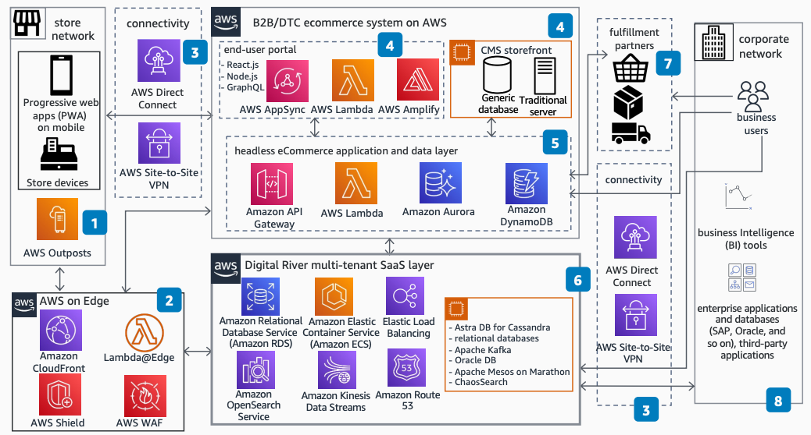

# Digital River for CPG, B2B, and DTC on AWS

Publication date: **March 28, 2022 ([Diagram history](#dr-history "#dr-history"))**

With this architecture, consumer packaged goods (CPG) companies manage all online commerce
activities. As CPG companies move to various sales channels domestically and worldwide, they
need robust solutions to reduce friction in ecommerce operations. Digital River
provides an all-in-one solution that runs on AWS for order-to-cash processes.

## Digital River commerce platform diagram

The following steps describe the architecture:

1. Use [Amazon CloudFront](../../../AmazonCloudFront/latest/DeveloperGuide.md "../../../AmazonCloudFront/latest/DeveloperGuide.md") for faster content
   delivery. Static content is served through CloudFront. Lambda@Edge provides edge computing
   for dynamic content. Shield and AWS WAF provide website security.
2. Choose either [https://docs.aws.amazon.com/directconnect/latest/UserGuide/](../../../directconnect/latest/UserGuide.md "../../../directconnect/latest/UserGuide.md") or AWS Site-to-Site VPN for
   data security in transit.
3. Build the business-to-business (B2B) or direct-to-consumer (DTC) ecommerce website
   frontend by using AWS services such as [Amazon EC2 Auto Scaling](../../../appsync/latest/devguide.md "../../../appsync/latest/devguide.md"), [management portal](../../../amplify/latest/userguide.md "../../../amplify/latest/userguide.md"), and Lambda. Serve the frontend through
   AWS edge locations.
4. Create the headless ecommerce application and data layer with [API Gateway](../../../apigateway/latest/developerguide.md "../../../apigateway/latest/developerguide.md"), Lambda,
   [Amazon Aurora](../../../AmazonRDS/latest/AuroraUserGuide.md "../../../AmazonRDS/latest/AuroraUserGuide.md"), and [Amazon DynamoDB](../../../amazondynamodb/latest/developerguide.md "../../../amazondynamodb/latest/developerguide.md"). This shared
   microservices layer interacts with storefronts, fulfillment partners, and
   Digital River.
5. The Digital River multi-tenant SaaS layer provides core commerce
   functionality. It runs on AWS services such as Amazon Relational Database Service, [Amazon Elastic Container Service](../../../AmazonECS/latest/developerguide.md "../../../AmazonECS/latest/developerguide.md"), Elastic Load Balancing,
   [Amazon OpenSearch Service](../../../opensearch-service/latest/developerguide.md "../../../opensearch-service/latest/developerguide.md"), and [Amazon Route 53](../../../Route53/latest/DeveloperGuide.md "../../../Route53/latest/DeveloperGuide.md").
6. Fulfillment partners interact with the headless ecommerce layer for fulfillment
   requests, order status updates, and return processes.
7. The application layer integrates with existing internal and third-party applications
   on corporate networks. Business users and existing business intelligence (BI) and
   enterprise resource planning (ERP) systems support day-to-day activities.
8. AWS Outposts adds AWS compute and storage capability at stores by using 1U
   and 2U form factors.

## Further reading

For additional information, see the following resources:

- [AWS Architecture Icons](https://aws.amazon.com/architecture/icons "https://aws.amazon.com/architecture/icons")
- [AWS Architecture Center](https://aws.amazon.com/architecture/ "https://aws.amazon.com/architecture/")
- [AWS Well-Architected](https://aws.amazon.com/architecture/well-architected "https://aws.amazon.com/architecture/well-architected")

## Diagram history

To receive updates about this reference architecture diagram, subscribe to the RSS
feed.

| Change              | Description                                     | Date           |
| ------------------- | ----------------------------------------------- | -------------- |
| Initial publication | Reference architecture diagram first published. | March 28, 2022 |

###### RSS subscription requirement

To subscribe to RSS updates, you must have an RSS plugin enabled for the browser you
are using.
