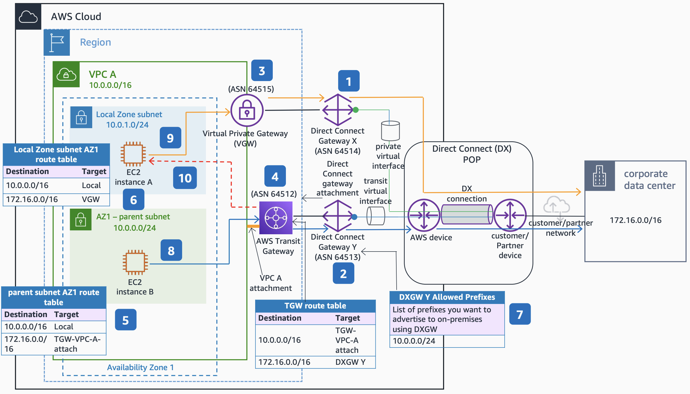

# AWS Direct Connect Traffic Flow with AWS Local Zone

Publication date: **September 29, 2022 ([Diagram history](#diagram-history "#diagram-history"))**

This architecture shows traffic flows from an on-premises data center to an AWS Local Zone using [AWS Direct Connect](../../../directconnect/latest/UserGuide/Welcome.md "../../../directconnect/latest/UserGuide/Welcome.md") for latency-sensitive applications running in [Amazon VPC](../../../vpc/latest/userguide/what-is-amazon-vpc.md "../../../vpc/latest/userguide/what-is-amazon-vpc.md").

## AWS Direct Connect traffic flow with AWS Local Zone architecture

The following steps describe this architecture:

1. Create AWS Direct Connect gateway (DXGW) "X" and assign a unique autonomous system number (ASN). Attach the Private Virtual Interface (VIF) to DXGW X.
2. Create DXGW "Y" and assign a unique ASN. Attach the Transit VIF to DXGW Y.
3. Create a Virtual Private Gateway (VGW) and attach it to **DXGW X**. Assign a unique ASN to the VGW. Attach the VGW to **VPC A**.
4. Create an [AWS Transit Gateway](../../../vpc/latest/tgw/what-is-transit-gateway.md "../../../vpc/latest/tgw/what-is-transit-gateway.md") (TGW) and attach it to **DXGW Y** using a DXGW attachment. Attach the TGW to **VPC A** using a **VPC A** attachment.
5. Create a parent subnet (**10.0.0.0/24**) with an [Amazon Elastic Compute Cloud](../../../AWSEC2/latest/UserGuide/concepts.md "../../../AWSEC2/latest/UserGuide/concepts.md") instance in an Availability Zone (AZ1) and associate it with a route table.
6. Create another subnet (**10.0.1.0/24**) in the AWS Local Zone where the latency-sensitive application runs. Associate this subnet with a separate Local Zone route table.
7. Add the AZ1 parent subnet (**10.0.0.0/24**) in the **DXGW Y** allowed prefixes list. For more information about allowed prefixes, see [Allowed prefixes interactions](../../../directconnect/latest/UserGuide/allowed-to-prefixes.md "../../../directconnect/latest/UserGuide/allowed-to-prefixes.md").
8. AWS Transit Gateway and **DXGW Y** advertise the AZ1 parent subnet (**10.0.0.0/24**) back to on-premises. Traffic destined to the parent subnet follows the TGW path.
9. Traffic destined to the Local Zone subnet (**10.0.1.0/24**) follows the shorter VGW path without hairpinning through the Local Zone parent Region.
10. Avoid routing resources to the Local Zone subnet from on-premises through Transit Gateway because traffic using this path hairpins through the parent Region.

## Further reading

For additional information, see the following resources:

- [AWS Architecture Icons](https://aws.amazon.com/architecture/icons "https://aws.amazon.com/architecture/icons")
- [AWS Architecture Center](https://aws.amazon.com/architecture "https://aws.amazon.com/architecture")
- [AWS Well-Architected](https://aws.amazon.com/architecture/well-architected "https://aws.amazon.com/architecture/well-architected")

## Diagram history

To be notified about updates to this reference architecture diagram, subscribe to the RSS feed.

| Change              | Description                                     | Date               |
| ------------------- | ----------------------------------------------- | ------------------ |
| Initial publication | Reference architecture diagram first published. | September 29, 2022 |

###### Note

To subscribe to RSS updates, you must have an RSS plugin enabled for the browser you are using.
