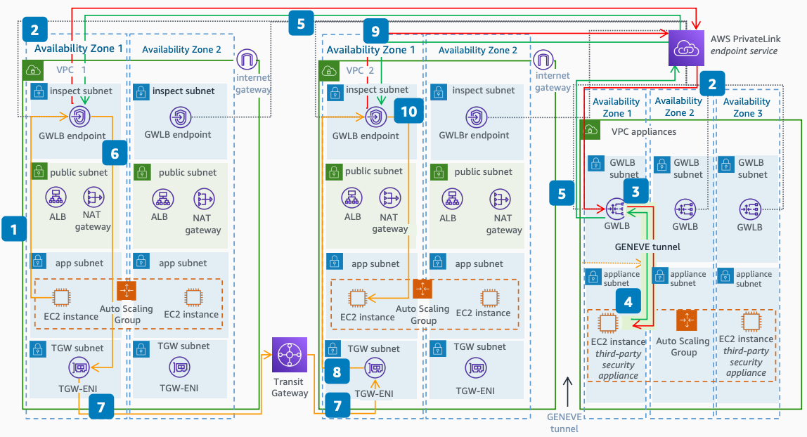

# East/West Distributed Inspection

Publication date: **July 21, 2022 ([Diagram history](#dew-diagram-history "#dew-diagram-history"))**

This architecture uses [Gateway Load Balancer](../../../elasticloadbalancing/latest/gateway/introduction.md "../../../elasticloadbalancing/latest/gateway/introduction.md") for distributed East/West inspection between VPCs. Traffic between VPCs routes through Gateway Load Balancer endpoints for inspection in both the source and destination VPCs.

## East/West distributed inspection architecture

The following steps describe the data flow in this architecture:

1. Traffic from an Amazon EC2 instance in **VPC 1** destined for an instance in **VPC 2** forwards to a Gateway Load Balancer endpoint.
2. The Gateway Load Balancer endpoint forwards the traffic to Gateway Load Balancer in the **appliances VPC** using AWS PrivateLink.
3. Gateway Load Balancer encapsulates the traffic in GENEVE and sends it to a security appliance for inspection.
4. The security appliance inspects the traffic and returns it to Gateway Load Balancer.
5. The traffic returns to the Gateway Load Balancer endpoint in the **inspect subnet**.
6. The Gateway Load Balancer endpoint uses the **inspect subnet route table** to forward the traffic to the Transit Gateway endpoint in the **TGW subnet**.
7. The traffic forwards according to the Transit Gateway route table and arrives in **VPC 2**.
8. In **VPC 2**, traffic forwards to the Gateway Load Balancer endpoint for re-inspection.
9. The traffic is re-inspected following the same flow through Gateway Load Balancer and the security appliance.
10. The Gateway Load Balancer endpoint forwards the traffic to the destination instance in the app subnet.

Use [Transit Gateway appliance mode](../../../vpc/latest/tgw/transit-gateway-appliance-scenario.md "../../../vpc/latest/tgw/transit-gateway-appliance-scenario.md") in the **Inspection VPC** Transit Gateway attachment to maintain flow symmetry.

## Further reading

For additional information, see the following resources:

- [AWS Architecture Icons](https://aws.amazon.com/architecture/icons "https://aws.amazon.com/architecture/icons")
- [AWS Architecture Center](https://aws.amazon.com/architecture "https://aws.amazon.com/architecture")
- [AWS Well-Architected](https://aws.amazon.com/architecture/well-architected "https://aws.amazon.com/architecture/well-architected")

## Diagram history

To be notified about updates to this reference architecture diagram, subscribe to the RSS feed.

| Change                                                                                                                                         | Description                                     | Date          |
| ---------------------------------------------------------------------------------------------------------------------------------------------- | ----------------------------------------------- | ------------- |
| [Initial publication](distributed-inbound-inspection.md#dinb-diagram-history "distributed-inbound-inspection.md#dinb-diagram-history")         | Reference architecture diagram first published. | July 21, 2022 |
| [Initial publication](distributed-outbound-inspection.md#dout-diagram-history "distributed-outbound-inspection.md#dout-diagram-history")       | Reference architecture diagram first published. | July 21, 2022 |
| Initial publication                                                                                                                            | Reference architecture diagram first published. | July 21, 2022 |
| [Initial publication](distributed-inspection-route-tables.md#drt-diagram-history "distributed-inspection-route-tables.md#drt-diagram-history") | Reference architecture diagram first published. | July 21, 2022 |

###### Note

To subscribe to RSS updates, you must have an RSS plugin enabled for the browser you are using.
