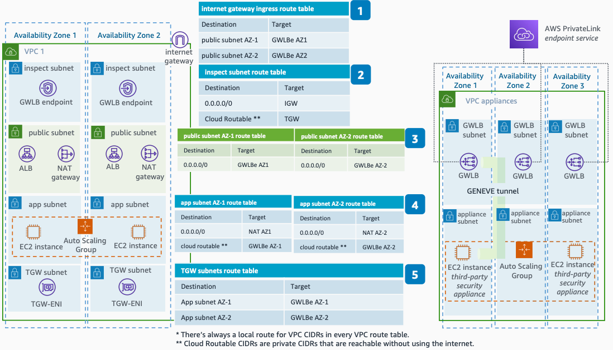

# Distributed Inspection Route Tables

Publication date: **July 21, 2022 ([Diagram history](#drt-diagram-history "#drt-diagram-history"))**

This diagram shows the route table configuration for distributed inspection architectures using [Gateway Load Balancer](../../../elasticloadbalancing/latest/gateway/introduction.md "../../../elasticloadbalancing/latest/gateway/introduction.md") in multiple Availability Zones. Proper route table configuration maintains flow symmetry across all traffic patterns.

## Distributed inspection route tables architecture

The following route tables control traffic flow in this architecture:

1. The **internet gateway ingress route table** applies to traffic from the internet to public subnets. It forwards traffic to the Gateway Load Balancer endpoint in the destination Availability Zone to maintain flow symmetry.
2. The **inspect subnet route table** applies to already-inspected traffic. This table defines which traffic routes to the internet and which routes to AWS Transit Gateway.
3. The **public subnet route tables** forward all traffic to the Gateway Load Balancer endpoints in the source Availability Zone.
4. The **application subnet route tables** forward traffic differently based on whether the destination IP is public or private. All traffic forwards to Gateway Load Balancer endpoints in the same Availability Zone to maintain symmetry.
5. The **Transit Gateway subnet route table** applies to traffic from AWS Transit Gateway. It sends traffic to the Gateway Load Balancer endpoint in the destination Availability Zone to maintain symmetry.

For more information about implementing a distributed inspection architecture, see [Scaling network traffic inspection using AWS Gateway Load Balancer](https://aws.amazon.com/blogs/networking-and-content-delivery/scaling-network-traffic-inspection-using-aws-gateway-load-balancer/ "https://aws.amazon.com/blogs/networking-and-content-delivery/scaling-network-traffic-inspection-using-aws-gateway-load-balancer/").

## Further reading

For additional information, see the following resources:

- [AWS Architecture Icons](https://aws.amazon.com/architecture/icons "https://aws.amazon.com/architecture/icons")
- [AWS Architecture Center](https://aws.amazon.com/architecture "https://aws.amazon.com/architecture")
- [AWS Well-Architected](https://aws.amazon.com/architecture/well-architected "https://aws.amazon.com/architecture/well-architected")

## Diagram history

To be notified about updates to this reference architecture diagram, subscribe to the RSS feed.

| Change                                                                                                                                   | Description                                     | Date          |
| ---------------------------------------------------------------------------------------------------------------------------------------- | ----------------------------------------------- | ------------- |
| [Initial publication](distributed-inbound-inspection.md#dinb-diagram-history "distributed-inbound-inspection.md#dinb-diagram-history")   | Reference architecture diagram first published. | July 21, 2022 |
| [Initial publication](distributed-outbound-inspection.md#dout-diagram-history "distributed-outbound-inspection.md#dout-diagram-history") | Reference architecture diagram first published. | July 21, 2022 |
| [Initial publication](distributed-east-west-inspection.md#dew-diagram-history "distributed-east-west-inspection.md#dew-diagram-history") | Reference architecture diagram first published. | July 21, 2022 |
| Initial publication                                                                                                                      | Reference architecture diagram first published. | July 21, 2022 |

###### Note

To subscribe to RSS updates, you must have an RSS plugin enabled for the browser you are using.
