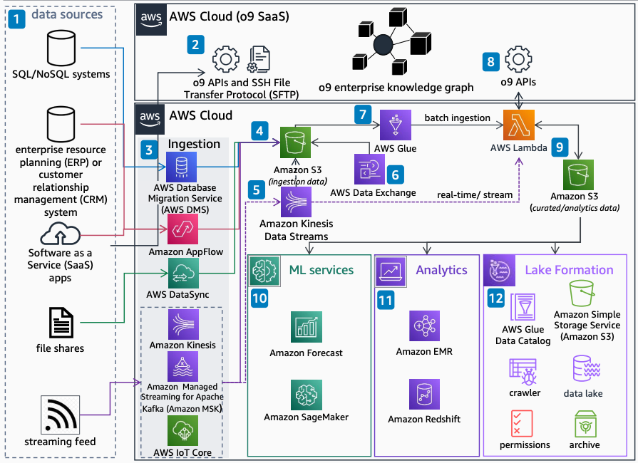

# Guidance for Driver-based Demand Planning with o9

Publication date: **April 25, 2022 ([Diagram history](#o9-driver-history "#o9-driver-history"))**

With this architecture, you can review options for ingesting data and using AWS services
in an [o9](https://o9solutions.com/ "https://o9solutions.com/") solution. You can
connect SQL and NoSQL systems, enterprise resource planning (ERP) or customer relationship
management (CRM) systems, SaaS applications, file shares, and streaming sources.

## Architecture diagram

The following steps describe the architecture:

1. Various sources feed data into demand planning software, such as SQL and NoSQL
   systems, ERP or CRM systems, other SaaS applications, file shares, and streaming
   sources like social media, smart devices, and logs.
2. You can ingest data into the o9 SaaS solution by using native
   o9 APIs and SSH File Transfer Protocol (SFTP).
3. You can also ingest data into your AWS account. Service selection depends on the
   source. Use [AWS Database Migration Service](../../../dms/latest/userguide.md "../../../dms/latest/userguide.md") for SQL and NoSQL. Use [Amazon AppFlow](../../../appflow/latest/userguide.md "../../../appflow/latest/userguide.md") for ERP, CRM, or
   SaaS. Use [AWS DataSync](../../../datasync/latest/userguide.md "../../../datasync/latest/userguide.md") for a file share. Use [Amazon Kinesis](../../../kinesis/latest/dev.md "../../../kinesis/latest/dev.md"), [Amazon MSK](../../../msk/latest/developerguide.md "../../../msk/latest/developerguide.md"), and [AWS IoT Core](../../../iot/latest/developerguide.md "../../../iot/latest/developerguide.md") for streaming
   feeds.
4. Store ingested data in [Amazon Simple Storage Service (Amazon S3)](../../../AmazonS3/latest/userguide.md "../../../AmazonS3/latest/userguide.md") in your AWS account.
5. Streaming data can feed the o9 SaaS solution by using o9
   REST APIs. Alternatively, store it in Amazon S3 through Amazon Kinesis Data Streams by using the AWS SDK or
   [AWS Lambda](../../../lambda/latest/dg.md "../../../lambda/latest/dg.md").
6. You can subscribe to and use third-party data (such as TransUnion, IMDb, or
   Reuters) in the AWS Cloud with AWS Data Exchange.
7. You can batch-ingest AWS customer account data in Amazon S3 into the o9
   SaaS solution by using [AWS Glue](../../../glue/latest/dg.md "../../../glue/latest/dg.md") through the AWS SDK or AWS Lambda.
8. Data within the o9 SaaS solution and the AWS customer account can
   be shared by using o9 APIs and optional AWS Lambda.
9. Collect outbound data from the o9 SaaS solution in Amazon S3 by using
   standard Amazon S3 APIs or AWS Lambda for analytics and AI/ML workloads.
10. Use [Amazon Forecast](../../../forecast/latest/dg.md "../../../forecast/latest/dg.md") and [Amazon SageMaker AI](../../../sagemaker/latest/dg.md "../../../sagemaker/latest/dg.md") to build, train, and deploy ML models
    that complement the o9 SaaS solution.
11. Use [Amazon EMR](../../../emr/latest/ManagementGuide.md "../../../emr/latest/ManagementGuide.md") and [Amazon Redshift](../../../redshift/latest/dg.md "../../../redshift/latest/dg.md") for big data processing and
    warehousing.
12. Integrate o9 SaaS data into a data lake built with Amazon S3, AWS Glue,
    IAM, and [AWS Lake Formation](../../../lake-formation/latest/dg.md "../../../lake-formation/latest/dg.md").

## Further reading

For additional information, see the following resources:

- [AWS Architecture Icons](https://aws.amazon.com/architecture/icons "https://aws.amazon.com/architecture/icons")
- [AWS Architecture Center](https://aws.amazon.com/architecture/ "https://aws.amazon.com/architecture/")
- [AWS Well-Architected](https://aws.amazon.com/architecture/well-architected "https://aws.amazon.com/architecture/well-architected")

## Diagram history

To receive updates about this reference architecture diagram, subscribe to the RSS
feed.

| Change              | Description                                     | Date           |
| ------------------- | ----------------------------------------------- | -------------- |
| Initial publication | Reference architecture diagram first published. | April 25, 2022 |

###### RSS subscription requirement

To subscribe to RSS updates, you must have an RSS plugin enabled for the browser you
are using.
