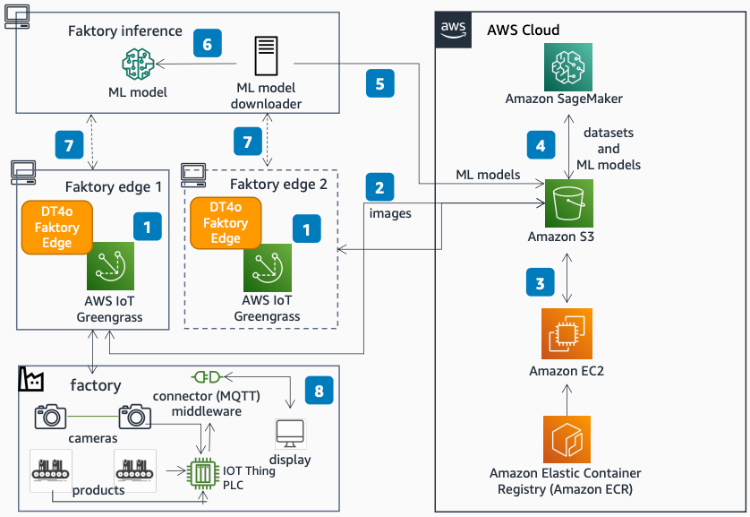

# DT4o Faktory Vision: Quality Insights on AWS

Publication date: **December 11, 2022 ([Diagram history](#dfv-diagram-history "#dfv-diagram-history"))**

With this architecture, you can deploy computer vision-based quality detection and defect
analytics to minimize product defects in manufacturing. DT4o
Faktory Vision uses [AWS IoT Greengrass](../../../greengrass/v2/developerguide.md "../../../greengrass/v2/developerguide.md"), [Amazon Simple Storage Service](../../../AmazonS3/latest/userguide.md "../../../AmazonS3/latest/userguide.md"), [Amazon Elastic Compute Cloud](../../../AWSEC2/latest/UserGuide.md "../../../AWSEC2/latest/UserGuide.md"), [Amazon SageMaker AI](../../../sagemaker/latest/dg.md "../../../sagemaker/latest/dg.md"), and [Amazon Elastic Container Registry](../../../AmazonECR/latest/userguide.md "../../../AmazonECR/latest/userguide.md").

## DT4o Faktory Vision architecture diagram

The following steps describe the architecture:

1. At the plant, acquire production data and synchronize cameras with the production
   controller (PLC). AWS IoT Greengrass initiates camera capture and inference events.
2. Capture images from cameras at low latency at the edge by using Message Queuing
   Telemetry Transport (MQTT). Store images in Amazon S3 through AWS IoT Greengrass.
3. The DT4o Faktory Vision container on Amazon EC2 configures
   the plant hierarchy and initiates ML modeling. Fine-tune and generate new model versions
   based on operator input.
4. Use SageMaker AI to train ML models per product type. Store model versions in Amazon S3.
5. Download ML models into the Faktory Inference local disk.
6. Load ML models onto the Faktory Inference service by plant
   hierarchy.
7. Access ML models for runtime inference at Faktory Edge (under
   500 ms for inference).
8. Product quality insights display with raw and processed images (under 600 ms).

## Further reading

For additional information, see the following resources:

- [AWS Architecture Icons](https://aws.amazon.com/architecture/icons "https://aws.amazon.com/architecture/icons")
- [AWS Architecture Center](https://aws.amazon.com/architecture "https://aws.amazon.com/architecture")
- [AWS Well-Architected](https://aws.amazon.com/architecture/well-architected "https://aws.amazon.com/architecture/well-architected")

## Diagram history

To be notified about updates to this reference architecture diagram, subscribe to the RSS feed.

| Change              | Description                                     | Date              |
| ------------------- | ----------------------------------------------- | ----------------- |
| Initial publication | Reference architecture diagram first published. | December 11, 2022 |

###### RSS subscription

To subscribe to RSS updates, you must have an RSS plugin enabled for the browser that you are using.
