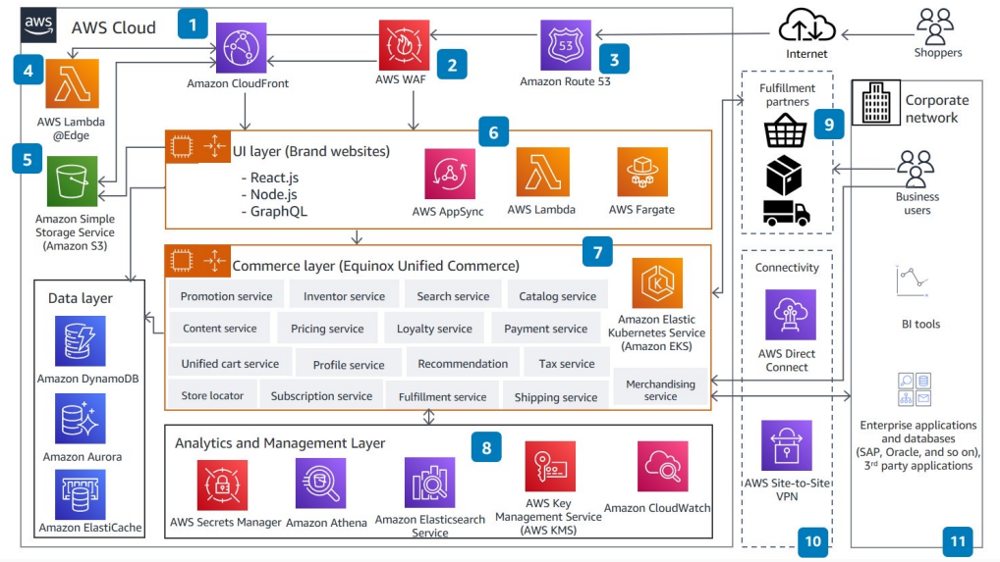

# Microservices-based Headless DTC Website with Infosys Equinox on AWS

Publication date: **2021 ([Diagram history](#dtc-history "#dtc-history"))**

With this architecture, you can build a microservices-based headless direct-to-consumer
(DTC) website. Headless applications let brand owners loosely couple brand websites with a
unified commerce engine that is extensible and durable. Infosys is an AWS partner with a
DTC platform, [Infosys
Equinox](https://www.infosys.com/about/alliances/amazon.html "https://www.infosys.com/about/alliances/amazon.html"), running on AWS to provide comprehensive capabilities across the
commerce lifecycle.

## Architecture diagram

The following steps describe the architecture:

1. [Amazon CloudFront](../../../AmazonCloudFront/latest/DeveloperGuide.md "../../../AmazonCloudFront/latest/DeveloperGuide.md") provides a highly
   secure, programmable content delivery network (CDN).
2. [AWS WAF](../../../waf/latest/developerguide.md "../../../waf/latest/developerguide.md") is the
   web application firewall that protects the ecommerce website against common web
   exploits.
3. [Amazon Route 53](../../../Route53/latest/DeveloperGuide.md "../../../Route53/latest/DeveloperGuide.md") provides domain name service
   (DNS) configuration.
4. Lambda@Edge improves performance for dynamic content processing.
5. [Amazon Simple Storage Service (Amazon S3)](../../../AmazonS3/latest/userguide.md "../../../AmazonS3/latest/userguide.md") stores static content
   (HTML, image, video).
6. Consumer packaged goods (CPG) brand websites are implemented with your choice of
   technologies by using [AWS Lambda](../../../lambda/latest/dg.md "../../../lambda/latest/dg.md"), AWS AppSync, or applications running on [AWS Fargate](../../../AmazonECS/latest/developerguide.md "../../../AmazonECS/latest/developerguide.md").
7. Infosys Equinox Unified Commerce is built with [Spring Boot](https://spring.io/projects/spring-boot "https://spring.io/projects/spring-boot"),
   [Hibernate](https://hibernate.org/ "https://hibernate.org/"), and [Hystrix](https://github.com/Netflix/Hystrix "https://github.com/Netflix/Hystrix") running on
   [Amazon EKS](../../../eks/latest/userguide.md "../../../eks/latest/userguide.md"). It provides
   essential DTC features for high availability and scalability.
8. An analytics and management layer provides ad hoc reporting, monitoring, security,
   and data protection.
9. Fulfillment partner integration handles order picking, packing, and shipping.
10. Your choice of a dedicated connection ([AWS Direct Connect](../../../directconnect/latest/UserGuide.md "../../../directconnect/latest/UserGuide.md")) or AWS Site-to-Site VPN secures data in
    transit.
11. Business users and existing business intelligence (BI) and ERP systems on the
    corporate network handle day-to-day activities.

## Further reading

For additional information, see the following resources:

- [AWS Architecture Icons](https://aws.amazon.com/architecture/icons "https://aws.amazon.com/architecture/icons")
- [AWS Architecture Center](https://aws.amazon.com/architecture/ "https://aws.amazon.com/architecture/")
- [AWS Well-Architected](https://aws.amazon.com/architecture/well-architected "https://aws.amazon.com/architecture/well-architected")

## Diagram history

To receive updates about this reference architecture diagram, subscribe to the RSS
feed.

| Change              | Description                                     | Date            |
| ------------------- | ----------------------------------------------- | --------------- |
| Initial publication | Reference architecture diagram first published. | January 1, 2021 |

###### RSS subscription requirement

To subscribe to RSS updates, you must have an RSS plugin enabled for the browser you
are using.
