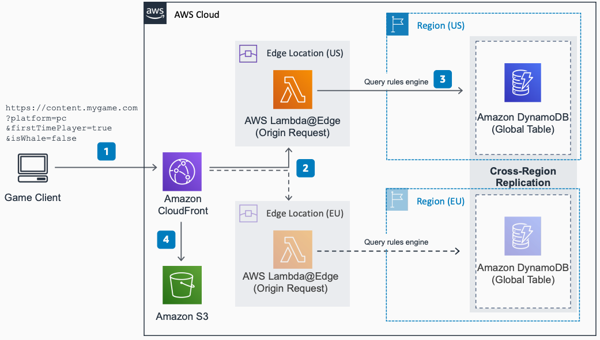

# Dynamic Media Content for Games

Publication date: **October 8, 2020 ([Diagram history](#dynamic-media-history "#dynamic-media-history"))**

Game developers often build custom solutions to engage with players through daily messages
and custom media content, including Message of the Day (MOTD). This architecture provides a
serverless approach for serving customized content based on request parameters and edge
computing.

## Dynamic Media Content for Games diagram

The following steps describe the architecture:

1. Game clients send a request with parameters to [Amazon CloudFront](../../../AmazonCloudFront/latest/DeveloperGuide.md "../../../AmazonCloudFront/latest/DeveloperGuide.md") to download dynamic
   content. Request parameters represent attributes about the player, but use low-cardinality
   values to maintain high cache rates and reduce cost.
2. CloudFront invokes an AWS [Lambda@Edge](../../../AmazonCloudFront/latest/DeveloperGuide/edge-functions-choosing.md "../../../AmazonCloudFront/latest/DeveloperGuide/edge-functions-choosing.md") function closest to the user. The
   function dynamically modifies the content that should be retrieved from origin based on
   request parameters.
3. [Amazon DynamoDB](../../../amazondynamodb/latest/developerguide.md "../../../amazondynamodb/latest/developerguide.md") Global Tables provides a
   multi-Region rules engine for custom routing. The Lambda function queries the table closest
   to the user to determine the content to serve.
4. CloudFront uses the response from Lambda to fetch the relevant content from [Amazon Simple Storage Service](../../../AmazonS3/latest/userguide.md "../../../AmazonS3/latest/userguide.md") (origin). CloudFront
   returns the content to the client and caches the response in edge locations to reduce cost
   and improve performance for future requests.

## Further reading

For additional information, see the following resources:

- [AWS Architecture Icons](https://aws.amazon.com/architecture/icons "https://aws.amazon.com/architecture/icons")
- [AWS Architecture Center](https://aws.amazon.com/architecture/ "https://aws.amazon.com/architecture/")
- [AWS
  Well-Architected](https://aws.amazon.com/architecture/well-architected "https://aws.amazon.com/architecture/well-architected")

## Diagram history

To be notified about updates to this reference architecture diagram, subscribe to the RSS
feed.

| Change              | Description                                     | Date            |
| ------------------- | ----------------------------------------------- | --------------- |
| Initial publication | Reference architecture diagram first published. | October 8, 2020 |

###### Note

To subscribe to RSS updates, you must have an RSS plugin enabled for the browser you are
using.
