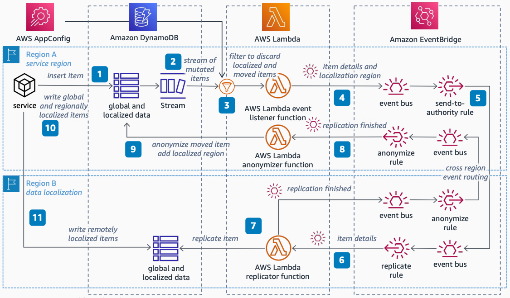

# DynamoDB Global Replication with Data Localization

Publication date: **March 10, 2023 ([Diagram history](#diagram-history "#diagram-history"))**

Use this architecture for global data-item replication in [DynamoDB](../../../amazondynamodb/latest/developerguide/Introduction.md "../../../amazondynamodb/latest/developerguide/Introduction.md") with scalability and performance while working to comply with data localization mandates for data to be stored in a specific Region only.

## DynamoDB Global Replication with Data Localization

The following steps describe the architecture:

1. On the main AWS Region, set services to add items with a localization-authority field into a regional DynamoDB table.
2. Enable [DynamoDB Streams](../../../amazondynamodb/latest/developerguide/Streams.md "../../../amazondynamodb/latest/developerguide/Streams.md") to capture events about mutated items and handle the events with an [AWS Lambda](../../../lambda/latest/dg/welcome.md "../../../lambda/latest/dg/welcome.md") event-listener function.
3. Map localization authorities to Regions with [AWS AppConfig](../../../appconfig/latest/userguide/what-is-appconfig.md "../../../appconfig/latest/userguide/what-is-appconfig.md"). Read the map on the function, then discard changes on items localized in the current Region and items already moved using event filtering.
4. Raise an event containing the mutated item details and the localization Region to an event bus in [EventBridge](../../../eventbridge/latest/userguide/eb-what-is.md "../../../eventbridge/latest/userguide/eb-what-is.md").
5. Set up EventBridge rules for cross-Region event routing. Send global items to all Regions. Send remotely localized items only to the localization Region defined on the payload.
6. On destination Regions, handle received item details with a Lambda replicator function.
7. Replicate received items in regional DynamoDB tables, then raise an event to the Region of origin indicating that the replication finished.
8. On the Region of origin, handle the finished event with an anonymizer Lambda function.
9. Set the function to anonymize sensitive information from localized moved items, stamping them with the localized Region that they moved into. Ignore global items.
10. When services update items, only update global items and localized items that belong to the same Region where they are stored.
11. If a localized item to update has already moved to a different Region, make a cross-Region call to the DynamoDB table in the localized Region to update the record.

## Further reading

For additional information, refer to the following resources:

- [AWS Architecture Icons](https://aws.amazon.com/architecture/icons "https://aws.amazon.com/architecture/icons")
- [AWS Architecture Center](https://aws.amazon.com/architecture "https://aws.amazon.com/architecture")
- [AWS Well-Architected](https://aws.amazon.com/architecture/well-architected "https://aws.amazon.com/architecture/well-architected")

## Diagram history

To be notified about updates to this reference architecture diagram, subscribe to the RSS feed.

| Change              | Description                                     | Date           |
| ------------------- | ----------------------------------------------- | -------------- |
| Initial publication | Reference architecture diagram first published. | March 10, 2023 |

###### Note

To subscribe to RSS updates, you must have an RSS plugin enabled for the browser you are using.
