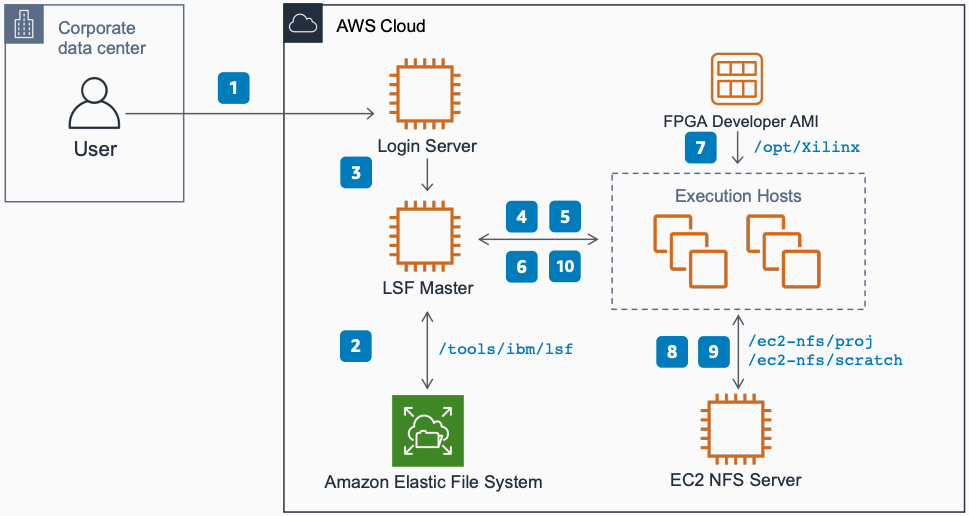

# EDA on AWS with IBM Spectrum LSF

Publication date: **February 18, 2021 ([Diagram history](#lsf-history "#lsf-history"))**

With this architecture, you can run Electronic Design Automation (EDA) workloads on AWS
by using IBM Spectrum LSF Resource Connector. The solution dynamically provisions
[Amazon Elastic Compute Cloud](../../../AWSEC2/latest/UserGuide.md "../../../AWSEC2/latest/UserGuide.md") instances to
satisfy workload in the queue and terminates them after jobs finish.

For more information about this workshop, see [aws-eda-workshops](https://github.com/aws-samples/aws-eda-workshops/blob/master/workshops/eda-workshop-lsf "https://github.com/aws-samples/aws-eda-workshops/blob/master/workshops/eda-workshop-lsf")
on GitHub.

## EDA on AWS with IBM Spectrum LSF diagram

The following steps describe the data flow and job execution for this architecture:

1. Log in to the login server from within the corporate network.
2. Submit simulation jobs from the login server.
3. IBM Spectrum LSF provisions Amazon EC2 instances to satisfy the workload in
   the queue.
4. Provisioned Amazon EC2 instances join the cluster as dynamic execution hosts.
5. Dispatch jobs to the new execution hosts.
6. Load the pre-licensed Xilinx Vivado Design Suite from the FPGA
   Developer AMI on each job execution host.
7. Vivado loads example IP and design from
   `/ec2-nfs/proj`.
8. Vivado writes job runtime data and results to
   `/ec2-nfs/scratch`.
9. IBM Spectrum LSF terminates Amazon EC2 instances after jobs finish.
10. Read and write IBM Spectrum LSF binaries, configuration, and logs to
    [Amazon Elastic File System](../../../efs/latest/ug.md "../../../efs/latest/ug.md").

## Further reading

For additional information, see the following resources:

- [AWS Architecture Icons](https://aws.amazon.com/architecture/icons "https://aws.amazon.com/architecture/icons")
- [AWS Architecture Center](https://aws.amazon.com/architecture/ "https://aws.amazon.com/architecture/")
- [AWS
  Well-Architected](https://aws.amazon.com/architecture/well-architected "https://aws.amazon.com/architecture/well-architected")

## Diagram history

To receive updates about this reference architecture diagram, subscribe to the RSS
feed.

| Change              | Description                                     | Date              |
| ------------------- | ----------------------------------------------- | ----------------- |
| Initial publication | Reference architecture diagram first published. | February 18, 2021 |

###### RSS subscription requirement

To subscribe to RSS updates, you must have an RSS plugin enabled for the browser you are
using.
